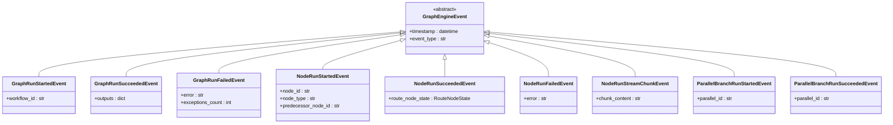
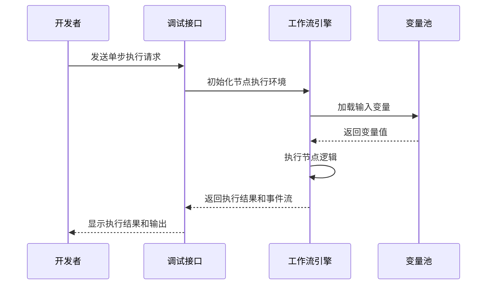
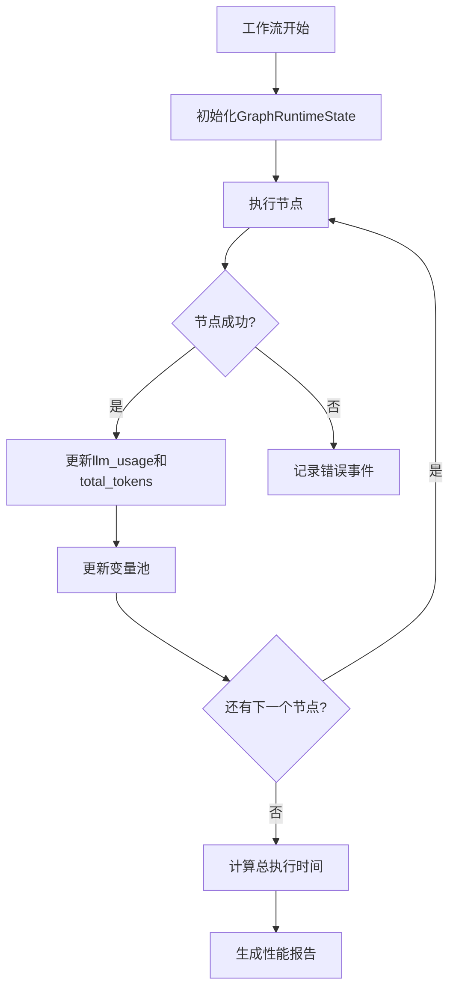
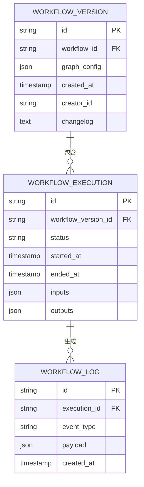
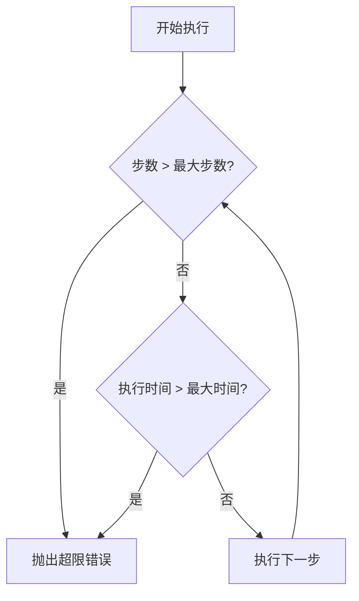

# 调试与监控

<cite>
**本文档中引用的文件**  
- [workflow.py](file://api/controllers/web/workflow.py)
- [workflow_entry.py](file://api/core/workflow/workflow_entry.py)
- [graph_engine.py](file://api/core/workflow/graph_engine/graph_engine.py)
- [workflow_logging_callback.py](file://api/core/workflow/callbacks/workflow_logging_callback.py)
- [workflow_execution_repository.py](file://api/core/workflow/repositories/workflow_execution_repository.py)
- [workflow_node_execution_repository.py](file://api/core/workflow/repositories/workflow_node_execution_repository.py)
- [workflow_run_fields.py](file://api/fields/workflow_run_fields.py)
- [workflow_app_log_fields.py](file://api/fields/workflow_app_log_fields.py)
- [workflow_run_service.py](file://api/services/workflow_run_service.py)
- [workflow_service.py](file://api/services/workflow_service.py)
</cite>

## 目录
1. [简介](#简介)
2. [执行日志结构与内容](#执行日志结构与内容)
3. [实时调试工具使用](#实时调试工具使用)
4. [性能监控指标解释](#性能监控指标解释)
5. [工作流版本对比与变更追踪](#工作流版本对比与变更追踪)
6. [典型问题诊断流程](#典型问题诊断流程)
7. [通过API获取执行详情与监控数据](#通过api获取执行详情与监控数据)
8. [结论](#结论)

## 简介
Dify平台提供了一套完整的工作流调试与监控机制，支持开发者对工作流的执行过程进行深度分析和优化。该系统通过结构化日志记录、实时事件流、性能指标采集和版本管理功能，帮助用户快速定位问题、优化执行效率并确保系统稳定性。

**Section sources**
- [workflow.py](file://api/controllers/web/workflow.py#L1-L119)
- [workflow_entry.py](file://api/core/workflow/workflow_entry.py#L1-L395)

## 执行日志结构与内容
Dify工作流的执行日志采用事件驱动的流式结构，每个执行步骤都会生成相应的事件对象，包含详细的上下文信息。日志事件通过`GraphEngineEvent`基类派生出多种具体类型，形成完整的执行轨迹。



**Diagram sources**
- [graph_engine.py](file://api/core/workflow/graph_engine/graph_engine.py#L100-L200)
- [workflow_entry.py](file://api/core/workflow/workflow_entry.py#L100-L150)

每个节点执行事件包含以下核心字段：
- `id`: 事件唯一标识
- `node_id`: 节点ID
- `node_type`: 节点类型（如LLM、代码、条件判断等）
- `node_data`: 节点配置数据
- `route_node_state`: 节点运行状态
- `parallel_id`: 并行分支ID（如适用）
- `parent_parallel_id`: 父级并行分支ID

日志通过`WorkflowCallback`接口进行统一处理，支持将执行过程记录到数据库或外部监控系统。

**Section sources**
- [graph_engine.py](file://api/core/workflow/graph_engine/graph_engine.py#L1-L799)
- [workflow_logging_callback.py](file://api/core/workflow/callbacks/workflow_logging_callback.py)

## 实时调试工具使用
Dify提供实时调试功能，允许开发者在工作流开发过程中进行单步执行、变量查看和断点设置。

### 单步执行模式
通过`WorkflowEntry.single_step_run()`方法实现单节点执行，可用于验证特定节点的逻辑正确性：



**Diagram sources**
- [workflow_entry.py](file://api/core/workflow/workflow_entry.py#L150-L250)
- [workflow_run_service.py](file://api/services/workflow_run_service.py)

### 变量查看功能
系统维护一个`VariablePool`对象，存储所有工作流变量的状态。调试时可通过以下方式查看变量：
1. 实时监控变量池中的值变化
2. 查看特定节点的输入输出变量
3. 追踪变量在整个工作流中的传递路径

变量加载通过`VariableLoader`和`load_into_variable_pool()`函数实现，支持从草稿变量、用户输入和环境变量中获取数据。

**Section sources**
- [workflow_entry.py](file://api/core/workflow/workflow_entry.py#L300-L395)
- [variable_loader.py](file://api/core/workflow/variable_loader.py)

## 性能监控指标解释
Dify工作流系统采集多项关键性能指标，用于评估和优化工作流执行效率。

### 核心性能指标
| 指标名称 | 描述 | 数据来源 |
|--------|------|---------|
| 执行时间 | 工作流从开始到结束的总耗时 | `GraphRuntimeState.start_at` |
| Token消耗 | LLM节点调用产生的总Token数 | `GraphRuntimeState.total_tokens` |
| 错误率 | 执行失败的节点占总节点数的比例 | `GraphRunFailedEvent`计数 |
| 并行度 | 同时执行的最大节点数量 | `GraphEngineThreadPool` |
| 内存使用 | 工作流执行过程中的内存占用 | 系统监控 |

### 指标采集机制


**Diagram sources**
- [graph_engine.py](file://api/core/workflow/graph_engine/graph_engine.py#L500-L700)
- [entities.py](file://api/core/workflow/entities/workflow_execution.py)

这些指标可用于：
- 识别性能瓶颈节点
- 优化LLM调用策略
- 调整并行执行参数
- 预测资源需求

**Section sources**
- [graph_engine.py](file://api/core/workflow/graph_engine/graph_engine.py#L1-L799)
- [workflow_execution.py](file://api/core/workflow/entities/workflow_execution.py)

## 工作流版本对比与变更追踪
Dify通过版本控制系统实现工作流的变更管理和历史追踪。

### 版本对比机制
系统存储每个工作流版本的`graph_config`，通过比较不同版本的节点配置和连接关系来识别变更：



**Diagram sources**
- [models.py](file://api/models/workflow.py)
- [workflow_service.py](file://api/services/workflow_service.py)

变更追踪功能包括：
- 记录每次修改的操作者和时间
- 保存变更说明（changelog）
- 支持版本回滚
- 提供可视化差异对比

**Section sources**
- [workflow_service.py](file://api/services/workflow_service.py)
- [workflow_execution_repository.py](file://api/core/workflow/repositories/workflow_execution_repository.py)

## 典型问题诊断流程
### 死循环检测
系统通过以下机制防止和诊断死循环：
1. 设置最大执行步数限制（`WORKFLOW_MAX_EXECUTION_STEPS`）
2. 设置最大执行时间限制（`WORKFLOW_MAX_EXECUTION_TIME`）
3. 在`_is_timed_out()`方法中检查超时情况

当检测到潜在死循环时，系统会抛出`GraphRunFailedError`异常并终止执行。



**Diagram sources**
- [graph_engine.py](file://api/core/workflow/graph_engine/graph_engine.py#L400-L450)
- [constants.py](file://api/core/workflow/constants.py)

### 超时问题处理
超时处理策略包括：
- 配置化的超时阈值
- 优雅的执行终止机制
- 完整的错误日志记录
- 资源清理和线程释放

### 数据类型错误诊断
系统通过以下方式处理数据类型错误：
1. 在变量池中维护类型信息
2. 执行前进行类型验证
3. 提供详细的错误信息定位问题节点

**Section sources**
- [graph_engine.py](file://api/core/workflow/graph_engine/graph_engine.py#L1-L799)
- [errors.py](file://api/core/workflow/errors.py)

## 通过API获取执行详情与监控数据
Dify提供RESTful API接口用于获取工作流执行详情和监控数据。

### 主要API端点
```mermaid
graph TB
subgraph Web控制器
A[POST /workflows/run] --> B[WorkflowRunApi]
C[POST /workflows/tasks/{task_id}/stop] --> D[WorkflowTaskStopApi]
end
subgraph 服务层
B --> E[AppGenerateService]
D --> F[AppQueueManager]
end
subgraph 核心引擎
E --> G[WorkflowEntry]
G --> H[GraphEngine]
end
subgraph 数据存储
H --> I[WorkflowExecutionRepository]
H --> J[WorkflowNodeExecutionRepository]
end
```

**Diagram sources**
- [workflow.py](file://api/controllers/web/workflow.py)
- [workflow_run_service.py](file://api/services/workflow_run_service.py)

### API响应结构
执行详情API返回标准化的响应格式，包含：
- 基本信息：执行ID、工作流ID、状态等
- 时间信息：开始时间、结束时间、持续时间
- 性能指标：Token消耗、错误计数等
- 节点执行详情：每个节点的输入输出和状态
- 事件日志：完整的执行事件流

查询参数支持按时间范围、状态、工作流版本等条件过滤。

**Section sources**
- [workflow_run_fields.py](file://api/fields/workflow_run_fields.py)
- [workflow_app_log_fields.py](file://api/fields/workflow_app_log_fields.py)
- [workflow_run_service.py](file://api/services/workflow_run_service.py)

## 结论
Dify的工作流调试与监控系统提供了一套完整的工具链，从执行日志记录、实时调试、性能监控到版本管理和问题诊断，全面支持工作流的开发和运维。通过结构化的事件流、丰富的性能指标和强大的API接口，开发者能够深入理解工作流的执行过程，快速定位和解决问题，并持续优化系统性能。