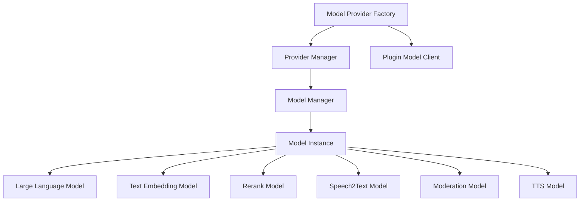
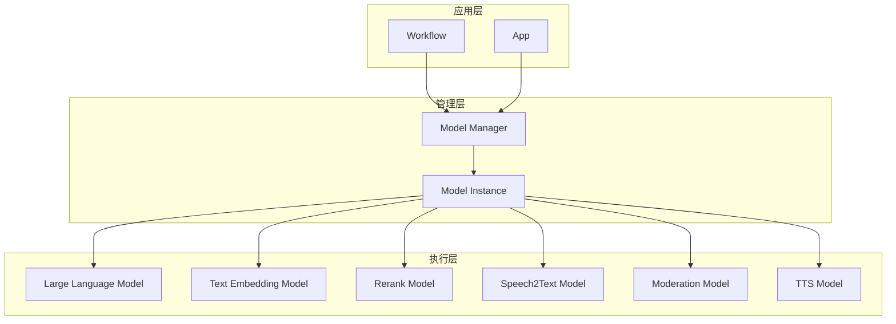
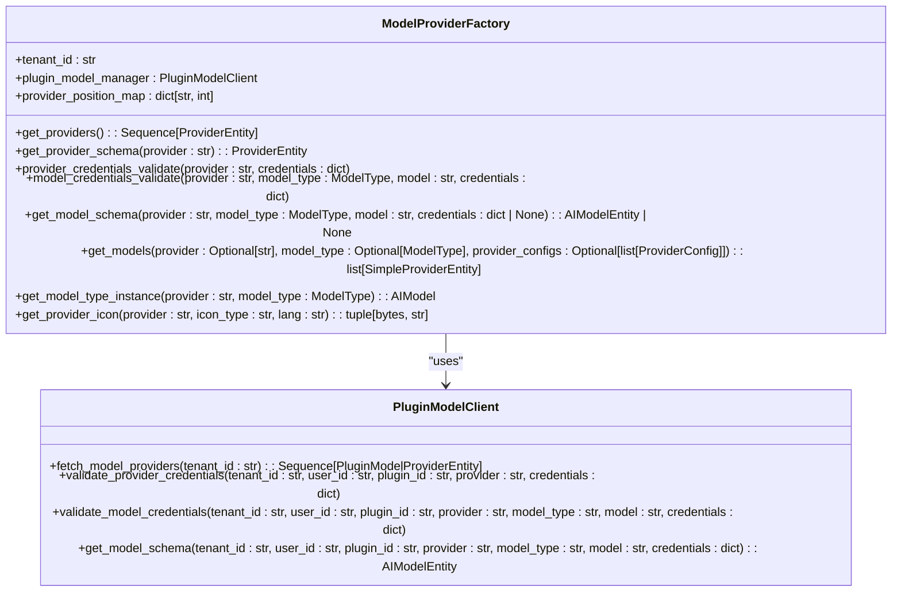
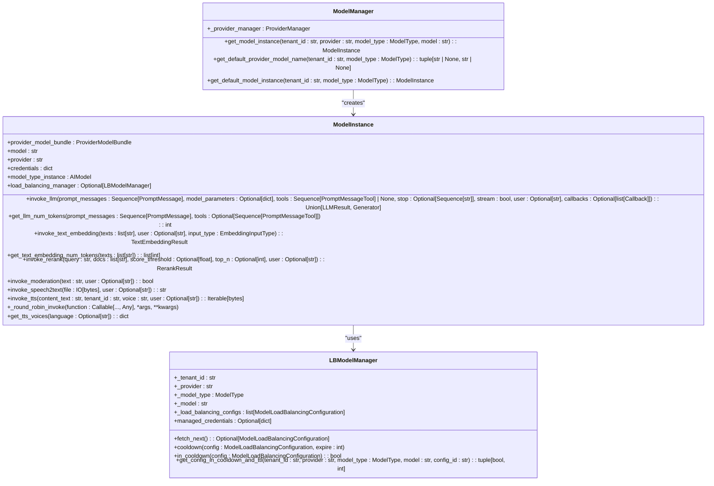
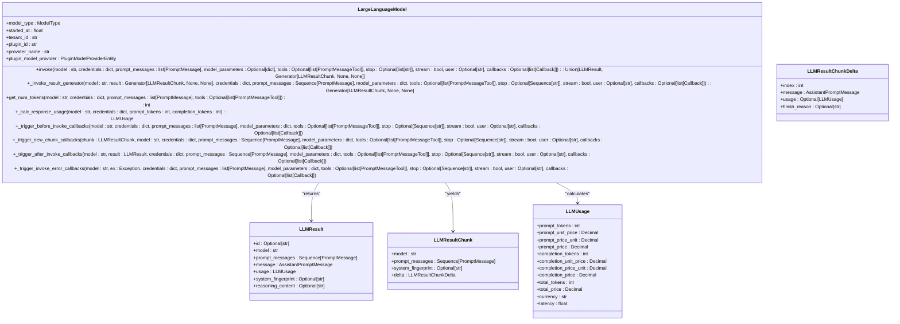
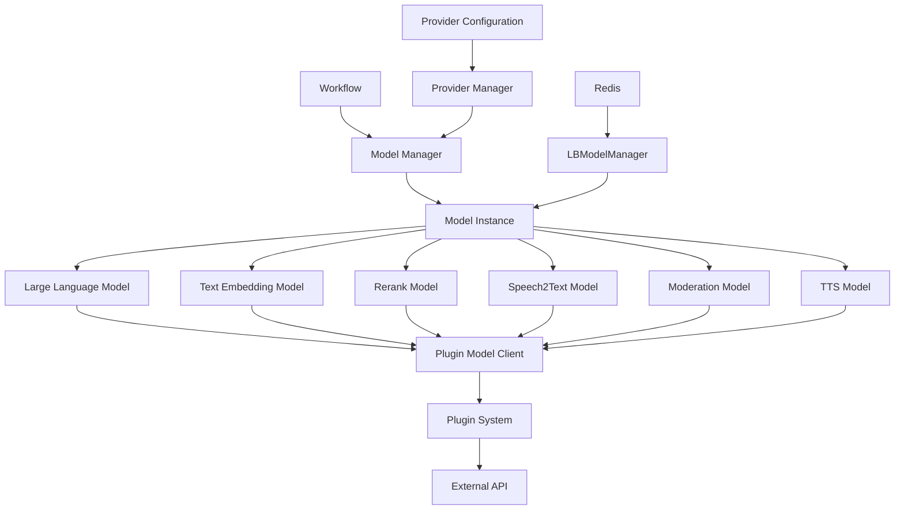

# LLM模型集成

<cite>
**本文档引用文件**  
- [large_language_model.py](file://api/core/model_runtime/model_providers/__base/large_language_model.py)
- [model_provider_factory.py](file://api/core/model_runtime/model_providers/model_provider_factory.py)
- [model_manager.py](file://api/core/model_manager.py)
- [llm_entities.py](file://api/core/model_runtime/entities/llm_entities.py)
- [model_entities.py](file://api/core/model_runtime/entities/model_entities.py)
- [provider_entities.py](file://api/core/model_runtime/entities/provider_entities.py)
- [README_CN.md](file://api/core/model_runtime/README_CN.md)
</cite>

## 目录
1. [引言](#引言)
2. [项目结构](#项目结构)
3. [核心组件](#核心组件)
4. [架构概述](#架构概述)
5. [详细组件分析](#详细组件分析)
6. [依赖分析](#依赖分析)
7. [性能考量](#性能考量)
8. [故障排除指南](#故障排除指南)
9. [结论](#结论)

## 引言
Dify平台提供了一套完整的LLM模型集成解决方案，支持多种模型类型和供应商的灵活配置。本文档系统说明了工作流如何集成和使用不同LLM模型，涵盖模型选择机制、参数配置、凭证管理、多模型编排、故障转移和负载均衡策略等核心功能。

## 项目结构
Dify的模型运行时模块采用分层架构设计，主要包含模型提供者工厂、模型实例管理、模型类型定义和实体定义等核心组件。

**图示来源**  
- [model_provider_factory.py](file://api/core/model_runtime/model_providers/model_provider_factory.py#L1-L377)
- [model_manager.py](file://api/core/model_manager.py#L1-L585)

**本节来源**  
- [model_provider_factory.py](file://api/core/model_runtime/model_providers/model_provider_factory.py#L1-L377)
- [model_manager.py](file://api/core/model_manager.py#L1-L585)

## 核心组件
Dify的LLM模型集成系统由模型提供者工厂、模型管理器和模型实例三大核心组件构成。模型提供者工厂负责创建和管理不同供应商的模型实例，模型管理器负责获取和管理模型实例，模型实例则封装了具体模型的调用逻辑。

**本节来源**  
- [model_provider_factory.py](file://api/core/model_runtime/model_providers/model_provider_factory.py#L1-L377)
- [model_manager.py](file://api/core/model_manager.py#L1-L585)

## 架构概述
Dify的模型集成架构采用分层设计，从上到下分为应用层、管理层和执行层。应用层通过模型管理器获取模型实例，管理层负责模型实例的创建和管理，执行层则负责具体模型的调用和结果处理。

**图示来源**  
- [model_manager.py](file://api/core/model_manager.py#L1-L585)
- [large_language_model.py](file://api/core/model_runtime/model_providers/__base/large_language_model.py#L1-L592)

## 详细组件分析

### 模型提供者工厂分析
模型提供者工厂是Dify模型集成系统的核心组件，负责创建和管理不同供应商的模型实例。它通过插件机制支持多种模型供应商，并提供了模型凭证验证、模型配置获取等功能。

**图示来源**  
- [model_provider_factory.py](file://api/core/model_runtime/model_providers/model_provider_factory.py#L1-L377)
- [provider_entities.py](file://api/core/model_runtime/entities/provider_entities.py#L1-L172)

### 模型管理器分析
模型管理器负责管理模型实例的生命周期，包括模型实例的创建、获取和调用。它还实现了负载均衡和故障转移机制，确保模型调用的高可用性。

**图示来源**  
- [model_manager.py](file://api/core/model_manager.py#L1-L585)
- [llm_entities.py](file://api/core/model_runtime/entities/llm_entities.py#L1-L209)

### 大语言模型分析
大语言模型类封装了LLM模型的调用逻辑，支持同步和流式响应，提供了token计算和成本监控功能。

**图示来源**  
- [large_language_model.py](file://api/core/model_runtime/model_providers/__base/large_language_model.py#L1-L592)
- [llm_entities.py](file://api/core/model_runtime/entities/llm_entities.py#L1-L209)

**本节来源**  
- [large_language_model.py](file://api/core/model_runtime/model_providers/__base/large_language_model.py#L1-L592)
- [model_manager.py](file://api/core/model_manager.py#L1-L585)
- [llm_entities.py](file://api/core/model_runtime/entities/llm_entities.py#L1-L209)

## 依赖分析
Dify的LLM模型集成系统依赖于多个核心组件和外部服务，形成了一个复杂的依赖网络。

**图示来源**  
- [model_manager.py](file://api/core/model_manager.py#L1-L585)
- [model_provider_factory.py](file://api/core/model_runtime/model_providers/model_provider_factory.py#L1-L377)
- [large_language_model.py](file://api/core/model_runtime/model_providers/__base/large_language_model.py#L1-L592)

**本节来源**  
- [model_manager.py](file://api/core/model_manager.py#L1-L585)
- [model_provider_factory.py](file://api/core/model_runtime/model_providers/model_provider_factory.py#L1-L377)

## 性能考量
Dify的LLM模型集成系统在性能方面进行了多项优化，包括：

1. **缓存机制**：模型配置信息被缓存在内存中，减少重复获取的开销
2. **连接池**：使用Redis作为负载均衡的协调器，实现高效的连接管理
3. **流式处理**：支持流式响应，减少用户等待时间
4. **异步调用**：通过生成器实现异步调用，提高系统吞吐量
5. **负载均衡**：采用轮询策略实现负载均衡，提高系统可用性

**本节来源**  
- [model_manager.py](file://api/core/model_manager.py#L1-L585)
- [large_language_model.py](file://api/core/model_runtime/model_providers/__base/large_language_model.py#L1-L592)

## 故障排除指南
当遇到LLM模型集成问题时，可以按照以下步骤进行排查：

1. **检查凭证配置**：确保模型提供者的凭证配置正确
2. **验证网络连接**：确认与模型提供者的网络连接正常
3. **检查配额限制**：查看是否达到模型调用的配额限制
4. **查看日志信息**：检查系统日志中的错误信息
5. **测试基础功能**：先测试简单的模型调用，逐步排查复杂问题

**本节来源**  
- [model_provider_factory.py](file://api/core/model_runtime/model_providers/model_provider_factory.py#L1-L377)
- [model_manager.py](file://api/core/model_manager.py#L1-L585)

## 结论
Dify的LLM模型集成系统提供了一套完整、灵活且高性能的解决方案。通过分层架构设计和插件化机制，系统能够轻松支持多种模型供应商和类型。负载均衡和故障转移机制确保了系统的高可用性，而详细的性能优化则保证了良好的用户体验。未来可以进一步优化模型选择算法，引入更智能的负载均衡策略，提升系统的整体性能和可靠性。