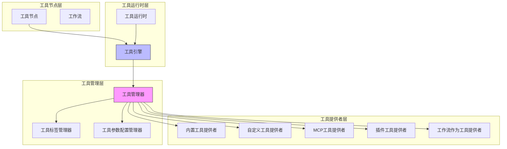
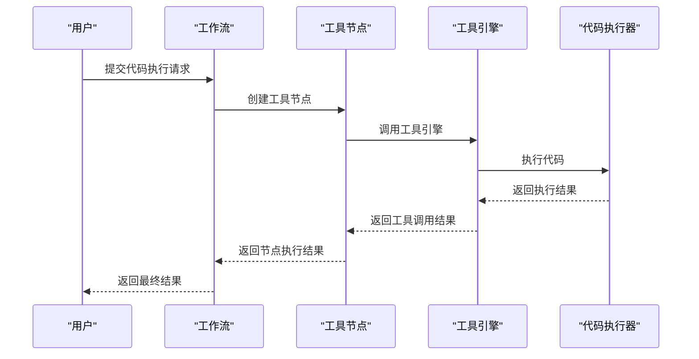
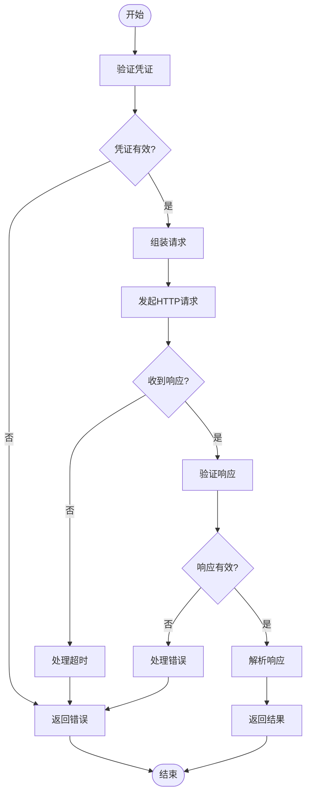
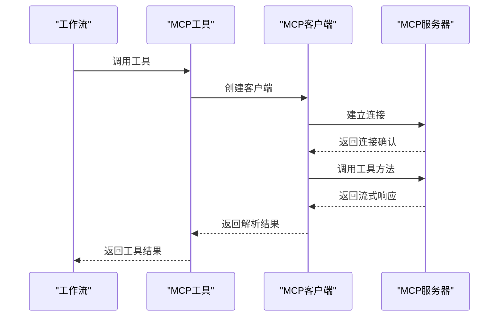
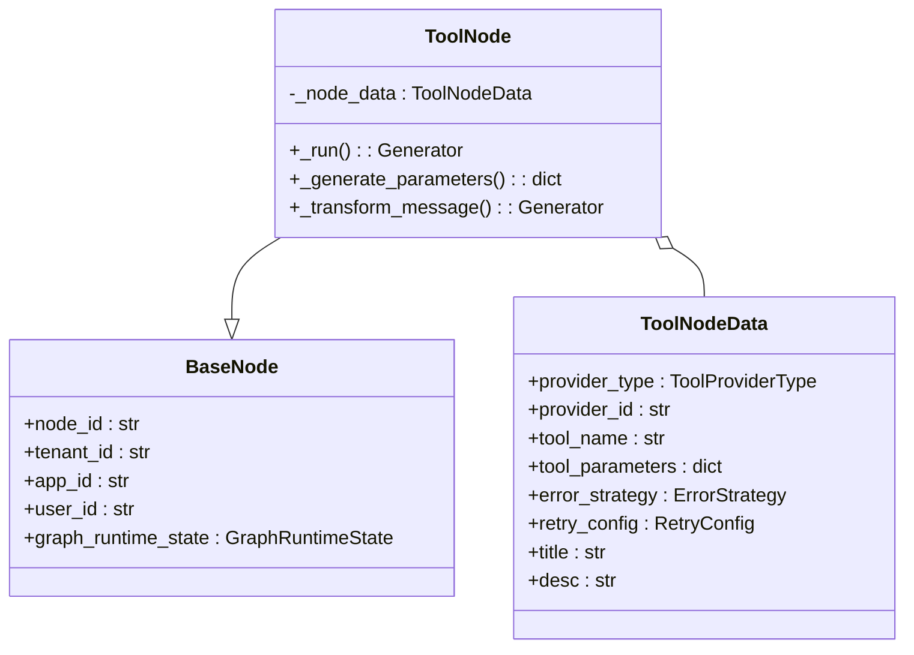
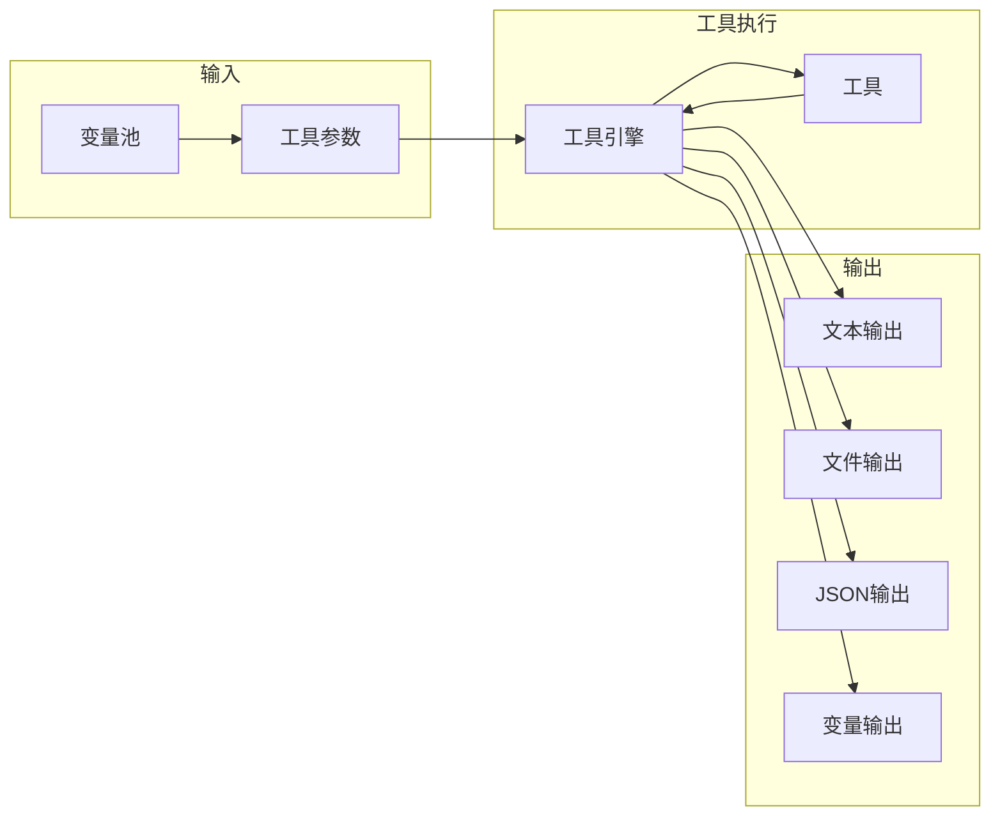
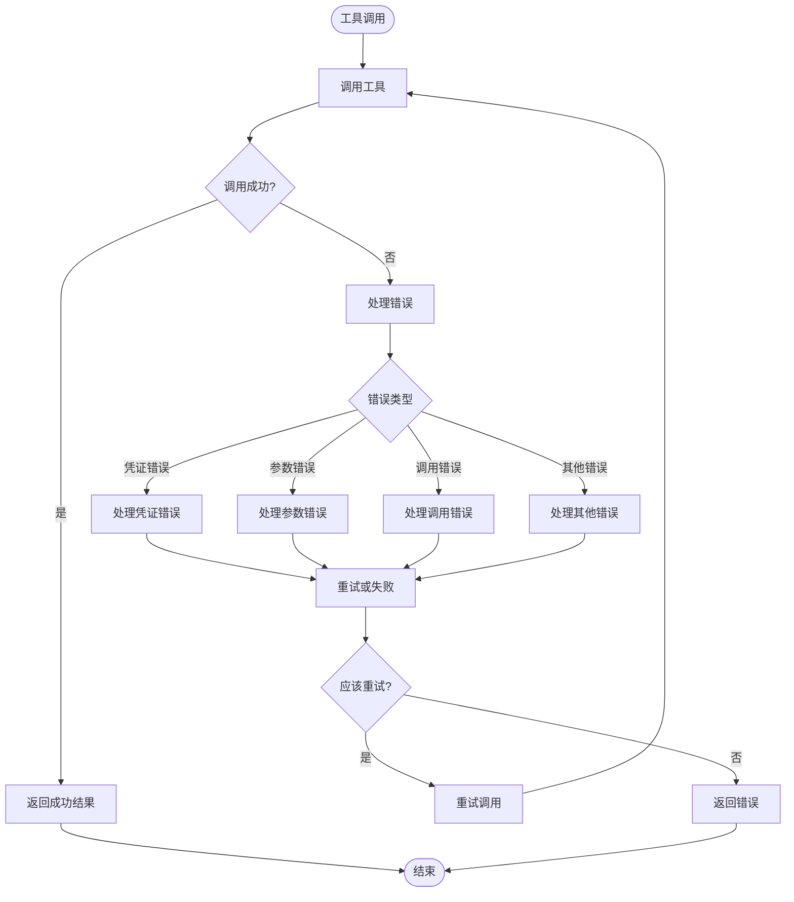
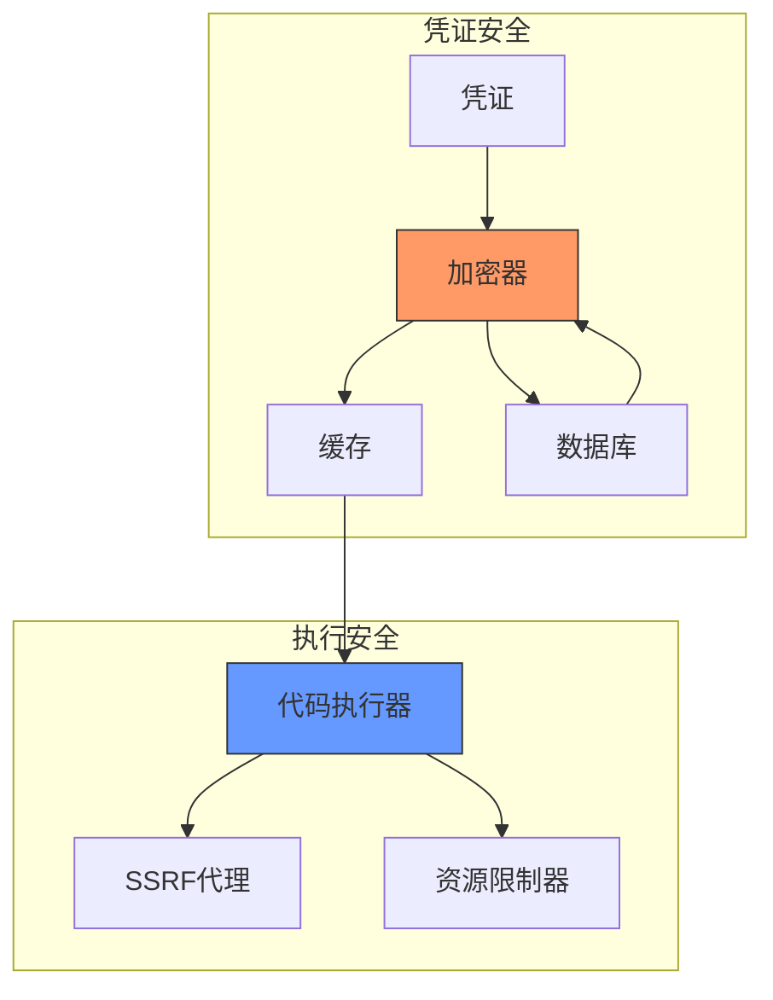
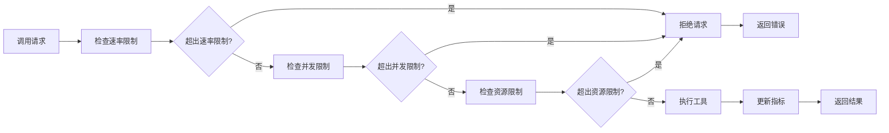

# 工具集成

<cite>
**本文档引用的文件**
- [tool_engine.py](file://api/core/tools/tool_engine.py)
- [tool_node.py](file://api/core/workflow/nodes/tool/tool_node.py)
- [builtin_tool.py](file://api/core/tools/builtin_tool/tool.py)
- [custom_tool.py](file://api/core/tools/custom_tool/tool.py)
- [mcp_tool.py](file://api/core/tools/mcp_tool/tool.py)
- [tool_manager.py](file://api/core/tools/tool_manager.py)
- [simple_code.py](file://api/core/tools/builtin_tool/providers/code/tools/simple_code.py)
- [code.py](file://api/core/tools/builtin_tool/providers/code/code.py)
</cite>

## 目录
1. [简介](#简介)
2. [工具集成架构](#工具集成架构)
3. [内置工具集成](#内置工具集成)
4. [自定义工具集成](#自定义工具集成)
5. [MCP工具集成](#mcp工具集成)
6. [工具节点配置](#工具节点配置)
7. [输入输出映射](#输入输出映射)
8. [错误处理机制](#错误处理机制)
9. [凭证配置与安全沙箱](#凭证配置与安全沙箱)
10. [调用限制策略](#调用限制策略)
11. [常见问题排查](#常见问题排查)

## 简介
Dify工作流工具集成系统提供了一套完整的工具集成框架，支持内置工具、自定义工具和MCP工具的无缝集成。该系统通过统一的工具引擎和工具管理器，实现了工具的注册、配置、调用和监控。用户可以在工作流中灵活调用各类工具，实现复杂业务逻辑的自动化处理。

## 工具集成架构

**图示来源**
- [tool_manager.py](file://api/core/tools/tool_manager.py)
- [tool_engine.py](file://api/core/tools/tool_engine.py)

**本节来源**
- [tool_manager.py](file://api/core/tools/tool_manager.py#L1-L1022)
- [tool_engine.py](file://api/core/tools/tool_engine.py#L1-L355)

## 内置工具集成

内置工具是Dify平台预置的常用功能工具，包括HTTP请求、代码执行、时间处理和网页抓取等。这些工具通过`BuiltinToolProviderController`进行管理，用户无需额外配置即可直接使用。

### 代码执行工具
代码执行工具支持Python3和JavaScript语言，通过安全沙箱环境执行用户提供的代码。工具使用`CodeExecutor`组件进行代码执行，确保执行过程的安全性。

**图示来源**
- [simple_code.py](file://api/core/tools/builtin_tool/providers/code/tools/simple_code.py)
- [tool_engine.py](file://api/core/tools/tool_engine.py)

**本节来源**
- [simple_code.py](file://api/core/tools/builtin_tool/providers/code/tools/simple_code.py#L1-L33)
- [code.py](file://api/core/tools/builtin_tool/providers/code/code.py#L1-L8)

### HTTP请求工具
HTTP请求工具允许工作流发起HTTP请求，支持GET、POST、PUT、DELETE等方法。工具通过`ssrf_proxy`组件进行请求代理，防止SSRF攻击。

## 自定义工具集成

自定义工具允许用户集成外部API服务，通过OpenAPI规范定义工具接口。工具配置包括服务器URL、请求方法、参数定义和认证方式。

### 工具配置流程
1. 在Dify控制台创建自定义工具
2. 定义工具的OpenAPI规范
3. 配置认证方式（API Key、OAuth等）
4. 测试工具连接
5. 在工作流中使用工具

### 认证方式
自定义工具支持多种认证方式：
- API Key（Header）
- API Key（Query Parameter）
- OAuth 2.0
- 无认证

**图示来源**
- [custom_tool.py](file://api/core/tools/custom_tool/tool.py)

**本节来源**
- [custom_tool.py](file://api/core/tools/custom_tool/tool.py#L1-L404)

## MCP工具集成

MCP（Model Context Protocol）工具是基于MCP协议的智能工具，通过MCP客户端与工具服务器通信。MCP工具支持流式响应和复杂数据类型（文本、图像、JSON等）。

### MCP工具调用流程
1. 创建MCP客户端连接
2. 验证MCP服务器认证
3. 调用指定工具方法
4. 处理流式响应
5. 解析返回结果

**图示来源**
- [mcp_tool.py](file://api/core/tools/mcp_tool/tool.py)

**本节来源**
- [mcp_tool.py](file://api/core/tools/mcp_tool/tool.py#L1-L108)

## 工具节点配置

工具节点是工作流中调用工具的基本单元，配置参数包括工具提供者类型、提供者ID、工具名称、参数配置和错误处理策略。

### 配置参数
- **工具提供者类型**: 内置工具、自定义工具、MCP工具等
- **提供者ID**: 工具提供者的唯一标识
- **工具名称**: 要调用的工具名称
- **参数配置**: 工具参数的值或变量引用
- **错误策略**: 失败时的处理策略（继续、终止、重试）
- **重试配置**: 重试次数和间隔

**图示来源**
- [tool_node.py](file://api/core/workflow/nodes/tool/tool_node.py)

**本节来源**
- [tool_node.py](file://api/core/workflow/nodes/tool/tool_node.py#L1-L466)

## 输入输出映射

工具节点支持灵活的输入输出映射机制，允许将工作流变量作为工具参数，并将工具输出映射到工作流变量。

### 输入映射
输入映射支持三种类型：
- **变量引用**: 引用工作流中的变量值
- **常量值**: 固定的常量值
- **混合模式**: 变量和常量的组合

### 输出映射
工具执行结果包含多种输出类型：
- **文本**: 工具返回的文本内容
- **文件**: 工具生成的文件
- **JSON**: 工具返回的JSON数据
- **变量**: 工具设置的变量值

**图示来源**
- [tool_node.py](file://api/core/workflow/nodes/tool/tool_node.py)
- [tool_engine.py](file://api/core/tools/tool_engine.py)

**本节来源**
- [tool_node.py](file://api/core/workflow/nodes/tool/tool_node.py#L1-L466)
- [tool_engine.py](file://api/core/tools/tool_engine.py#L1-L355)

## 错误处理机制

Dify工具集成系统提供了完善的错误处理机制，包括错误分类、错误策略和错误回调。

### 错误类型
- **工具未找到**: 指定的工具不存在
- **凭证验证失败**: 工具认证信息无效
- **参数验证失败**: 工具参数不符合要求
- **工具调用失败**: 工具执行过程中发生错误
- **引擎调用失败**: 工具引擎调用失败

### 错误策略
- **继续执行**: 忽略错误，继续执行后续节点
- **终止执行**: 停止工作流执行
- **重试执行**: 按照配置重试工具调用

**图示来源**
- [tool_engine.py](file://api/core/tools/tool_engine.py)
- [tool_node.py](file://api/core/workflow/nodes/tool/tool_node.py)

**本节来源**
- [tool_engine.py](file://api/core/tools/tool_engine.py#L1-L355)
- [tool_node.py](file://api/core/workflow/nodes/tool/tool_node.py#L1-L466)

## 凭证配置与安全沙箱

Dify平台通过加密存储和安全沙箱机制确保工具集成的安全性。

### 凭证管理
- **加密存储**: 所有凭证信息使用租户密钥加密存储
- **缓存机制**: 使用Redis缓存解密后的凭证，提高性能
- **过期处理**: 自动处理OAuth凭证的过期和刷新

### 安全沙箱
- **代码执行沙箱**: Python和JavaScript代码在隔离环境中执行
- **网络访问控制**: 限制工具的网络访问范围，防止SSRF攻击
- **资源限制**: 限制工具执行的CPU、内存和执行时间

**图示来源**
- [tool_manager.py](file://api/core/tools/tool_manager.py)
- [custom_tool.py](file://api/core/tools/custom_tool/tool.py)
- [simple_code.py](file://api/core/tools/builtin_tool/providers/code/tools/simple_code.py)

**本节来源**
- [tool_manager.py](file://api/core/tools/tool_manager.py#L1-L1022)
- [custom_tool.py](file://api/core/tools/custom_tool/tool.py#L1-L404)
- [simple_code.py](file://api/core/tools/builtin_tool/providers/code/tools/simple_code.py#L1-L33)

## 调用限制策略

为防止滥用和资源耗尽，Dify平台实施了多种调用限制策略。

### 限制类型
- **速率限制**: 限制单位时间内的调用次数
- **并发限制**: 限制同时执行的工具数量
- **资源限制**: 限制单次调用的资源使用
- **配额限制**: 限制每日或每月的总调用次数

### 实现机制
- **租户级限制**: 基于租户的调用配额
- **工具级限制**: 基于特定工具的调用限制
- **用户级限制**: 基于用户的调用限制

**图示来源**
- [tool_engine.py](file://api/core/tools/tool_engine.py)
- [tool_manager.py](file://api/core/tools/tool_manager.py)

**本节来源**
- [tool_engine.py](file://api/core/tools/tool_engine.py#L1-L355)
- [tool_manager.py](file://api/core/tools/tool_manager.py#L1-L1022)

## 常见问题排查

### 凭证错误
**症状**: 工具调用返回"凭证验证失败"错误
**解决方案**:
1. 检查凭证是否正确配置
2. 对于OAuth工具，重新进行授权
3. 检查凭证是否已过期

### 超时设置
**症状**: 工具调用超时
**解决方案**:
1. 检查目标服务是否响应缓慢
2. 调整API工具的超时设置
3. 优化工具执行逻辑

### 网络访问限制
**症状**: 工具调用无法访问外部服务
**解决方案**:
1. 检查网络连接是否正常
2. 确认目标服务地址是否可达
3. 检查防火墙或代理设置

### 代码执行错误
**症状**: 代码工具执行失败
**解决方案**:
1. 检查代码语法是否正确
2. 确认使用的语言是否支持
3. 检查代码是否超出资源限制

**本节来源**
- [tool_engine.py](file://api/core/tools/tool_engine.py#L1-L355)
- [tool_node.py](file://api/core/workflow/nodes/tool/tool_node.py#L1-L466)
- [custom_tool.py](file://api/core/tools/custom_tool/tool.py#L1-L404)
- [mcp_tool.py](file://api/core/tools/mcp_tool/tool.py#L1-L108)