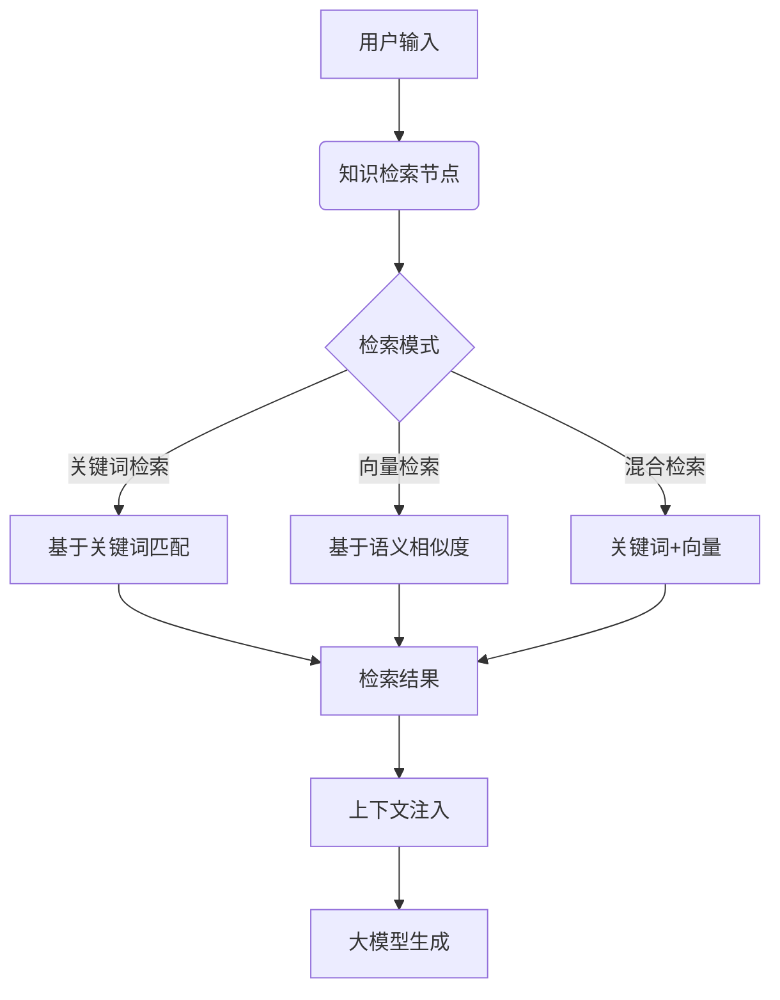
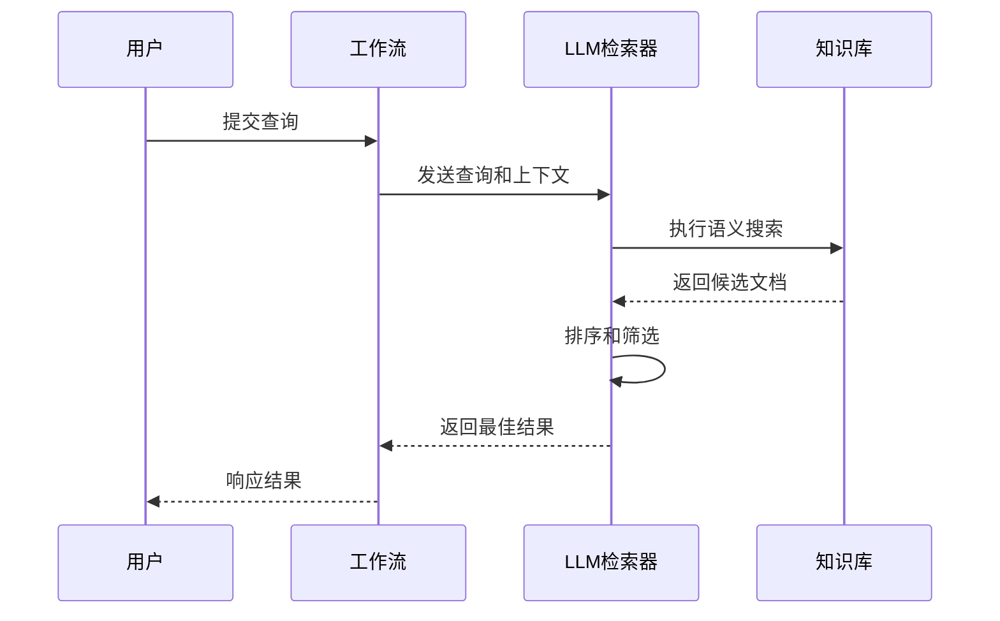
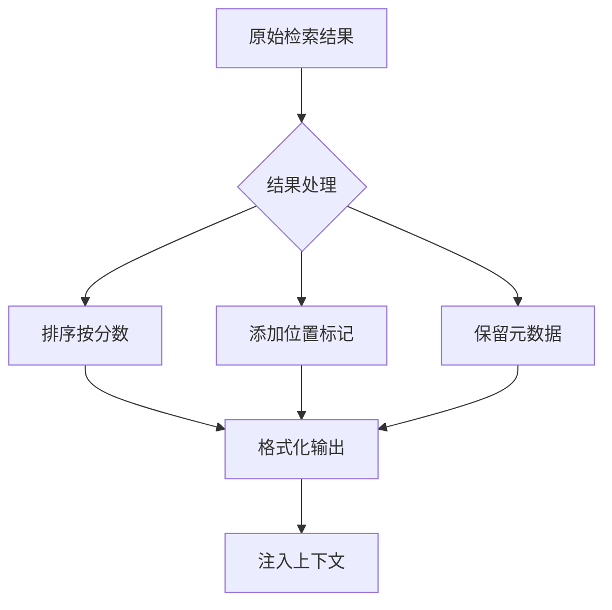

# 知识库集成

<cite>
**本文档中引用的文件**  
- [knowledge_retrieval_node.py](file://api/core/workflow/nodes/knowledge_retrieval/knowledge_retrieval_node.py)
- [entities.py](file://api/core/workflow/nodes/knowledge_retrieval/entities.py)
- [node.tsx](file://web/app/components/workflow/nodes/knowledge-retrieval/node.tsx)
- [panel.tsx](file://web/app/components/workflow/nodes/knowledge-retrieval/panel.tsx)
- [use-config.ts](file://web/app/components/workflow/nodes/knowledge-retrieval/use-config.ts)
- [workflow_converter.py](file://api/services/workflow/workflow_converter.py)
- [test_workflow_converter.py](file://api/tests/unit_tests/services/workflow/test_workflow_converter.py)
</cite>

## 目录
1. [简介](#简介)
2. [工作流与知识库集成概述](#工作流与知识库集成概述)
3. [知识检索节点配置](#知识检索节点配置)
4. [检索模式详解](#检索模式详解)
5. [上下文注入与引用标注](#上下文注入与引用标注)
6. [高级检索功能](#高级检索功能)
7. [性能优化与最佳实践](#性能优化与最佳实践)
8. [错误处理与异常应对](#错误处理与异常应对)
9. [结论](#结论)

## 简介
Dify平台通过工作流中的知识检索节点实现与知识库组件的深度集成。该集成机制允许工作流从预定义的知识库中检索相关信息，并将检索结果作为上下文注入到后续的模型调用中，从而增强生成内容的相关性和准确性。本文档详细说明了知识检索节点的配置方式、检索机制、高级功能及优化策略。

## 工作流与知识库集成概述
知识检索节点是Dify工作流中的核心组件之一，负责从一个或多个数据集中检索与用户查询相关的信息。该节点通过配置化的界面进行设置，支持多种检索模式和过滤条件，能够灵活适应不同的应用场景。



**图示来源**  
- [knowledge_retrieval_node.py](file://api/core/workflow/nodes/knowledge_retrieval/knowledge_retrieval_node.py#L134-L171)
- [entities.py](file://api/core/workflow/nodes/knowledge_retrieval/entities.py#L1-L134)

**本节来源**  
- [knowledge_retrieval_node.py](file://api/core/workflow/nodes/knowledge_retrieval/knowledge_retrieval_node.py#L1-L776)
- [node.tsx](file://web/app/components/workflow/nodes/knowledge-retrieval/node.tsx#L0-L35)

## 知识检索节点配置
知识检索节点的配置主要包括数据集选择、查询变量指定、检索模式设置等关键参数。

### 数据集选择
用户可通过界面选择一个或多个数据集作为检索源。每个数据集包含已索引的文档集合，支持多种数据源类型（如本地文档、外部API等）。

### 查询变量配置
检索节点通过`query_variable_selector`参数指定用于检索的查询变量。该变量通常来自工作流中的前序节点输出，如用户输入或系统变量。

```json
{
  "query_variable_selector": ["sys", "query"],
  "dataset_ids": ["dataset_1", "dataset_2"],
  "retrieval_mode": "multiple"
}
```

**本节来源**  
- [entities.py](file://api/core/workflow/nodes/knowledge_retrieval/entities.py#L70-L80)
- [workflow_converter.py](file://api/services/workflow/workflow_converter.py#L346-L374)

## 检索模式详解
Dify支持三种主要的检索模式：单模型检索（Single）、多路检索（Multiple），每种模式适用于不同的场景。

### 单模型检索模式
在单模型检索模式下，系统使用指定的大语言模型（LLM）作为检索器，通过模型的推理能力进行信息提取和匹配。



**图示来源**  
- [knowledge_retrieval_node.py](file://api/core/workflow/nodes/knowledge_retrieval/knowledge_retrieval_node.py#L240-L280)
- [entities.py](file://api/core/workflow/nodes/knowledge_retrieval/entities.py#L50-L60)

### 多路检索模式
多路检索模式支持更复杂的检索策略，包括：

- **Top-K设置**：指定返回的最相关文档数量
- **相似度阈值**：设置结果的最低相似度分数
- **重排序（Reranking）**：使用专门的重排序模型对初步检索结果进行二次排序

```python
class MultipleRetrievalConfig(BaseModel):
    top_k: int
    score_threshold: Optional[float] = None
    reranking_mode: str = "reranking_model"
    reranking_enable: bool = True
    reranking_model: Optional[RerankingModelConfig] = None
```

**本节来源**  
- [entities.py](file://api/core/workflow/nodes/knowledge_retrieval/entities.py#L30-L50)
- [test_workflow_converter.py](file://api/tests/unit_tests/services/workflow/test_workflow_converter.py#L180-L210)

## 上下文注入与引用标注
检索结果的处理机制包括上下文注入和引用标注两个核心功能。

### 上下文注入机制
检索到的文档内容会被格式化为结构化数据，并注入到后续节点的上下文中。系统会自动对结果进行排序，按相关性从高到低排列。

### 引用标注功能
每个检索结果都包含完整的元数据信息，包括：
- 数据集ID和名称
- 文档ID和名称
- 相似度分数
- 检索位置
- 原始元数据

这些信息可用于在最终输出中添加引用标注，提高结果的可追溯性。



**图示来源**  
- [knowledge_retrieval_node.py](file://api/core/workflow/nodes/knowledge_retrieval/knowledge_retrieval_node.py#L396-L420)
- [panel.tsx](file://web/app/components/workflow/nodes/knowledge-retrieval/panel.tsx#L0-L39)

**本节来源**  
- [knowledge_retrieval_node.py](file://api/core/workflow/nodes/knowledge_retrieval/knowledge_retrieval_node.py#L300-L420)

## 高级检索功能
Dify提供了多种高级检索功能，以满足复杂场景的需求。

### 多数据集检索
支持同时从多个数据集中检索信息，系统会合并所有数据集的结果并进行统一排序。

### 过滤条件应用
支持基于元数据的过滤条件，包括：
- 手动过滤：用户自定义过滤规则
- 自动过滤：由LLM根据查询自动推断过滤条件

### 元数据查询
通过`metadata_filtering_mode`参数控制元数据过滤行为，支持"disabled"、"automatic"和"manual"三种模式。

```python
def _get_metadata_filter_condition(
    self, dataset_ids: list, query: str, node_data: KnowledgeRetrievalNodeData
) -> tuple[Optional[dict[str, list[str]]], Optional[MetadataCondition]]:
```

**本节来源**  
- [knowledge_retrieval_node.py](file://api/core/workflow/nodes/knowledge_retrieval/knowledge_retrieval_node.py#L420-L500)
- [use-config.ts](file://web/app/components/workflow/nodes/knowledge-retrieval/use-config.ts#L40-L68)

## 性能优化与最佳实践
为确保知识检索的高效性和准确性，建议遵循以下最佳实践。

### 文档分块策略
合理的文档分块是提高检索质量的关键。建议：
- 保持分块大小适中（通常300-500字）
- 在语义边界处进行分割
- 保留必要的上下文信息

### 索引更新机制
系统通过事件驱动的方式维护索引的实时性：
- 文档创建/更新时自动触发索引构建
- 支持批量索引更新
- 提供索引状态监控

### 性能调优建议
- 合理设置`top_k`值，平衡性能和质量
- 根据应用场景调整相似度阈值
- 选择合适的重排序模型

**本节来源**  
- [knowledge_retrieval_node.py](file://api/core/workflow/nodes/knowledge_retrieval/knowledge_retrieval_node.py#L170-L196)
- [events/document_index_event.py](file://api/events/document_index_event.py)

## 错误处理与异常应对
系统提供了完善的错误处理机制来应对各种异常情况。

### 检索失败处理
当检索过程出现错误时，系统会返回详细的错误信息，包括：
- 错误类型
- 错误描述
- 可能的原因

### 空结果应对
对于空检索结果，建议：
- 检查查询语句的准确性
- 验证数据集是否包含相关内容
- 调整检索参数（如降低相似度阈值）

### 相关性不足策略
当检索结果相关性不足时，可以：
- 优化查询表达
- 扩大检索范围
- 调整重排序参数

```python
except KnowledgeRetrievalNodeError as e:
    return NodeRunResult(
        status=WorkflowNodeExecutionStatus.FAILED,
        inputs=variables,
        error=str(e),
        error_type=type(e).__name__,
    )
```

**本节来源**  
- [knowledge_retrieval_node.py](file://api/core/workflow/nodes/knowledge_retrieval/knowledge_retrieval_node.py#L195-L227)
- [errors.py](file://api/core/workflow/nodes/knowledge_retrieval/exc.py)

## 结论
Dify的工作流知识库集成提供了强大而灵活的信息检索能力。通过合理配置知识检索节点，结合适当的优化策略，可以显著提升应用的智能化水平和用户体验。建议开发者根据具体应用场景，深入理解各种检索模式和配置选项，以实现最佳的检索效果。