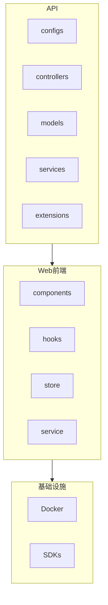
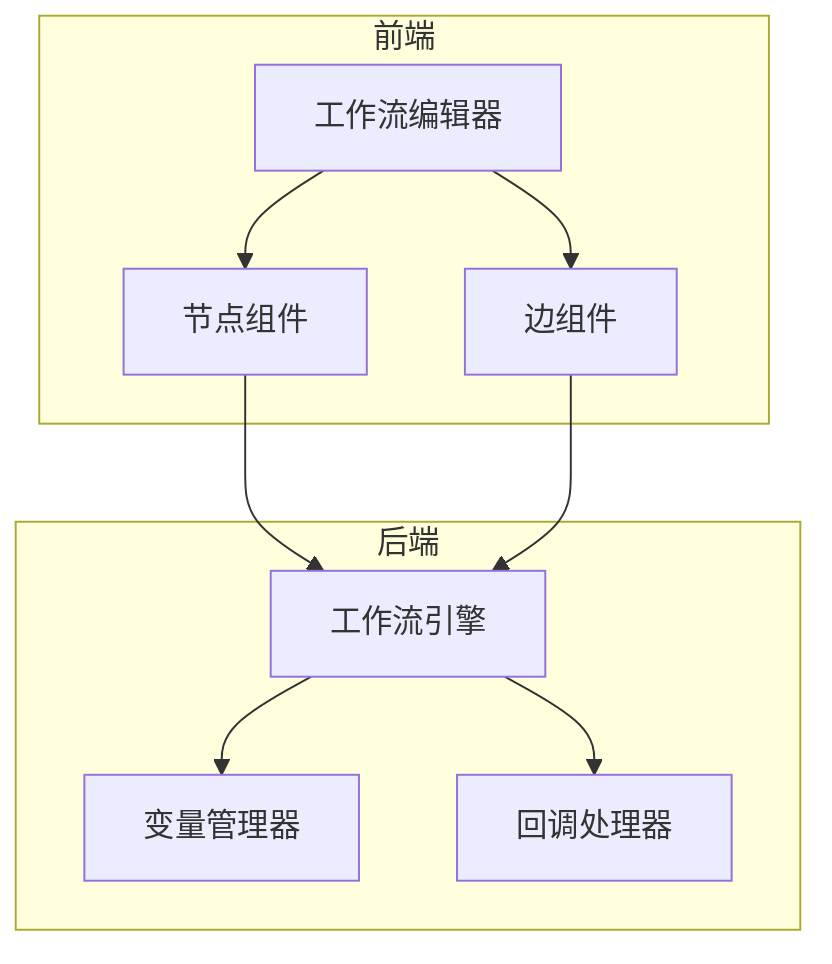
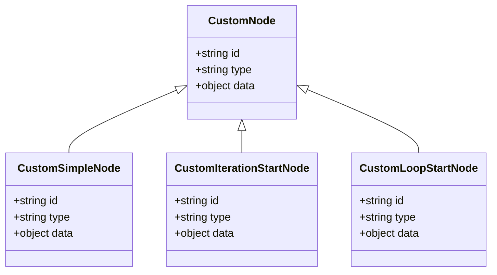
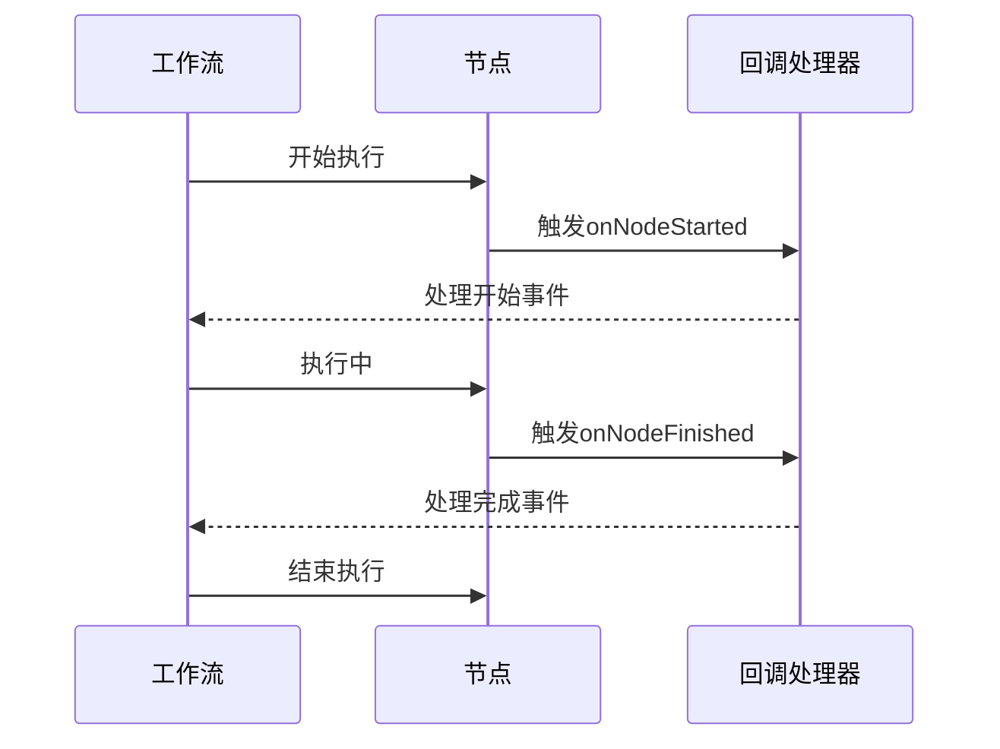
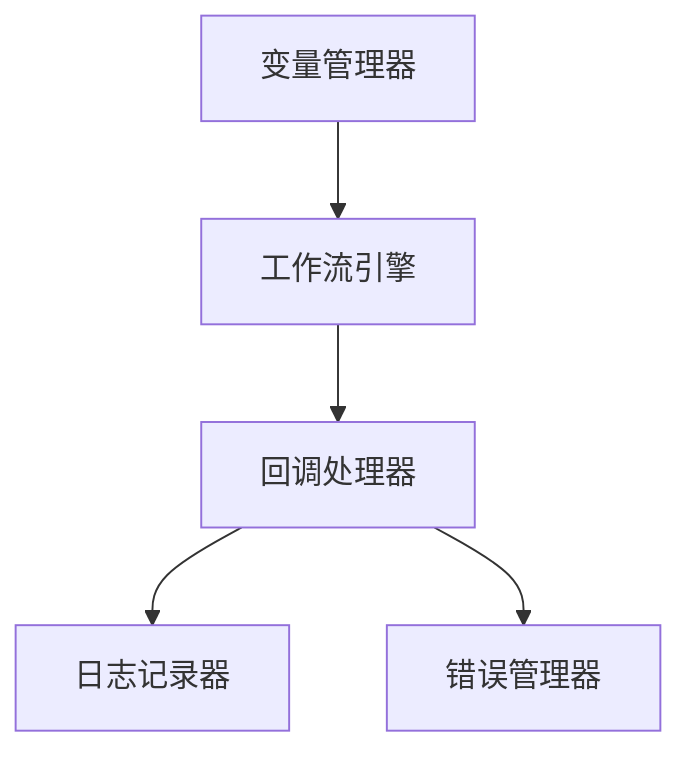

# 自定义扩展

<cite>
**本文档引用的文件**
- [constants.ts](file://web/app/components/workflow/constants.ts)
- [simple-node/constants.ts](file://web/app/components/workflow/simple-node/constants.ts)
- [nodes/index.tsx](file://web/app/components/workflow/nodes/index.tsx)
- [use-workflow-run-event.ts](file://web/app/components/workflow/hooks/use-workflow-run-event/use-workflow-run-event.ts)
- [use-workflow-run.ts](file://web/app/components/workflow-app/hooks/use-workflow-run.ts)
- [workflow_cycle_manager.py](file://api/core/workflow/workflow_cycle_manager.py)
- [use-set-workflow-vars-with-value.ts](file://web/app/components/workflow/hooks/use-set-workflow-vars-with-value.ts)
- [workflow-store.ts](file://web/app/components/workflow/store/workflow.ts)
</cite>

## 目录
1. [简介](#简介)
2. [项目结构](#项目结构)
3. [核心组件](#核心组件)
4. [架构概述](#架构概述)
5. [详细组件分析](#详细组件分析)
6. [依赖分析](#依赖分析)
7. [性能考虑](#性能考虑)
8. [故障排除指南](#故障排除指南)
9. [结论](#结论)

## 简介
本文档旨在为开发者提供创建Dify工作流自定义节点的全面指导。文档涵盖了扩展点的接口规范、生命周期方法和注册机制，详细说明了从环境搭建到部署测试的完整流程。同时，文档还包含了自定义节点与核心系统（如变量管理、日志记录、错误处理）集成的示例，以及安全考虑、性能监控和版本兼容性要求。此外，文档还提供了调试技巧和最佳实践，如状态管理、异常处理和资源清理，并说明了扩展的打包、分发和更新策略。

## 项目结构
Dify项目采用模块化设计，主要分为API、Web前端、Docker配置、SDKs等部分。API部分包含核心业务逻辑、控制器、模型和扩展功能；Web前端部分使用React框架，包含工作流、组件、服务等模块；Docker配置提供了容器化部署的支持；SDKs则为不同编程语言提供了客户端库。

**Diagram sources**
- [project_structure](file://project_structure)

## 核心组件
Dify工作流的核心组件包括节点管理、变量管理、执行引擎和回调处理。节点管理负责定义和注册各种工作流节点；变量管理处理环境变量和会话变量；执行引擎负责工作流的执行和调度；回调处理则用于监听和响应工作流事件。

**Section sources**
- [constants.ts](file://web/app/components/workflow/constants.ts)
- [workflow_cycle_manager.py](file://api/core/workflow/workflow_cycle_manager.py)

## 架构概述
Dify工作流的架构基于React Flow库构建，采用组件化设计。工作流由节点和边组成，节点代表不同的操作，边代表数据流。工作流的执行由执行引擎控制，通过回调机制监听和响应各种事件。

**Diagram sources**
- [nodes/index.tsx](file://web/app/components/workflow/nodes/index.tsx)
- [use-workflow-run.ts](file://web/app/components/workflow-app/hooks/use-workflow-run.ts)

## 详细组件分析
### 节点类型分析
Dify工作流支持多种节点类型，包括自定义节点、简单节点、迭代开始节点和循环开始节点。每种节点类型都有其特定的用途和实现方式。

#### 节点类型定义

**Diagram sources**
- [nodes/index.tsx](file://web/app/components/workflow/nodes/index.tsx)

### 生命周期方法分析
Dify工作流提供了丰富的生命周期方法，用于监听和响应工作流的不同阶段。

#### 生命周期方法调用流程

**Diagram sources**
- [use-workflow-run-event.ts](file://web/app/components/workflow/hooks/use-workflow-run-event/use-workflow-run-event.ts)

## 依赖分析
Dify工作流依赖于多个核心模块，包括变量管理、执行引擎和回调处理。这些模块之间通过清晰的接口进行通信，确保了系统的可维护性和可扩展性。

**Diagram sources**
- [workflow_cycle_manager.py](file://api/core/workflow/workflow_cycle_manager.py)

## 性能考虑
在设计和实现自定义工作流节点时，需要考虑性能因素。建议采用异步处理、缓存机制和资源池化等技术来提高系统性能。同时，应避免在节点执行过程中进行耗时操作，以免影响整体工作流的执行效率。

## 故障排除指南
### 常见问题及解决方案
- **问题：节点无法正常执行**
  - **解决方案**：检查节点的输入参数是否正确，确保所有依赖项都已正确配置。
- **问题：工作流执行超时**
  - **解决方案**：优化节点的执行逻辑，减少不必要的计算和I/O操作。
- **问题：变量值不正确**
  - **解决方案**：检查变量的定义和赋值逻辑，确保在正确的时机进行变量更新。

**Section sources**
- [use-set-workflow-vars-with-value.ts](file://web/app/components/workflow/hooks/use-set-workflow-vars-with-value.ts)

## 结论
通过本文档的指导，开发者可以全面了解Dify工作流的自定义扩展机制，掌握从环境搭建到部署测试的完整流程。文档提供的示例和最佳实践有助于开发者快速上手，创建高效、可靠的自定义工作流节点。