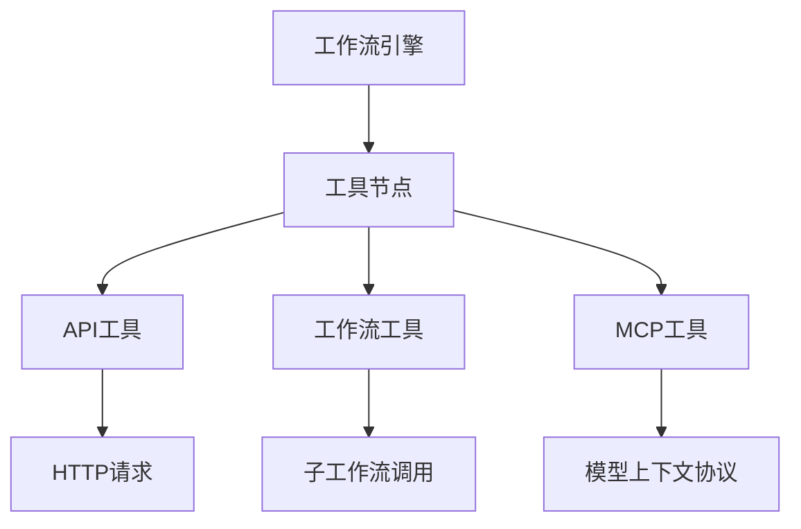
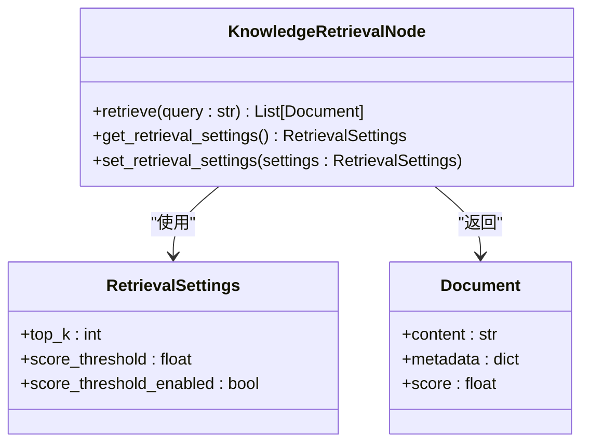
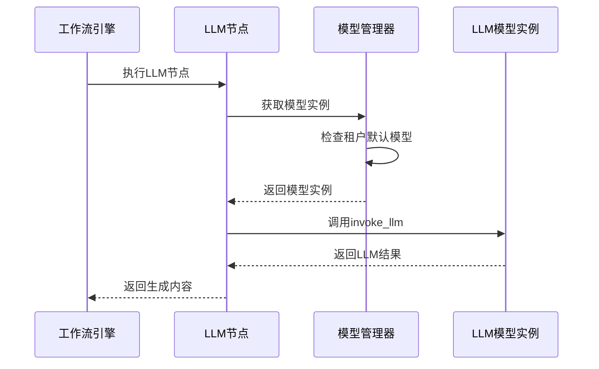
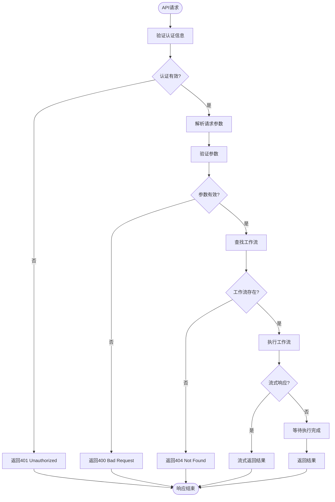
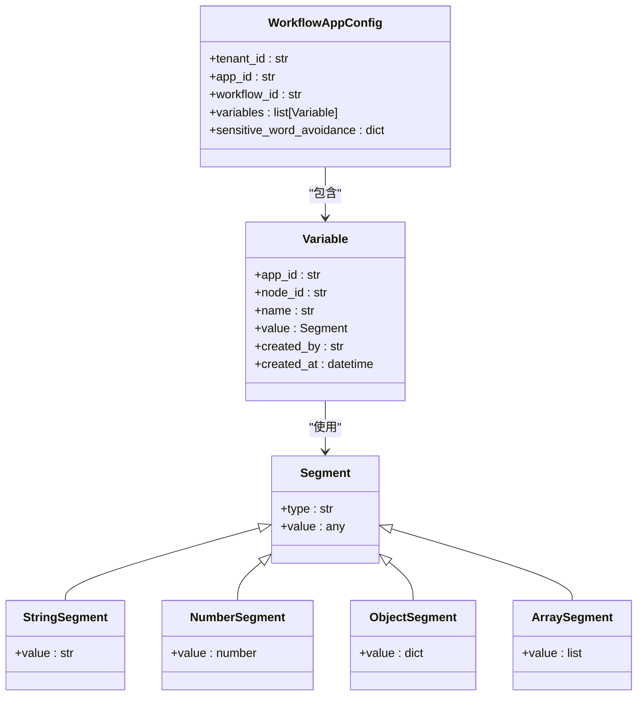
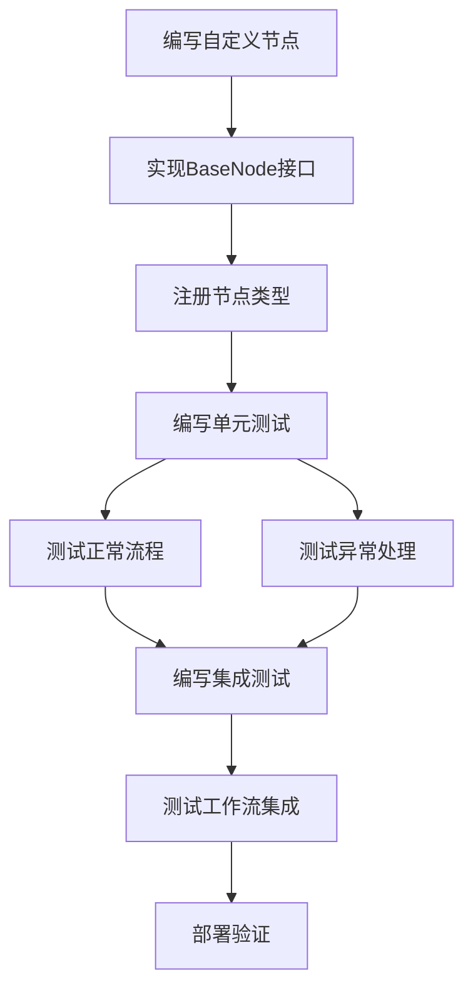
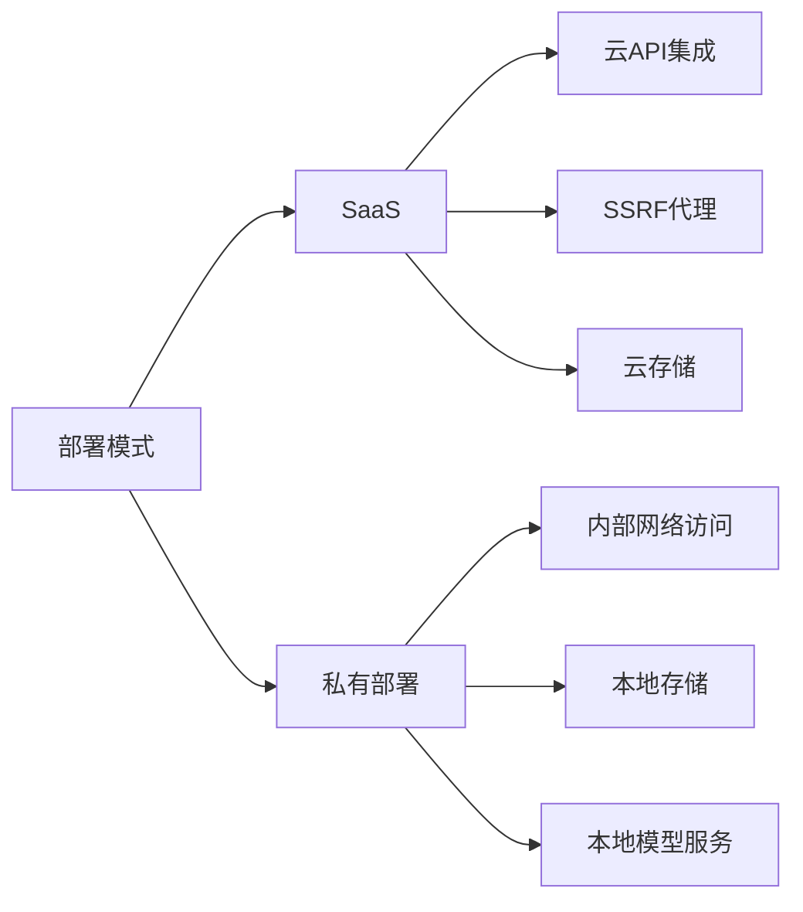

# 集成与扩展

<cite>
**本文档中引用的文件**  
- [workflow_fields.py](file://api/fields/workflow_fields.py)
- [test_workflow_converter.py](file://api/tests/unit_tests/services/workflow/test_workflow_converter.py)
- [llm_generator.py](file://api/core/llm_generator/llm_generator.py)
- [types.ts](file://web/app/components/tools/types.ts)
- [workflow.py](file://api/controllers/service_api/app/workflow.py)
- [tool_providers.py](file://api/controllers/console/workspace/tool_providers.py)
- [app.py](file://api/controllers/service_api/app/app.py)
- [chat/app_config_manager.py](file://api/core/app/apps/chat/app_config_manager.py)
- [entities.py](file://api/core/app/app_config/entities.py)
- [workflow_draft_variable.py](file://api/controllers/console/app/workflow_draft_variable.py)
- [workflow_draft_variable_service.py](file://api/services/workflow_draft_variable_service.py)
- [test_sync_workflow.py](file://api/tests/integration_tests/workflow/test_sync_workflow.py)
- [workflow_converter.py](file://api/services/workflow_service.py)
- [workflow_service.py](file://api/services/workflow_service.py)
- [workflow.py](file://api/controllers/web/workflow.py)
- [app_config_manager.py](file://api/core/app/apps/workflow/app_config_manager.py)
- [node_mapping.py](file://api/core/workflow/nodes/node_mapping.py)
- [nodes](file://api/core/workflow/nodes)
</cite>

## 目录
1. [简介](#简介)
2. [工作流与外部系统集成](#工作流与外部系统集成)
3. [知识库访问机制](#知识库访问机制)
4. [LLM模型使用策略](#llm模型使用策略)
5. [工作流API服务暴露机制](#工作流api服务暴露机制)
6. [与应用配置和变量管理的交互](#与应用配置和变量管理的交互)
7. [自定义节点开发指南](#自定义节点开发指南)
8. [不同部署模式下的集成差异](#不同部署模式下的集成差异)

## 简介
Dify平台的工作流系统提供了一套完整的集成与扩展机制，支持与外部工具、知识库和多种LLM模型的深度集成。本文档详细说明了工作流系统的集成架构、API暴露机制、配置交互方式以及自定义开发能力，为开发者提供全面的技术指导。

## 工作流与外部系统集成

Dify工作流系统通过工具节点（Tool Node）实现与外部系统的集成。系统支持多种类型的外部工具集成，包括API工具、工作流工具和MCP（Model Context Protocol）工具。



**Diagram sources**
- [tool_providers.py](file://api/controllers/console/workspace/tool_providers.py#L415-L500)
- [types.ts](file://web/app/components/tools/types.ts#L122-L189)

工作流通过`ToolNode`类实现外部工具调用，支持配置认证方式、请求参数和响应处理。API工具支持Bearer Token、API Key等多种认证方式，并可自定义请求头和参数映射。

**Section sources**
- [tool_providers.py](file://api/controllers/console/workspace/tool_providers.py#L415-L500)
- [types.ts](file://web/app/components/tools/types.ts#L122-L189)

## 知识库访问机制

工作流系统通过知识检索节点（Knowledge Retrieval Node）访问知识库。知识库可以是内部文档集合，也可以是外部知识API。



**Diagram sources**
- [node_mapping.py](file://api/core/workflow/nodes/node_mapping.py#L0-L135)
- [nodes/knowledge_retrieval](file://api/core/workflow/nodes/knowledge_retrieval)

知识检索支持配置检索参数，包括返回结果数量（top_k）、相似度阈值（score_threshold）和阈值启用状态。外部知识库通过`CreateKnowledgeBaseReq`接口创建和配置。

**Section sources**
- [node_mapping.py](file://api/core/workflow/nodes/node_mapping.py#L0-L135)
- [nodes/knowledge_retrieval](file://api/core/workflow/nodes/knowledge_retrieval)
- [declarations.ts](file://web/app/components/datasets/external-knowledge-base/create/declarations.ts#L0-L11)

## LLM模型使用策略

工作流系统通过LLM节点（LLM Node）使用不同的LLM模型。系统支持模型选择、参数配置和生成策略。



**Diagram sources**
- [llm_generator.py](file://api/core/llm_generator/llm_generator.py#L29-L65)
- [node_mapping.py](file://api/core/workflow/nodes/node_mapping.py#L0-L135)

LLM生成过程包括提示词构建、模型调用和结果处理。系统支持流式响应和非流式响应两种模式，并可配置最大令牌数、温度等参数。

**Section sources**
- [llm_generator.py](file://api/core/llm_generator/llm_generator.py#L29-L65)
- [node_mapping.py](file://api/core/workflow/nodes/node_mapping.py#L0-L135)

## 工作流API服务暴露机制

工作流系统通过RESTful API暴露服务，支持同步和流式响应模式。API端点提供工作流执行、状态查询和日志获取等功能。



**Diagram sources**
- [workflow.py](file://api/controllers/service_api/app/workflow.py#L126-L158)
- [workflow.py](file://api/controllers/service_api/app/workflow.py#L54-L96)

API认证采用API Token机制，请求需在Header中包含`Authorization: Bearer <token>`。响应格式包含执行状态、输入输出、错误信息和性能指标。

**Section sources**
- [workflow.py](file://api/controllers/service_api/app/workflow.py#L54-L158)

## 与应用配置和变量管理的交互

工作流系统与应用配置和变量管理系统深度集成，支持环境变量、会话变量和节点变量的管理。



**Diagram sources**
- [entities.py](file://api/core/app/app_config/entities.py#L296-L324)
- [workflow_draft_variable_service.py](file://api/services/workflow_draft_variable_service.py#L192-L222)

系统提供REST API用于管理各类变量，包括会话变量、系统变量和环境变量。变量管理支持CRUD操作和批量操作。

**Section sources**
- [entities.py](file://api/core/app/app_config/entities.py#L296-L324)
- [workflow_draft_variable.py](file://api/controllers/console/app/workflow_draft_variable.py#L327-L356)
- [workflow_draft_variable_service.py](file://api/services/workflow_draft_variable_service.py#L192-L222)

## 自定义节点开发指南

Dify工作流系统支持自定义节点开发，开发者可以创建新的节点类型扩展工作流功能。

### 节点接口定义

自定义节点需实现`BaseNode`接口，主要方法包括：

```python
class BaseNode(ABC):
    @abstractmethod
    def run(self, 
            graph_engine: GraphEngine,
            node_id: str,
            node_data: NodeData,
            outputs: List[str],
            flow_variables: dict) -> NodeRunResult:
        pass
```

### 节点注册方法

新节点类型需在`node_mapping.py`中注册：

```python
NODE_TYPE_CLASSES_MAPPING: Mapping[NodeType, Mapping[str, type[BaseNode]]] = {
    # ... existing mappings
    NodeType.CUSTOM_NODE: {
        LATEST_VERSION: CustomNode,
        "1": CustomNode,
    },
}
```

### 测试策略

自定义节点应包含单元测试和集成测试，测试用例应覆盖正常流程和异常处理。



**Diagram sources**
- [node_mapping.py](file://api/core/workflow/nodes/node_mapping.py#L0-L135)
- [base/node.py](file://api/core/workflow/nodes/base/node.py)

**Section sources**
- [node_mapping.py](file://api/core/workflow/nodes/node_mapping.py#L0-L135)
- [base](file://api/core/workflow/nodes/base)

## 不同部署模式下的集成差异

Dify支持SaaS和私有部署两种模式，集成方式存在一些差异。

### SaaS模式

在SaaS模式下，集成主要通过公共API和云服务进行：

- 外部工具调用需通过SSRF代理
- 知识库存储在云数据库中
- 模型服务通过云API访问
- 变量数据加密存储在云端

### 私有部署模式

在私有部署模式下，集成更加灵活：

- 外部工具调用可直接访问内部网络
- 知识库可存储在本地数据库或文件系统
- 模型服务可部署在本地GPU集群
- 变量数据可根据安全策略选择加密方式



**Diagram sources**
- [config.py](file://api/configs/app_config.py)
- [hosting_configuration.py](file://api/core/hosting_configuration.py)

**Section sources**
- [config.py](file://api/configs/app_config.py)
- [hosting_configuration.py](file://api/core/hosting_configuration.py)