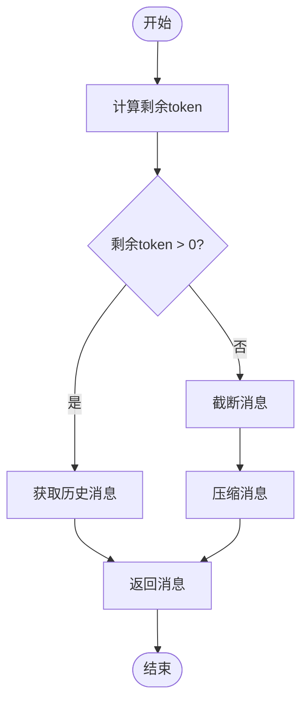
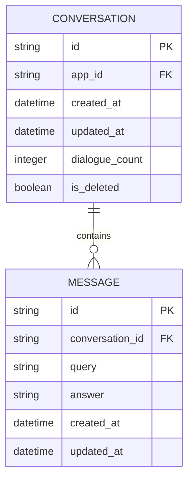
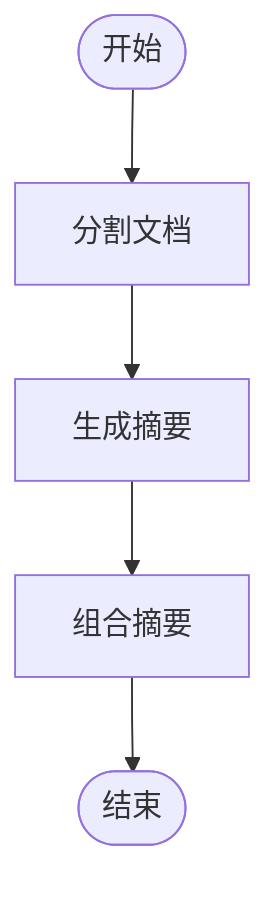

# 上下文管理

<cite>
**本文档引用的文件**   
- [token_buffer_memory.py](file://api/core/memory/token_buffer_memory.py)
- [prompt_transform.py](file://api/core/prompt/prompt_transform.py)
- [llm_utils.py](file://api/core/workflow/nodes/llm/llm_utils.py)
- [test_advanced_prompt_transform.py](file://api/tests/unit_tests/core/prompt/test_advanced_prompt_transform.py)
- [test_simple_prompt_transform.py](file://api/tests/unit_tests/core/prompt/test_simple_prompt_transform.py)
- [context-block/node.tsx](file://web/app/components/base/prompt-editor/plugins/context-block/node.tsx)
- [context-block/index.tsx](file://web/app/components/base/prompt-editor/plugins/context-block/index.tsx)
- [chat-with-history/context.tsx](file://web/app/components/base/chat/chat-with-history/context.tsx)
- [conversation_service.py](file://api/services/conversation_service.py)
- [wrapper.py](file://api/contexts/wrapper.py)
</cite>

## 目录
1. [引言](#引言)
2. [对话历史处理机制](#对话历史处理机制)
3. [上下文窗口优化策略](#上下文窗口优化策略)
4. [消息组织结构](#消息组织结构)
5. [会话状态持久化方法](#会话状态持久化方法)
6. [上下文缓存与记忆增强](#上下文缓存与记忆增强)
7. [跨会话信息继承](#跨会话信息继承)
8. [长文档摘要处理](#长文档摘要处理)
9. [多轮对话连贯性](#多轮对话连贯性)
10. [上下文泄漏防护](#上下文泄漏防护)
11. [上下文长度与优先级配置](#上下文长度与优先级配置)

## 引言
Dify平台的上下文管理机制旨在有效处理对话历史，优化上下文窗口使用，确保在模型token限制内保留关键信息。该系统通过智能截断、压缩和优先级排序策略，维持多轮对话的连贯性，同时防止敏感信息泄漏。本文档详细阐述了Dify上下文管理的核心组件、工作流程和最佳实践。

## 对话历史处理机制
Dify通过TokenBufferMemory类实现对话历史的管理，该类负责存储和检索对话上下文。系统根据模型的token限制自动截断和压缩长对话历史，确保关键信息得以保留。对话历史的处理包括用户消息、助手消息和系统消息的序列化与反序列化，以及基于token数量的动态调整。

**Section sources**
- [token_buffer_memory.py](file://api/core/memory/token_buffer_memory.py)
- [prompt_transform.py](file://api/core/prompt/prompt_transform.py)

## 上下文窗口优化策略
Dify采用多种策略优化上下文窗口的使用，包括自动截断、消息压缩和优先级排序。系统计算剩余token数量，根据模型配置和当前消息的token消耗，动态调整历史消息的数量和长度。对于超出限制的长文本，系统使用摘要生成技术进行压缩，确保上下文的完整性和有效性。

**Diagram sources **
- [prompt_transform.py](file://api/core/prompt/prompt_transform.py#L30-L65)
- [llm_utils.py](file://api/core/workflow/nodes/llm/llm_utils.py#L61-L98)

## 消息组织结构
Dify中的消息组织结构包括系统消息、用户消息和助手消息。系统消息用于定义对话的初始上下文和规则，用户消息代表用户的输入，助手消息是模型的响应。这些消息按时间顺序排列，形成对话历史，供模型在生成响应时参考。

**Section sources**
- [context-block/node.tsx](file://web/app/components/base/prompt-editor/plugins/context-block/node.tsx)
- [context-block/index.tsx](file://web/app/components/base/prompt-editor/plugins/context-block/index.tsx)

## 会话状态持久化方法
会话状态通过数据库和本地存储进行持久化。对话ID、用户输入和对话历史等关键信息被存储在数据库中，确保跨会话的一致性。同时，前端使用localStorage保存会话状态，如侧边栏折叠状态和当前对话ID，提升用户体验。

**Diagram sources **
- [conversation_service.py](file://api/services/conversation_service.py#L163-L200)
- [chat-with-history/context.tsx](file://web/app/components/base/chat/chat-with-history/context.tsx#L38-L74)

## 上下文缓存与记忆增强
Dify通过上下文缓存和记忆增强技术提升对话质量。系统缓存频繁访问的上下文数据，减少数据库查询开销。记忆增强功能允许模型在生成响应时参考更广泛的历史信息，提高对话的连贯性和相关性。

**Section sources**
- [token_buffer_memory.py](file://api/core/memory/token_buffer_memory.py)
- [wrapper.py](file://api/contexts/wrapper.py)

## 跨会话信息继承
Dify支持跨会话的信息继承，允许用户在不同对话中共享上下文。通过会话ID和用户ID的关联，系统能够识别和继承先前对话中的关键信息，如用户偏好和对话主题，从而提供更个性化的服务。

**Section sources**
- [chat-with-history/hooks.tsx](file://web/app/components/base/chat/chat-with-history/hooks.tsx#L107-L141)
- [web-app-context.tsx](file://web/context/web-app-context.tsx#L0-L33)

## 长文档摘要处理
对于长文档的处理，Dify采用分块和摘要生成技术。系统将长文档分割成多个段落，对每个段落生成摘要，然后将摘要组合成最终的上下文。这种方法有效减少了token消耗，同时保留了文档的核心信息。

**Diagram sources **
- [parent_child_index_processor.py](file://api/core/rag/index_processor/processor/parent_child_index_processor.py#L30-L56)
- [clean_processor.py](file://api/core/rag/cleaner/clean_processor.py#L0-L29)

## 多轮对话连贯性
Dify通过维护完整的对话历史和上下文，确保多轮对话的连贯性。系统在生成每条响应时，都会参考之前的对话内容，避免重复提问和信息丢失。此外，上下文窗口的优化策略确保了即使在长对话中，关键信息也能被保留。

**Section sources**
- [test_advanced_prompt_transform.py](file://api/tests/unit_tests/core/prompt/test_advanced_prompt_transform.py#L30-L69)
- [test_simple_prompt_transform.py](file://api/tests/unit_tests/core/prompt/test_simple_prompt_transform.py#L167-L202)

## 上下文泄漏防护
为防止上下文泄漏，Dify实施了严格的数据访问控制和加密措施。系统确保只有授权用户才能访问特定会话的上下文数据。此外，敏感信息在存储和传输过程中被加密，防止未经授权的访问。

**Section sources**
- [share/utils.ts](file://web/app/components/share/utils.ts#L32-L62)
- [web-app-context.tsx](file://web/context/web-app-context.tsx#L60-L101)

## 上下文长度与优先级配置
Dify允许用户配置上下文长度和优先级策略。通过调整模型参数和上下文窗口大小，用户可以根据具体需求优化对话性能。优先级策略确保关键消息在截断时被保留，非关键信息则被优先移除。

**Section sources**
- [prompt_transform.py](file://api/core/prompt/prompt_transform.py#L30-L65)
- [llm_utils.py](file://api/core/workflow/nodes/llm/llm_utils.py#L61-L98)