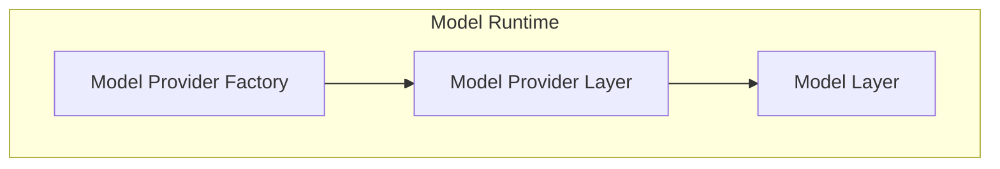
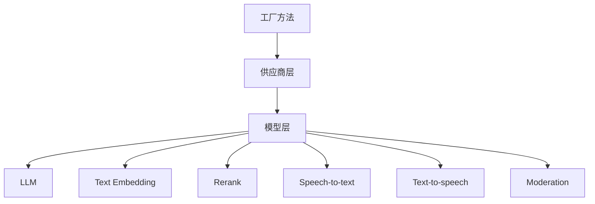
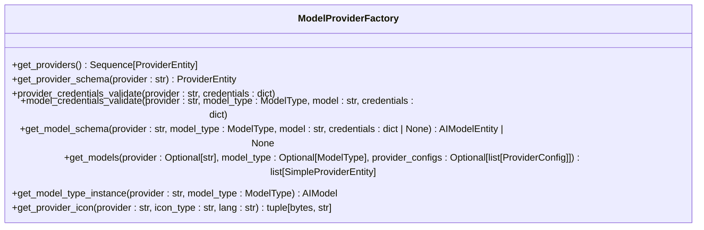
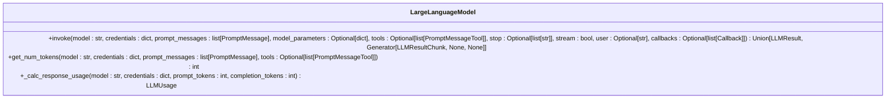
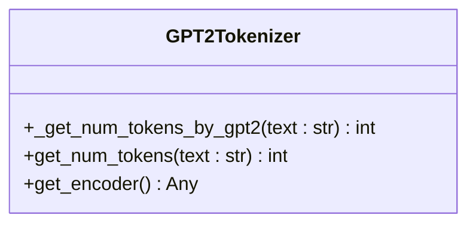
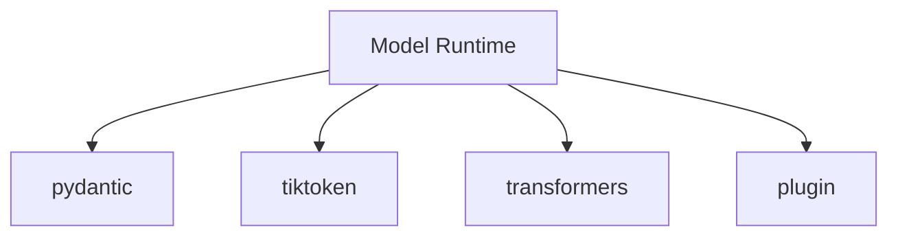

# 多模型适配

<cite>
**本文档中引用的文件**  
- [large_language_model.py](file://api/core/model_runtime/model_providers/__base/large_language_model.py)
- [gpt2_tokenizer.py](file://api/core/model_runtime/model_providers/__base/tokenizers/gpt2_tokenizer.py)
- [llm_entities.py](file://api/core/model_runtime/entities/llm_entities.py)
- [model_provider_factory.py](file://api/core/model_runtime/model_provider_factory.py)
- [README_CN.md](file://api/core/model_runtime/README_CN.md)
</cite>

## 目录
1. [引言](#引言)
2. [项目结构](#项目结构)
3. [核心组件](#核心组件)
4. [架构概述](#架构概述)
5. [详细组件分析](#详细组件分析)
6. [依赖分析](#依赖分析)
7. [性能考量](#性能考量)
8. [故障排除指南](#故障排除指南)
9. [结论](#结论)

## 引言
Dify 是一个支持多模型适配的 AI 应用开发平台，能够兼容多种大语言模型（LLM）提供商和模型架构。本文档详细说明 Dify 如何实现对 OpenAI、Anthropic、Llama 等不同模型家族的兼容性设计，涵盖提示词格式调整、特殊 token 处理、参数配置、模型特性自动识别、预处理与后处理规则应用、跨模型提示词标准化、输出归一化及性能调优方法。同时提供主流模型（如 GPT 系列、Claude、通义千问）的适配案例和自定义模型集成指南。

## 项目结构
Dify 的多模型适配功能主要集中在 `api/core/model_runtime` 模块中，该模块负责模型调用、鉴权接口、模型供应商信息管理及凭据表单规则定义。通过将模型与上下游解耦，方便开发者横向扩展模型支持。

**Diagram sources**
- [model_provider_factory.py](file://api/core/model_runtime/model_provider_factory.py)
- [README_CN.md](file://api/core/model_runtime/README_CN.md)

**Section sources**
- [README_CN.md](file://api/core/model_runtime/README_CN.md)

## 核心组件
Dify 的多模型适配核心组件包括模型提供工厂（Model Provider Factory）、模型层（Model Layer）和 tokenizer 工具。这些组件协同工作，确保不同模型的无缝集成和高效调用。

**Section sources**
- [model_provider_factory.py](file://api/core/model_runtime/model_provider_factory.py)
- [large_language_model.py](file://api/core/model_runtime/model_providers/__base/large_language_model.py)
- [gpt2_tokenizer.py](file://api/core/model_runtime/model_providers/__base/tokenizers/gpt2_tokenizer.py)

## 架构概述
Dify 的多模型适配架构分为三层：最外层为工厂方法，提供获取所有供应商、模型列表、供应商实例及凭据鉴权方法；第二层为供应商层，提供当前供应商模型列表、模型实例、凭据鉴权及配置规则信息；最底层为模型层，提供各种模型类型的直接调用、预定义模型配置信息、获取预定义/远程模型列表及模型凭据鉴权方法。

**Diagram sources**
- [README_CN.md](file://api/core/model_runtime/README_CN.md)

## 详细组件分析

### 模型提供工厂分析
模型提供工厂是 Dify 多模型适配的核心，负责管理所有模型供应商和模型实例。它通过插件机制动态加载模型供应商，并提供统一的接口进行模型调用和凭据验证。

**Diagram sources**
- [model_provider_factory.py](file://api/core/model_runtime/model_provider_factory.py)

**Section sources**
- [model_provider_factory.py](file://api/core/model_runtime/model_provider_factory.py)

### 模型层分析
模型层提供了各种模型类型的直接调用接口，包括 LLM 文本补全、对话、预计算 tokens 能力，文本 Embedding，分段 Rerank 能力，语音转文本能力，文本转语音能力，以及 Moderation 能力。不同模型类型提供了特殊方法，如 LLM 提供预计算 tokens 方法、获取费用信息方法等。

**Diagram sources**
- [large_language_model.py](file://api/core/model_runtime/model_providers/__base/large_language_model.py)

**Section sources**
- [large_language_model.py](file://api/core/model_runtime/model_providers/__base/large_language_model.py)

### Tokenizer 工具分析
Tokenizer 工具用于计算文本的 token 数量，支持 GPT-2 tokenizer。该工具尝试使用 tiktoken 库以获得更快的速度，如果失败则回退到 Transformers 的 GPT-2 tokenizer。

**Diagram sources**
- [gpt2_tokenizer.py](file://api/core/model_runtime/model_providers/__base/tokenizers/gpt2_tokenizer.py)

**Section sources**
- [gpt2_tokenizer.py](file://api/core/model_runtime/model_providers/__base/tokenizers/gpt2_tokenizer.py)

## 依赖分析
Dify 的多模型适配功能依赖于多个外部库和内部模块，包括 pydantic 用于数据验证，tiktoken 用于快速 token 计算，transformers 作为备选 tokenizer，以及内部的 plugin 模块用于动态加载模型供应商。

**Diagram sources**
- [model_provider_factory.py](file://api/core/model_runtime/model_provider_factory.py)
- [gpt2_tokenizer.py](file://api/core/model_runtime/model_providers/__base/tokenizers/gpt2_tokenizer.py)

**Section sources**
- [model_provider_factory.py](file://api/core/model_runtime/model_provider_factory.py)
- [gpt2_tokenizer.py](file://api/core/model_runtime/model_providers/__base/tokenizers/gpt2_tokenizer.py)

## 性能考量
Dify 在多模型适配方面进行了多项性能优化，包括使用缓存减少重复的模型 schema 获取，通过异步回调机制提高响应速度，以及利用高效的 tokenizer 库减少 token 计算时间。此外，Dify 还支持流式响应，允许客户端在模型生成过程中逐步接收结果，从而提升用户体验。

## 故障排除指南
当遇到多模型适配问题时，可以检查以下几点：
- 确认模型供应商凭据是否正确配置
- 检查模型参数是否符合模型要求
- 查看日志文件以获取详细的错误信息
- 确认网络连接是否正常，特别是对于远程模型供应商

**Section sources**
- [model_provider_factory.py](file://api/core/model_runtime/model_provider_factory.py)
- [large_language_model.py](file://api/core/model_runtime/model_providers/__base/large_language_model.py)

## 结论
Dify 的多模型适配设计充分考虑了灵活性和可扩展性，通过分层架构和插件机制，实现了对多种 LLM 供应商和模型架构的支持。开发者可以通过简单的配置添加新的模型供应商或模型，而无需修改前端逻辑。这种设计不仅提高了系统的可维护性，也为用户提供了更丰富的模型选择。