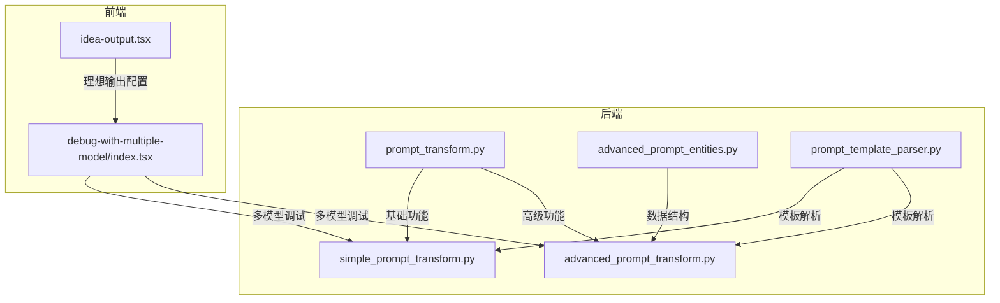
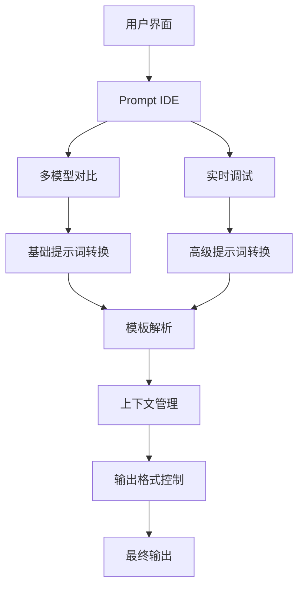
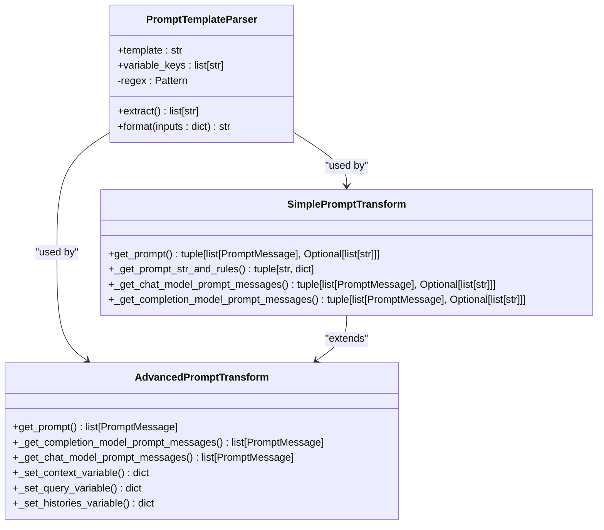
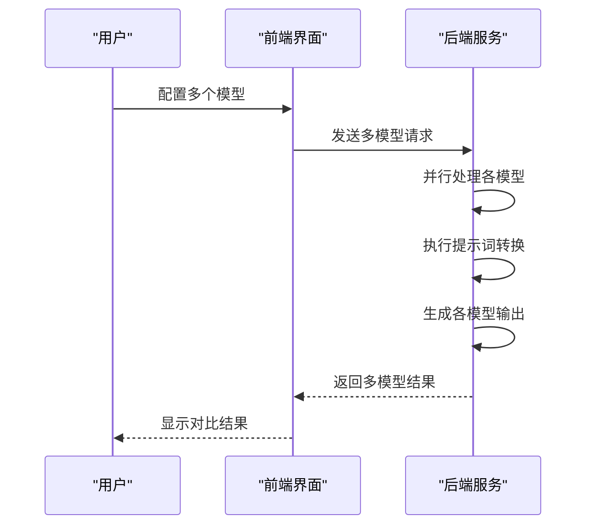
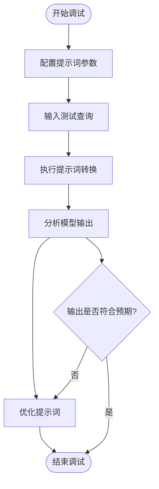
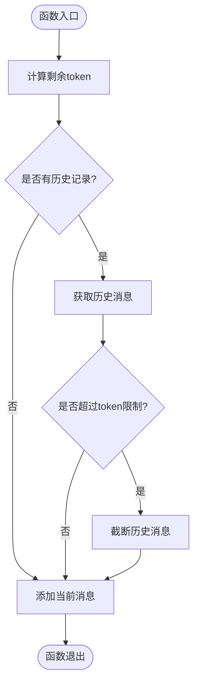
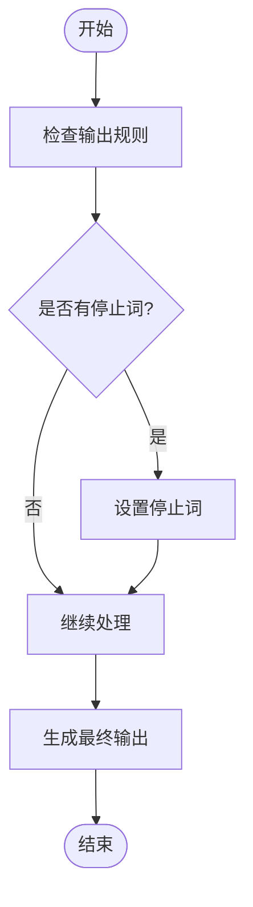
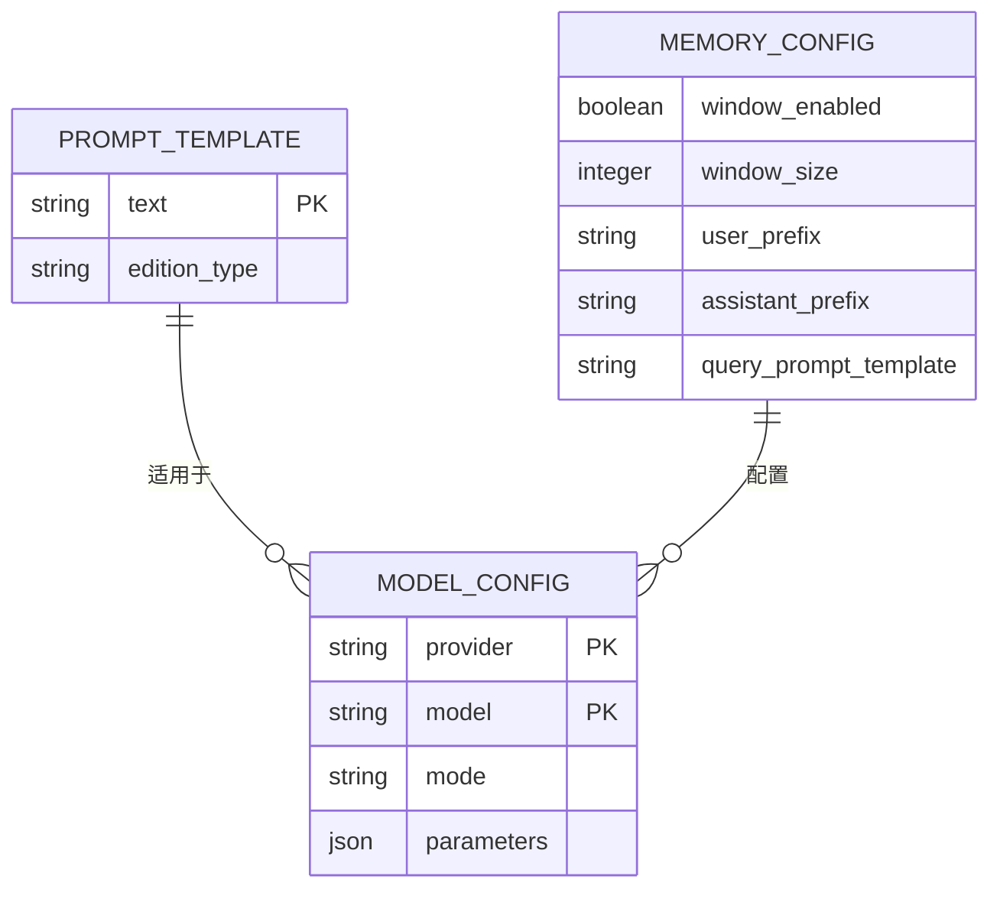

# 提示词工程

<cite>
**本文档引用的文件**
- [prompt_transform.py](file://api\core\prompt\prompt_transform.py)
- [simple_prompt_transform.py](file://api\core\prompt\simple_prompt_transform.py)
- [advanced_prompt_transform.py](file://api\core\prompt\advanced_prompt_transform.py)
- [advanced_prompt_entities.py](file://api\core\prompt\entities\advanced_prompt_entities.py)
- [prompt_template_parser.py](file://api\core\prompt\utils\prompt_template_parser.py)
- [idea-output.tsx](file://web\app\components\app\configuration\config\automatic\idea-output.tsx)
- [debug-with-multiple-model\index.tsx](file://web\app\components\app\configuration\debug\debug-with-multiple-model\index.tsx)
</cite>

## 目录
1. [简介](#简介)
2. [项目结构](#项目结构)
3. [核心组件](#核心组件)
4. [架构概述](#架构概述)
5. [详细组件分析](#详细组件分析)
6. [依赖分析](#依赖分析)
7. [性能考虑](#性能考虑)
8. [故障排除指南](#故障排除指南)
9. [结论](#结论)

## 简介
Dify的提示词工程系统提供了一套完整的提示词开发环境，支持从简单到复杂的各种提示词设计需求。系统包含Prompt IDE、多模型对比和实时调试三大核心功能，帮助开发者构建高效、可靠的提示词模板。本文档详细解释了这些功能的设计理念和实现方法，并提供了最佳实践指导。

## 项目结构
Dify的提示词工程功能主要分布在API核心模块和Web前端组件中。后端逻辑集中在`api/core/prompt`目录，包含提示词转换、模板解析和上下文管理等核心功能。前端界面位于`web/app/components/app/configuration`目录，提供了直观的用户交互界面。

**Diagram sources**
- [prompt_transform.py](file://api\core\prompt\prompt_transform.py)
- [simple_prompt_transform.py](file://api\core\prompt\simple_prompt_transform.py)
- [advanced_prompt_transform.py](file://api\core\prompt\advanced_prompt_transform.py)
- [advanced_prompt_entities.py](file://api\core\prompt\entities\advanced_prompt_entities.py)
- [prompt_template_parser.py](file://api\core\prompt\utils\prompt_template_parser.py)
- [idea-output.tsx](file://web\app\components\app\configuration\config\automatic\idea-output.tsx)
- [debug-with-multiple-model\index.tsx](file://web\app\components\app\configuration\debug\debug-with-multiple-model\index.tsx)

**Section sources**
- [prompt_transform.py](file://api\core\prompt\prompt_transform.py)
- [simple_prompt_transform.py](file://api\core\prompt\simple_prompt_transform.py)
- [advanced_prompt_transform.py](file://api\core\prompt\advanced_prompt_transform.py)
- [advanced_prompt_entities.py](file://api\core\prompt\entities\advanced_prompt_entities.py)
- [prompt_template_parser.py](file://api\core\prompt\utils\prompt_template_parser.py)
- [idea-output.tsx](file://web\app\components\app\configuration\config\automatic\idea-output.tsx)
- [debug-with-multiple-model\index.tsx](file://web\app\components\app\configuration\debug\debug-with-multiple-model\index.tsx)

## 核心组件
Dify的提示词工程系统由多个核心组件构成，包括提示词转换器、模板解析器、上下文管理器和多模型调试器。这些组件协同工作，实现了从提示词设计到执行的完整流程。

**Section sources**
- [prompt_transform.py](file://api\core\prompt\prompt_transform.py)
- [simple_prompt_transform.py](file://api\core\prompt\simple_prompt_transform.py)
- [advanced_prompt_transform.py](file://api\core\prompt\advanced_prompt_transform.py)
- [advanced_prompt_entities.py](file://api\core\prompt\entities\advanced_prompt_entities.py)
- [prompt_template_parser.py](file://api\core\prompt\utils\prompt_template_parser.py)

## 架构概述
Dify的提示词工程采用分层架构设计，分为基础提示词转换层和高级提示词转换层。基础层处理简单的提示词模板，高级层支持复杂的条件逻辑和变量插值。系统通过统一的接口对外提供服务，确保了功能的灵活性和可扩展性。

**Diagram sources**
- [prompt_transform.py](file://api\core\prompt\prompt_transform.py)
- [simple_prompt_transform.py](file://api\core\prompt\simple_prompt_transform.py)
- [advanced_prompt_transform.py](file://api\core\prompt\advanced_prompt_transform.py)
- [prompt_template_parser.py](file://api\core\prompt\utils\prompt_template_parser.py)

## 详细组件分析

### Prompt IDE设计理念
Dify的Prompt IDE设计旨在提供一个直观、高效的提示词开发环境。系统支持变量插值、条件逻辑和上下文管理等高级功能，帮助开发者构建复杂的提示词模板。

#### 变量插值和条件逻辑

**Diagram sources**
- [prompt_template_parser.py](file://api\core\prompt\utils\prompt_template_parser.py)
- [simple_prompt_transform.py](file://api\core\prompt\simple_prompt_transform.py)
- [advanced_prompt_transform.py](file://api\core\prompt\advanced_prompt_transform.py)

### 多模型对比功能
Dify的多模型对比功能允许用户同时测试多个模型的输出，帮助选择最佳模型配置。

#### 多模型调试流程

**Diagram sources**
- [debug-with-multiple-model\index.tsx](file://web\app\components\app\configuration\debug\debug-with-multiple-model\index.tsx)
- [simple_prompt_transform.py](file://api\core\prompt\simple_prompt_transform.py)
- [advanced_prompt_transform.py](file://api\core\prompt\advanced_prompt_transform.py)

### 实时调试能力
Dify的实时调试功能提供了即时反馈，帮助开发者快速优化提示词。

#### 调试流程

**Diagram sources**
- [debug-with-multiple-model\index.tsx](file://web\app\components\app\configuration\debug\debug-with-multiple-model\index.tsx)
- [simple_prompt_transform.py](file://api\core\prompt\simple_prompt_transform.py)

### 上下文管理和历史对话处理
Dify的上下文管理功能确保了对话的连贯性和一致性。

#### 上下文管理流程

**Diagram sources**
- [prompt_transform.py](file://api\core\prompt\prompt_transform.py)
- [simple_prompt_transform.py](file://api\core\prompt\simple_prompt_transform.py)

### 输出格式控制
Dify提供了灵活的输出格式控制机制，确保输出符合预期格式。

#### 输出格式控制流程

**Diagram sources**
- [simple_prompt_transform.py](file://api\core\prompt\simple_prompt_transform.py)

## 依赖分析
Dify的提示词工程系统依赖于多个核心模块，包括模型管理、文件管理和内存管理。这些模块协同工作，确保了系统的稳定性和性能。

**Diagram sources**
- [advanced_prompt_entities.py](file://api\core\prompt\entities\advanced_prompt_entities.py)
- [simple_prompt_transform.py](file://api\core\prompt\simple_prompt_transform.py)
- [advanced_prompt_transform.py](file://api\core\prompt\advanced_prompt_transform.py)

## 性能考虑
Dify的提示词工程系统在设计时充分考虑了性能因素，通过优化算法和缓存机制确保了高效的执行速度。

## 故障排除指南
当遇到提示词输出不一致或偏离主题等问题时，可以按照以下步骤进行排查：

**Section sources**
- [prompt_transform.py](file://api\core\prompt\prompt_transform.py)
- [simple_prompt_transform.py](file://api\core\prompt\simple_prompt_transform.py)
- [advanced_prompt_transform.py](file://api\core\prompt\advanced_prompt_transform.py)

## 结论
Dify的提示词工程系统提供了一套完整的解决方案，从简单的问答到复杂的指令遵循都能有效支持。通过合理的架构设计和功能实现，系统能够满足各种提示词开发需求。