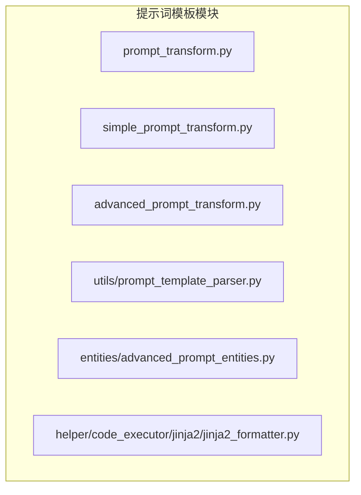
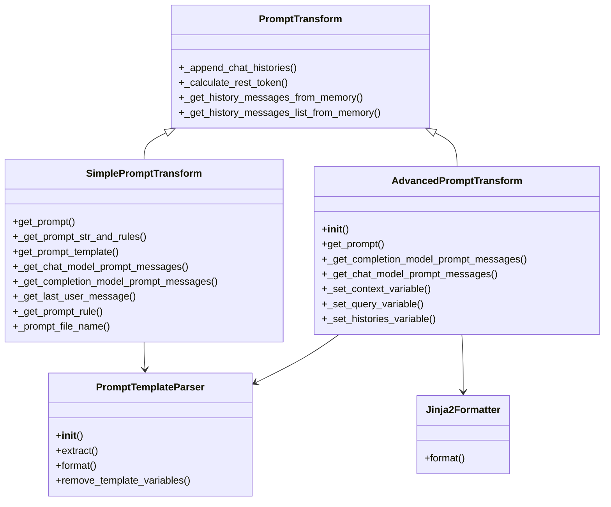
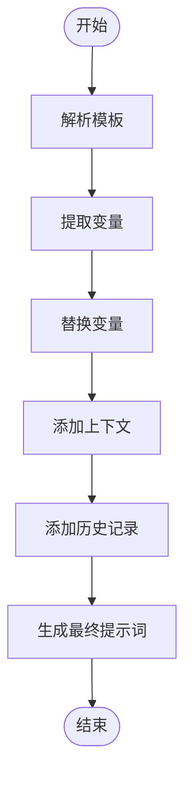
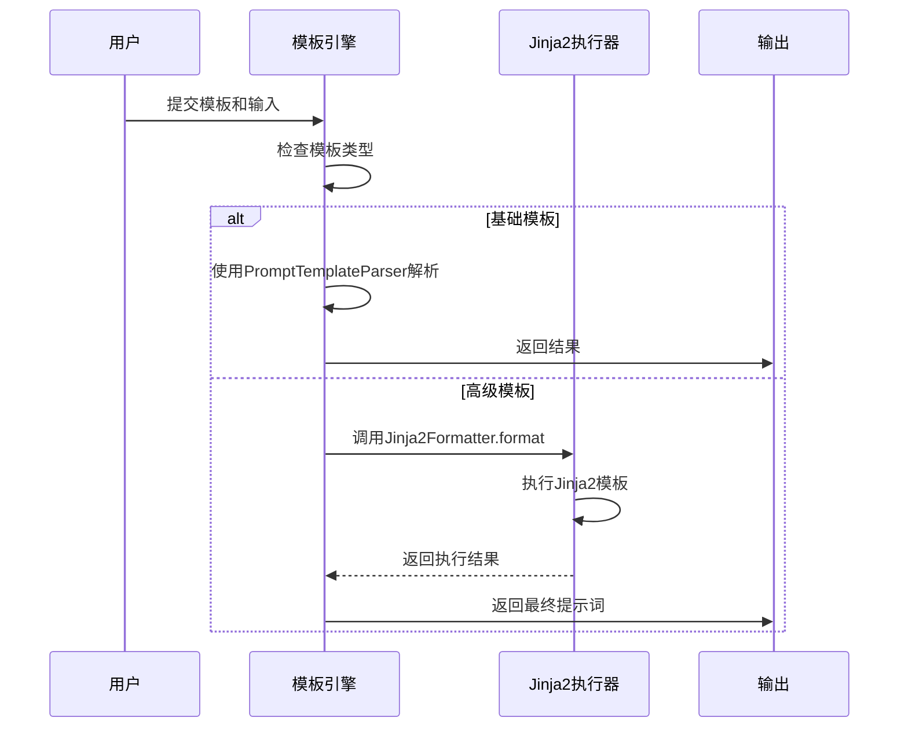
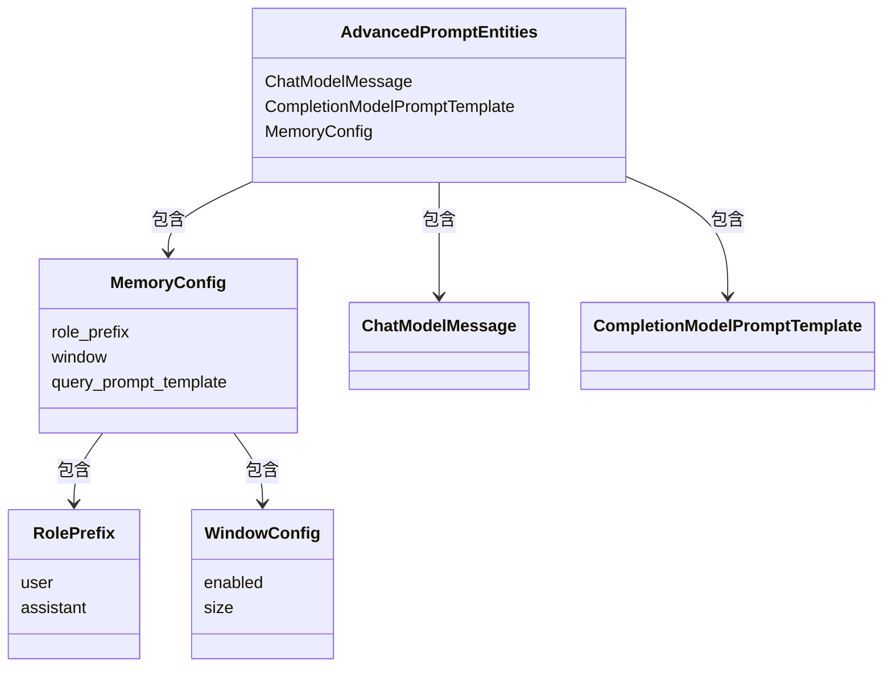
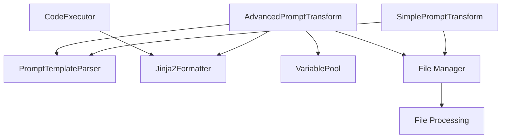

# 提示词模板设计

<cite>
**本文档中引用的文件**  
- [prompt_transform.py](file://api/core/prompt/prompt_transform.py)
- [simple_prompt_transform.py](file://api/core/prompt/simple_prompt_transform.py)
- [advanced_prompt_transform.py](file://api/core/prompt/advanced_prompt_transform.py)
- [prompt_template_parser.py](file://api/core/prompt/utils/prompt_template_parser.py)
- [jinja2_formatter.py](file://api/core/helper/code_executor/jinja2/jinja2_formatter.py)
- [advanced_prompt_entities.py](file://api/core/prompt/entities/advanced_prompt_entities.py)
</cite>

## 目录
1. [简介](#简介)
2. [项目结构](#项目结构)
3. [核心组件](#核心组件)
4. [架构概述](#架构概述)
5. [详细组件分析](#详细组件分析)
6. [依赖分析](#依赖分析)
7. [性能考虑](#性能考虑)
8. [故障排除指南](#故障排除指南)
9. [结论](#结论)

## 简介
Dify 提供了一套灵活且强大的提示词模板系统，支持从基础变量插值到复杂控制流的完整功能。该系统基于 Jinja2 模板引擎实现，允许用户通过可视化界面或代码方式构建动态提示词。本文档详细解释了提示词模板的设计原理、结构组成、变量处理机制以及高级功能的应用。

## 项目结构
Dify 的提示词模板相关代码主要集中在 `api/core/prompt` 目录下，包含基础和高级模板处理逻辑、实体定义及工具类。

**图示来源**  
- [prompt_transform.py](file://api/core/prompt/prompt_transform.py)
- [simple_prompt_transform.py](file://api/core/prompt/simple_prompt_transform.py)
- [advanced_prompt_transform.py](file://api/core/prompt/advanced_prompt_transform.py)
- [prompt_template_parser.py](file://api/core/prompt/utils/prompt_template_parser.py)
- [jinja2_formatter.py](file://api/core/helper/code_executor/jinja2/jinja2_formatter.py)
- [advanced_prompt_entities.py](file://api/core/prompt/entities/advanced_prompt_entities.py)

**本节来源**  
- [prompt_transform.py](file://api/core/prompt/prompt_transform.py)
- [simple_prompt_transform.py](file://api/core/prompt/simple_prompt_transform.py)
- [advanced_prompt_transform.py](file://api/core/prompt/advanced_prompt_transform.py)

## 核心组件
Dify 的提示词模板系统由多个核心组件构成，包括模板解析器、变量处理器、Jinja2 执行器和高级模板转换器。这些组件协同工作，实现了从静态模板到动态提示词的完整转换流程。

**本节来源**  
- [prompt_template_parser.py](file://api/core/prompt/utils/prompt_template_parser.py)
- [jinja2_formatter.py](file://api/core/helper/code_executor/jinja2/jinja2_formatter.py)
- [advanced_prompt_transform.py](file://api/core/prompt/advanced_prompt_transform.py)

## 架构概述
Dify 的提示词模板系统采用分层架构设计，分为基础模板和高级模板两种模式。基础模板使用简单的变量替换机制，而高级模板则支持完整的 Jinja2 语法，包括条件判断、循环等控制流语句。

**图示来源**  
- [prompt_transform.py](file://api/core/prompt/prompt_transform.py)
- [simple_prompt_transform.py](file://api/core/prompt/simple_prompt_transform.py)
- [advanced_prompt_transform.py](file://api/core/prompt/advanced_prompt_transform.py)
- [prompt_template_parser.py](file://api/core/prompt/utils/prompt_template_parser.py)
- [jinja2_formatter.py](file://api/core/helper/code_executor/jinja2/jinja2_formatter.py)

## 详细组件分析

### 基础模板分析
基础模板使用 `SimplePromptTransform` 类进行处理，采用简单的变量替换机制。模板中的变量用 `{{variable_name}}` 表示，系统会自动将输入变量替换到相应位置。

**图示来源**  
- [simple_prompt_transform.py](file://api/core/prompt/simple_prompt_transform.py)
- [prompt_template_parser.py](file://api/core/prompt/utils/prompt_template_parser.py)

**本节来源**  
- [simple_prompt_transform.py](file://api/core/prompt/simple_prompt_transform.py)
- [prompt_template_parser.py](file://api/core/prompt/utils/prompt_template_parser.py)

### 高级模板分析
高级模板使用 `AdvancedPromptTransform` 类处理，支持完整的 Jinja2 语法。模板可以包含条件判断、循环等复杂逻辑，适用于多步骤推理等复杂场景。

**图示来源**  
- [advanced_prompt_transform.py](file://api/core/prompt/advanced_prompt_transform.py)
- [jinja2_formatter.py](file://api/core/helper/code_executor/jinja2/jinja2_formatter.py)

**本节来源**  
- [advanced_prompt_transform.py](file://api/core/prompt/advanced_prompt_transform.py)
- [jinja2_formatter.py](file://api/core/helper/code_executor/jinja2/jinja2_formatter.py)

### 变量处理机制
Dify 的变量处理机制支持三种特殊变量：`#context#`、`#query#` 和 `#histories#`，分别表示上下文、用户查询和对话历史。

**图示来源**  
- [advanced_prompt_entities.py](file://api/core/prompt/entities/advanced_prompt_entities.py)

**本节来源**  
- [advanced_prompt_entities.py](file://api/core/prompt/entities/advanced_prompt_entities.py)

## 依赖分析
Dify 的提示词模板系统依赖于多个内部模块，形成了清晰的依赖关系网络。

**图示来源**  
- [simple_prompt_transform.py](file://api/core/prompt/simple_prompt_transform.py)
- [advanced_prompt_transform.py](file://api/core/prompt/advanced_prompt_transform.py)
- [prompt_template_parser.py](file://api/core/prompt/utils/prompt_template_parser.py)
- [jinja2_formatter.py](file://api/core/helper/code_executor/jinja2/jinja2_formatter.py)

**本节来源**  
- [simple_prompt_transform.py](file://api/core/prompt/simple_prompt_transform.py)
- [advanced_prompt_transform.py](file://api/core/prompt/advanced_prompt_transform.py)
- [prompt_template_parser.py](file://api/core/prompt/utils/prompt_template_parser.py)
- [jinja2_formatter.py](file://api/core/helper/code_executor/jinja2/jinja2_formatter.py)

## 性能考虑
在处理大型提示词模板时，应考虑以下性能优化策略：
- 合理设置上下文窗口大小，避免过长的历史记录
- 使用缓存机制存储常用的模板解析结果
- 限制 Jinja2 模板的复杂度，避免深度嵌套的循环和条件判断
- 对大型文件进行分块处理，避免内存溢出

## 故障排除指南
常见问题及解决方案：
- **变量未替换**：检查变量名是否符合命名规则，确保变量存在于输入中
- **Jinja2 语法错误**：验证模板语法是否正确，检查是否有未闭合的标签
- **上下文截断**：调整模型的最大上下文长度设置
- **特殊变量无效**：确认特殊变量 `#context#`、`#query#`、`#histories#` 的使用是否正确

**本节来源**  
- [prompt_template_parser.py](file://api/core/prompt/utils/prompt_template_parser.py)
- [advanced_prompt_transform.py](file://api/core/prompt/advanced_prompt_transform.py)
- [simple_prompt_transform.py](file://api/core/prompt/simple_prompt_transform.py)

## 结论
Dify 的提示词模板系统提供了一个强大而灵活的框架，支持从简单变量替换到复杂逻辑控制的完整功能。通过结合 Jinja2 模板引擎和可视化编辑界面，用户可以轻松构建复杂的多步骤推理流程。系统的模块化设计使得扩展和维护变得简单，为构建智能应用提供了坚实的基础。