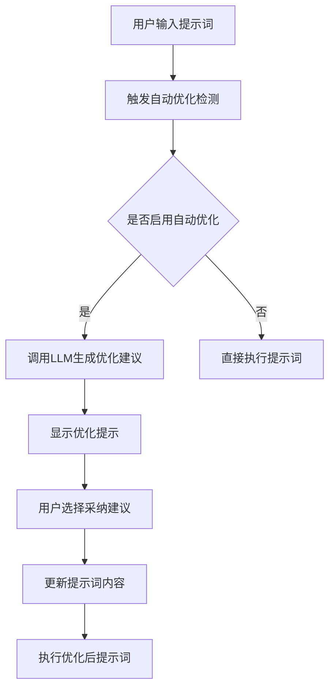
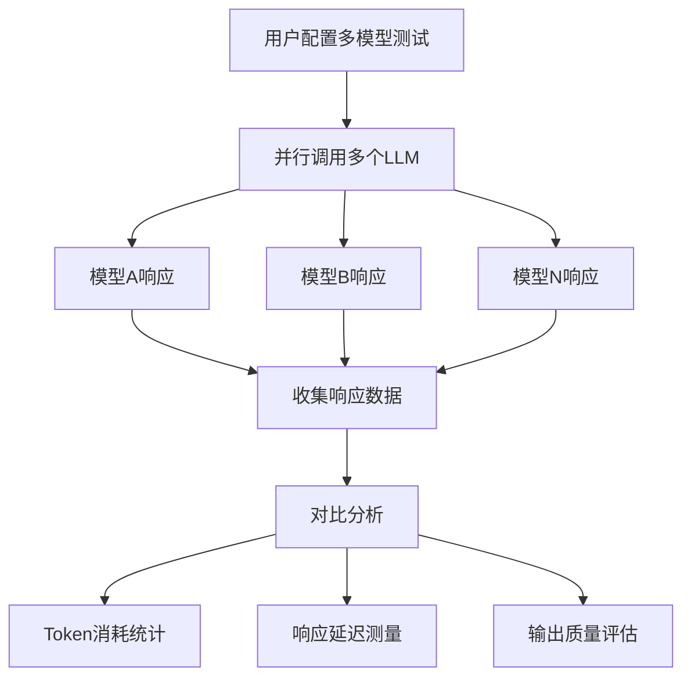
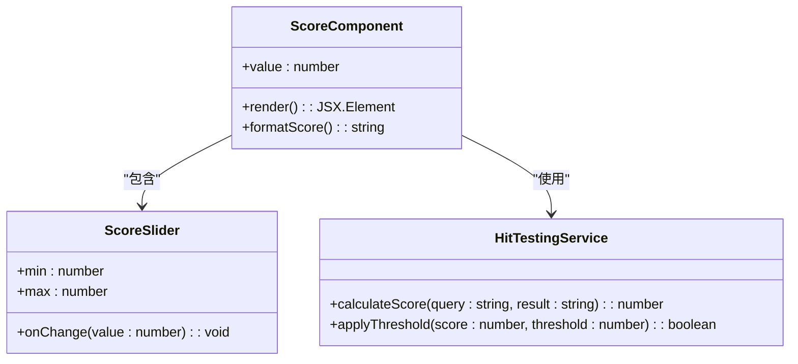
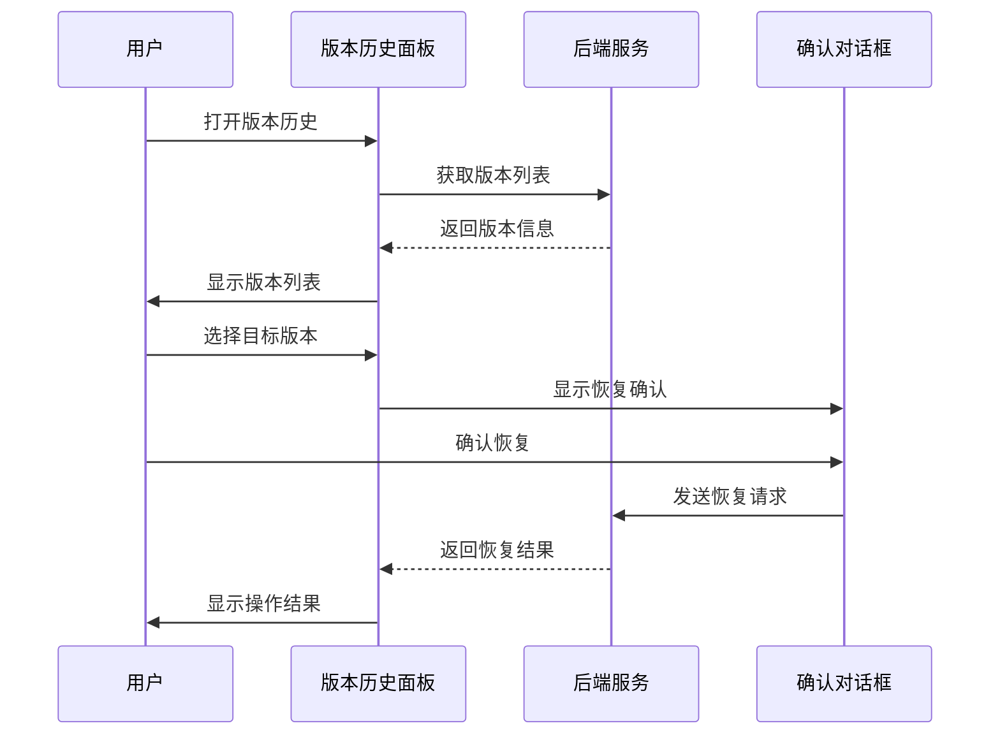

# 提示词调试与优化

<cite>
**本文档引用文件**  
- [prompt-toast.tsx](file://web\app\components\app\configuration\config\automatic\prompt-toast.tsx)
- [simple-prompt-input.tsx](file://web\app\components\app\configuration\config-prompt\simple-prompt-input.tsx)
- [automatic-btn.tsx](file://web\app\components\app\configuration\config\automatic\automatic-btn.tsx)
- [debug-info.tsx](file://web\app\components\plugins\plugin-page\debug-info.tsx)
- [score.tsx](file://web\app\components\datasets\hit-testing\components\score.tsx)
- [score-slider.tsx](file://web\app\components\base\features\new-feature-panel\annotation-reply\score-slider\index.tsx)
- [version-history-button.tsx](file://web\app\components\workflow\header\version-history-button.tsx)
- [restore-confirm-modal.tsx](file://web\app\components\workflow\panel\version-history-panel\restore-confirm-modal.tsx)
- [version-slice.ts](file://web\app\components\workflow\store\workflow\version-slice.ts)
- [llm_generator.py](file://api\core\llm_generator\llm_generator.py)
- [prompts.py](file://api\core\llm_generator\prompts.py)
- [agent_entities.py](file://api\core\entities\agent_entities.py)
</cite>

## 目录
1. [简介](#简介)
2. [实时调试界面工作原理](#实时调试界面工作原理)
3. [多模型并行测试与对比分析](#多模型并行测试与对比分析)
4. [提示词评分机制与A/B测试](#提示词评分机制与ab测试)
5. [历史版本回溯能力](#历史版本回溯能力)
6. [提示词优化策略](#提示词优化策略)
7. [常见问题诊断与解决方案](#常见问题诊断与解决方案)
8. [日志追踪与性能监控](#日志追踪与性能监控)
9. [结论](#结论)

## 简介
Dify平台提供了一套完整的提示词调试与优化体系，支持开发者通过可视化界面进行提示词工程的全生命周期管理。系统集成了实时调试、多模型对比、评分机制、版本控制和性能监控等功能，帮助用户构建高质量的AI应用。本文档详细说明各项功能的实现原理和使用方法。

## 实时调试界面工作原理

Dify的实时调试界面通过前端组件与后端服务的协同工作，实现了提示词的即时反馈和优化建议。核心组件包括提示词输入框、自动优化按钮和优化提示面板。

**图示来源**  
- [simple-prompt-input.tsx](file://web\app\components\app\configuration\config-prompt\simple-prompt-input.tsx#L162-L196)
- [automatic-btn.tsx](file://web\app\components\app\configuration\config\automatic\automatic-btn.tsx#L0-L24)
- [prompt-toast.tsx](file://web\app\components\app\configuration\config\automatic\prompt-toast.tsx#L39-L53)

**本节来源**  
- [simple-prompt-input.tsx](file://web\app\components\app\configuration\config-prompt\simple-prompt-input.tsx#L162-L196)
- [automatic-btn.tsx](file://web\app\components\app\configuration\config\automatic\automatic-btn.tsx#L0-L24)

## 多模型并行测试与对比分析

系统支持同时测试多个大模型的输出效果，通过并行执行机制比较不同模型的响应质量和性能指标。

**图示来源**  
- [debug-info.tsx](file://web\app\components\plugins\plugin-page\debug-info.tsx#L36-L66)
- [llm_generator.py](file://api\core\llm_generator\llm_generator.py#L226-L255)

**本节来源**  
- [debug-info.tsx](file://web\app\components\plugins\plugin-page\debug-info.tsx#L36-L66)
- [llm_generator.py](file://api\core\llm_generator\llm_generator.py#L226-L255)

## 提示词评分机制与A/B测试

Dify实现了基于分数的提示词评估系统，支持A/B测试来比较不同提示词版本的效果。

**图示来源**  
- [score.tsx](file://web\app\components\datasets\hit-testing\components\score.tsx#L0-L27)
- [score-slider.tsx](file://web\app\components\base\features\new-feature-panel\annotation-reply\score-slider\index.tsx#L0-L45)
- [prompts.py](file://api\core\llm_generator\prompts.py#L127-L141)

**本节来源**  
- [score.tsx](file://web\app\components\datasets\hit-testing\components\score.tsx#L0-L27)
- [score-slider.tsx](file://web\app\components\base\features\new-feature-panel\annotation-reply\score-slider\index.tsx#L0-L45)

## 历史版本回溯能力

系统提供了完整的版本历史管理功能，支持查看、比较和恢复到任意历史版本。

**图示来源**  
- [version-history-button.tsx](file://web\app\components\workflow\header\version-history-button.tsx#L0-L43)
- [restore-confirm-modal.tsx](file://web\app\components\workflow\panel\version-history-panel\restore-confirm-modal.tsx#L0-L41)
- [version-slice.ts](file://web\app\components\workflow\store\workflow\version-slice.ts#L0-L25)

**本节来源**  
- [version-history-button.tsx](file://web\app\components\workflow\header\version-history-button.tsx#L0-L43)
- [restore-confirm-modal.tsx](file://web\app\components\workflow\panel\version-history-panel\restore-confirm-modal.tsx#L0-L41)

## 提示词优化策略

### Few-shot示例设计
通过提供高质量的输入输出示例，引导模型学习期望的响应模式。系统支持在提示词中嵌入多个示例，帮助模型理解任务要求。

### 角色设定技巧
利用角色设定功能，为AI赋予特定身份和专业知识，提高响应的相关性和专业性。系统支持复杂的角色描述和行为准则定义。

### 输出格式约束
通过XML标签等结构化标记，明确指定输出格式要求，确保模型输出符合预期结构。支持JSON、XML等多种格式约束。

### 防越狱措施
系统内置了多种安全机制，防止模型产生不当内容或绕过限制。包括内容过滤、权限控制和行为监控等功能。

**本节来源**  
- [prompts.py](file://api\core\llm_generator\prompts.py#L127-L141)
- [agent_entities.py](file://api\core\entities\agent_entities.py#L0-L7)
- [llm_generator.py](file://api\core\llm_generator\llm_generator.py#L226-L255)

## 常见问题诊断与解决方案

### 输出不一致问题
当模型输出结果不稳定时，可检查提示词的明确性和完整性，增加Few-shot示例，或调整温度参数。

### 逻辑错误问题
对于推理过程中的逻辑错误，建议优化提示词结构，明确推理步骤，或使用链式思维（Chain-of-Thought）提示技术。

### 性能瓶颈问题
当响应延迟过高时，可通过分析Token消耗，优化提示词长度，或选择更适合的模型来改善性能。

**本节来源**  
- [llm_generator.py](file://api\core\llm_generator\llm_generator.py#L226-L255)
- [prompts.py](file://api\core\llm_generator\prompts.py#L127-L141)

## 日志追踪与性能监控

系统集成了全面的日志记录和性能监控功能，帮助开发者深入了解提示词执行过程。

**图示来源**  
- [llm_generator.py](file://api\core\llm_generator\llm_generator.py#L226-L255)
- [prompts.py](file://api\core\llm_generator\prompts.py#L127-L141)

**本节来源**  
- [llm_generator.py](file://api\core\llm_generator\llm_generator.py#L226-L255)

## 结论
Dify的提示词调试与优化系统为开发者提供了强大的工具集，涵盖了从设计、测试到部署的完整工作流程。通过合理利用这些功能，可以显著提升AI应用的质量和性能。