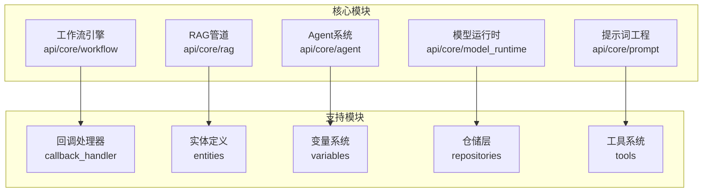
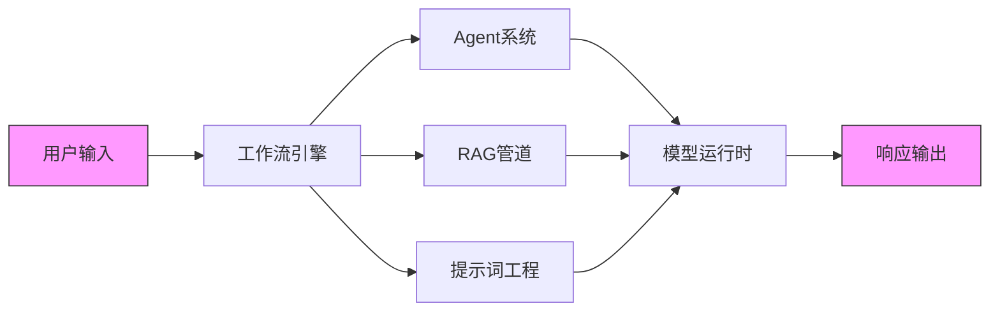
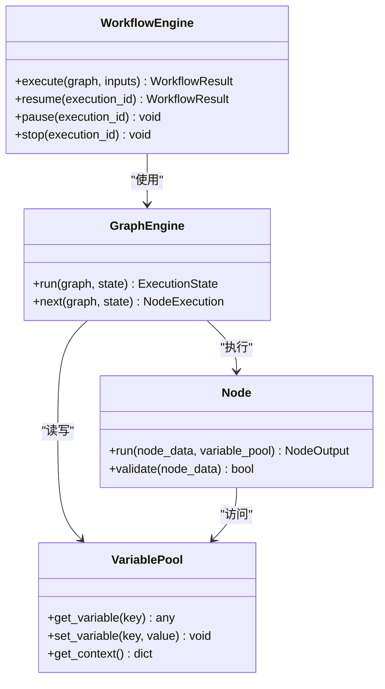
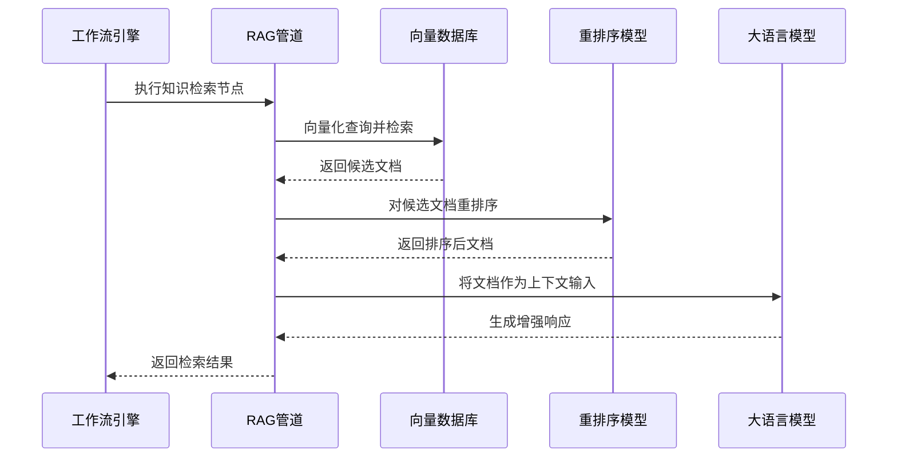
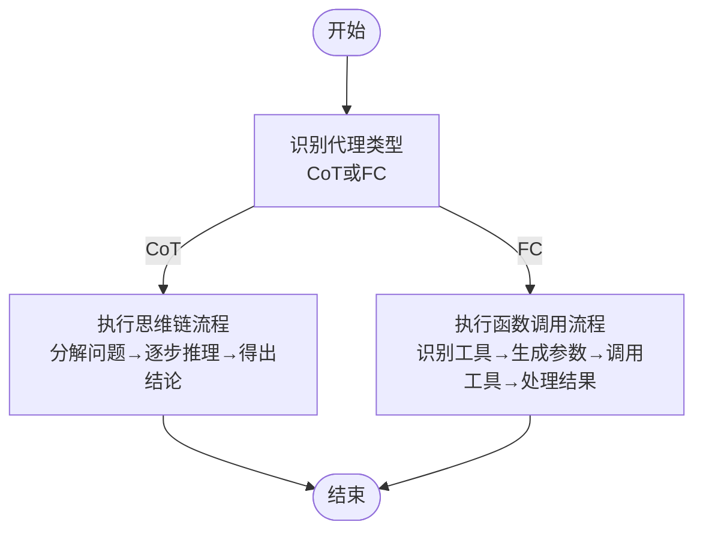
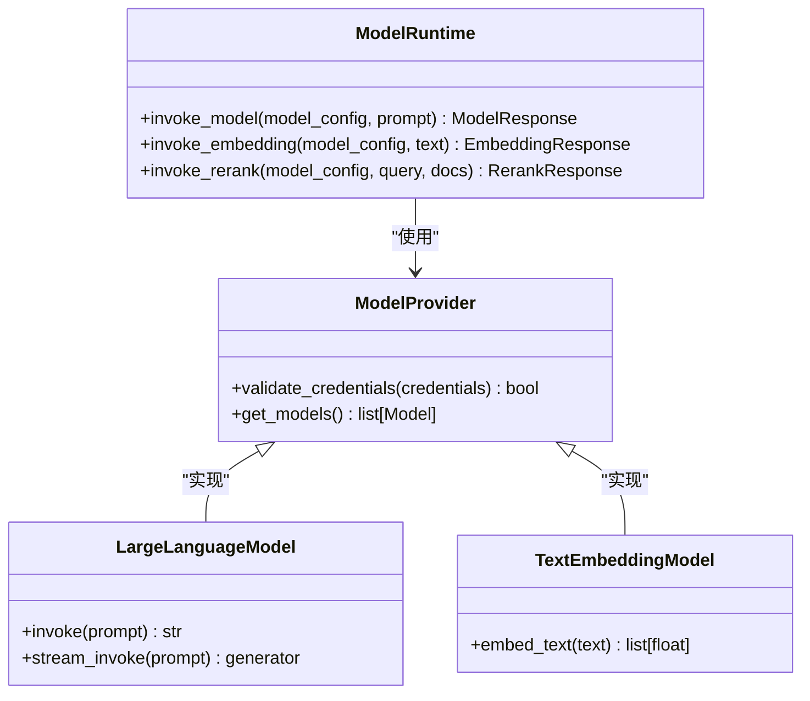
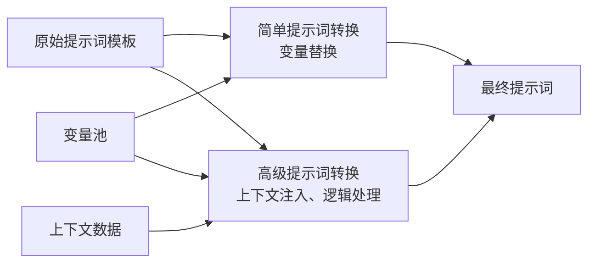
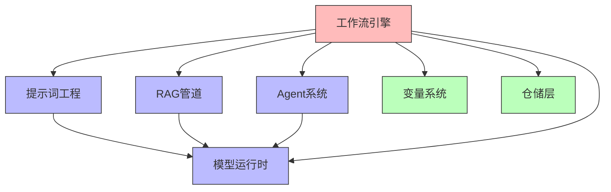

# 核心功能模块

<cite>
**本文档引用文件**  
- [base_agent_runner.py](file://api/core/agent/base_agent_runner.py)
- [workflow_entry.py](file://api/core/workflow/workflow_entry.py)
- [rag_pipeline.py](file://api/core/rag/retrieval/dataset_retrieval.py)
- [model_runtime.py](file://api/core/model_runtime/model_providers/model_provider_factory.py)
- [prompt_transform.py](file://api/core/prompt/prompt_transform.py)
- [knowledge_retrieval_node.py](file://api/core/workflow/nodes/knowledge_retrieval/knowledge_retrieval_node.py)
- [agent_node.py](file://api/core/workflow/nodes/agent/agent_node.py)
- [llm_node.py](file://api/core/workflow/nodes/llm/node.py)
- [workflow_execution_repository.py](file://api/core/workflow/repositories/workflow_execution_repository.py)
- [variable_loader.py](file://api/core/workflow/variable_loader.py)
- [retrieval_methods.py](file://api/core/rag/retrieval/retrieval_methods.py)
- [rerank_model.py](file://api/core/rag/rerank/rerank_model.py)
- [cot_agent_runner.py](file://api/core/agent/cot_agent_runner.py)
- [fc_agent_runner.py](file://api/core/agent/fc_agent_runner.py)
- [advanced_prompt_transform.py](file://api/core/prompt/advanced_prompt_transform.py)
</cite>

## 目录
1. [引言](#引言)
2. [项目结构](#项目结构)
3. [核心组件](#核心组件)
4. [架构概览](#架构概览)
5. [详细组件分析](#详细组件分析)
6. [依赖分析](#依赖分析)
7. [性能考量](#性能考量)
8. [故障排除指南](#故障排除指南)
9. [结论](#结论)

## 引言
本文档旨在全面解析Dify平台的核心功能模块，包括工作流引擎、RAG管道、Agent系统、模型运行时和提示词工程。文档将深入探讨各模块的设计理念、技术实现、配置选项、最佳实践以及模块间的交互关系。通过实际案例展示如何组合使用这些模块构建复杂的AI应用，并提供性能调优建议和故障排除指南。

## 项目结构
Dify平台采用分层架构设计，核心功能模块集中于`api/core`目录下，各模块职责明确，耦合度低，便于扩展和维护。

**图示来源**  
- [workflow_entry.py](file://api/core/workflow/workflow_entry.py)
- [rag_pipeline.py](file://api/core/rag/retrieval/dataset_retrieval.py)
- [agent_node.py](file://api/core/workflow/nodes/agent/agent_node.py)
- [model_runtime.py](file://api/core/model_runtime/model_providers/model_provider_factory.py)
- [prompt_transform.py](file://api/core/prompt/prompt_transform.py)

**本节来源**  
- [api/core](file://api/core)
- [api/core/workflow](file://api/core/workflow)
- [api/core/rag](file://api/core/rag)
- [api/core/agent](file://api/core/agent)
- [api/core/model_runtime](file://api/core/model_runtime)
- [api/core/prompt](file://api/core/prompt)

## 核心组件
Dify平台的核心功能由五大模块构成：工作流引擎、RAG管道、Agent系统、模型运行时和提示词工程。这些模块协同工作，为构建复杂的AI应用提供强大支持。

**本节来源**  
- [workflow_entry.py](file://api/core/workflow/workflow_entry.py#L1-L20)
- [retrieval_methods.py](file://api/core/rag/retrieval/retrieval_methods.py#L5-L15)
- [base_agent_runner.py](file://api/core/agent/base_agent_runner.py#L10-L25)
- [model_provider_factory.py](file://api/core/model_runtime/model_providers/model_provider_factory.py#L8-L20)
- [advanced_prompt_transform.py](file://api/core/prompt/advanced_prompt_transform.py#L12-L30)

## 架构概览
Dify平台采用模块化设计，各核心组件通过明确定义的接口进行交互，形成一个灵活、可扩展的AI应用开发框架。

**图示来源**  
- [workflow_entry.py](file://api/core/workflow/workflow_entry.py#L25-L40)
- [base_agent_runner.py](file://api/core/agent/base_agent_runner.py#L30-L45)
- [dataset_retrieval.py](file://api/core/rag/retrieval/dataset_retrieval.py#L20-L35)
- [prompt_transform.py](file://api/core/prompt/prompt_transform.py#L40-L55)
- [model_provider_factory.py](file://api/core/model_runtime/model_providers/model_provider_factory.py#L25-L40)

## 详细组件分析

### 工作流引擎分析
工作流引擎是Dify平台的核心调度器，负责协调各个组件的执行流程，管理变量状态，并处理节点间的依赖关系。

**图示来源**  
- [workflow_entry.py](file://api/core/workflow/workflow_entry.py#L50-L70)
- [graph_engine.py](file://api/core/workflow/graph_engine/graph_engine.py#L15-L35)
- [node.py](file://api/core/workflow/nodes/base/node.py#L10-L25)
- [variable_pool.py](file://api/core/workflow/entities/variable_pool.py#L8-L20)

**本节来源**  
- [workflow_entry.py](file://api/core/workflow/workflow_entry.py#L45-L100)
- [graph_engine.py](file://api/core/workflow/graph_engine/graph_engine.py#L10-L50)
- [variable_loader.py](file://api/core/workflow/variable_loader.py#L15-L40)
- [workflow_execution_repository.py](file://api/core/workflow/repositories/workflow_execution_repository.py#L20-L50)

### RAG管道分析
RAG（检索增强生成）管道负责从知识库中检索相关信息，并将其整合到生成过程中，以提高输出的准确性和相关性。

**图示来源**  
- [knowledge_retrieval_node.py](file://api/core/workflow/nodes/knowledge_retrieval/knowledge_retrieval_node.py#L25-L45)
- [dataset_retrieval.py](file://api/core/rag/retrieval/dataset_retrieval.py#L30-L60)
- [retrieval_methods.py](file://api/core/rag/retrieval/retrieval_methods.py#L20-L40)
- [rerank_model.py](file://api/core/rag/rerank/rerank_model.py#L15-L30)

**本节来源**  
- [knowledge_retrieval_node.py](file://api/core/workflow/nodes/knowledge_retrieval/knowledge_retrieval_node.py#L20-L80)
- [dataset_retrieval.py](file://api/core/rag/retrieval/dataset_retrieval.py#L25-L100)
- [retrieval_methods.py](file://api/core/rag/retrieval/retrieval_methods.py#L15-L50)
- [rerank_model.py](file://api/core/rag/rerank/rerank_model.py#L10-L40)
- [vector_factory.py](file://api/core/rag/datasource/vdb/vector_factory.py#L12-L35)

### Agent系统分析
Agent系统实现了多种智能代理模式，包括思维链（CoT）和函数调用（FC），能够自主决策和执行复杂任务。

**图示来源**  
- [base_agent_runner.py](file://api/core/agent/base_agent_runner.py#L40-L60)
- [cot_agent_runner.py](file://api/core/agent/cot_agent_runner.py#L15-L35)
- [fc_agent_runner.py](file://api/core/agent/fc_agent_runner.py#L20-L40)

**本节来源**  
- [base_agent_runner.py](file://api/core/agent/base_agent_runner.py#L35-L90)
- [cot_agent_runner.py](file://api/core/agent/cot_agent_runner.py#L10-L50)
- [fc_agent_runner.py](file://api/core/agent/fc_agent_runner.py#L15-L60)
- [agent_node.py](file://api/core/workflow/nodes/agent/agent_node.py#L20-L50)
- [plugin_entities.py](file://api/core/agent/plugin_entities.py#L5-L25)

### 模型运行时分析
模型运行时模块负责管理各种AI模型的调用，提供统一的接口抽象，支持多种模型提供商和模型类型。

**图示来源**  
- [model_provider_factory.py](file://api/core/model_runtime/model_providers/model_provider_factory.py#L30-L50)
- [large_language_model.py](file://api/core/model_runtime/model_providers/__base/large_language_model.py#L10-L25)
- [text_embedding_model.py](file://api/core/model_runtime/model_providers/__base/text_embedding_model.py#L8-L20)

**本节来源**  
- [model_provider_factory.py](file://api/core/model_runtime/model_providers/model_provider_factory.py#L25-L70)
- [large_language_model.py](file://api/core/model_runtime/model_providers/__base/large_language_model.py#L5-L40)
- [text_embedding_model.py](file://api/core/model_runtime/model_providers/__base/text_embedding_model.py#L5-L35)
- [model_entities.py](file://api/core/entities/model_entities.py#L10-L30)
- [provider_entities.py](file://api/core/entities/provider_entities.py#L12-L32)

### 提示词工程分析
提示词工程模块提供了从简单到高级的提示词转换能力，支持上下文注入、变量替换和复杂逻辑处理。

**图示来源**  
- [prompt_transform.py](file://api/core/prompt/prompt_transform.py#L25-L45)
- [advanced_prompt_transform.py](file://api/core/prompt/advanced_prompt_transform.py#L20-L40)
- [simple_prompt_transform.py](file://api/core/prompt/simple_prompt_transform.py#L15-L30)

**本节来源**  
- [prompt_transform.py](file://api/core/prompt/prompt_transform.py#L20-L80)
- [advanced_prompt_transform.py](file://api/core/prompt/advanced_prompt_transform.py#L15-L60)
- [simple_prompt_transform.py](file://api/core/prompt/simple_prompt_transform.py#L10-L40)
- [agent_history_prompt_transform.py](file://api/core/prompt/agent_history_prompt_transform.py#L8-L25)
- [prompt_templates](file://api/core/prompt/prompt_templates)

## 依赖分析
Dify平台的各个核心模块之间存在明确的依赖关系，这种设计保证了系统的灵活性和可维护性。

**图示来源**  
- [workflow_entry.py](file://api/core/workflow/workflow_entry.py#L60-L80)
- [knowledge_retrieval_node.py](file://api/core/workflow/nodes/knowledge_retrieval/knowledge_retrieval_node.py#L35-L50)
- [agent_node.py](file://api/core/workflow/nodes/agent/agent_node.py#L30-L45)
- [llm_node.py](file://api/core/workflow/nodes/llm/node.py#L25-L40)
- [variable_loader.py](file://api/core/workflow/variable_loader.py#L20-L35)

**本节来源**  
- [workflow_entry.py](file://api/core/workflow/workflow_entry.py#L75-L120)
- [model_provider_factory.py](file://api/core/model_runtime/model_providers/model_provider_factory.py#L55-L80)
- [prompt_transform.py](file://api/core/prompt/prompt_transform.py#L60-L90)
- [variable_loader.py](file://api/core/workflow/variable_loader.py#L30-L60)
- [workflow_execution_repository.py](file://api/core/workflow/repositories/workflow_execution_repository.py#L40-L70)

## 性能考量
在使用Dify核心功能模块时，应注意以下性能优化建议：

1. **工作流引擎**：避免创建过于复杂的工作流图，合理设置节点超时时间，使用异步执行模式处理耗时操作。
2. **RAG管道**：优化向量数据库索引策略，合理设置检索返回的文档数量，使用重排序模型提高检索质量。
3. **Agent系统**：限制思维链的推理步骤，合理配置函数调用的重试机制，避免无限循环。
4. **模型运行时**：使用模型缓存减少重复计算，合理选择模型实例大小，监控API调用配额。
5. **提示词工程**：避免生成过长的提示词，合理使用上下文窗口，定期审查提示词模板的有效性。

## 故障排除指南
当遇到问题时，可参考以下常见问题及解决方案：

**本节来源**  
- [errors.py](file://api/core/workflow/errors.py#L5-L25)
- [error.py](file://api/core/errors/error.py#L10-L30)
- [workflow_logging_callback.py](file://api/core/workflow/callbacks/workflow_logging_callback.py#L15-L40)
- [logging_callback.py](file://api/core/model_runtime/callbacks/logging_callback.py#L8-L25)

## 结论
Dify平台的核心功能模块设计精良，各组件职责明确，通过清晰的接口进行交互。工作流引擎作为调度中枢，协调RAG管道、Agent系统、模型运行时和提示词工程等模块，实现了复杂AI应用的构建能力。开发者可以基于这些模块快速构建出功能强大、性能优越的AI应用。