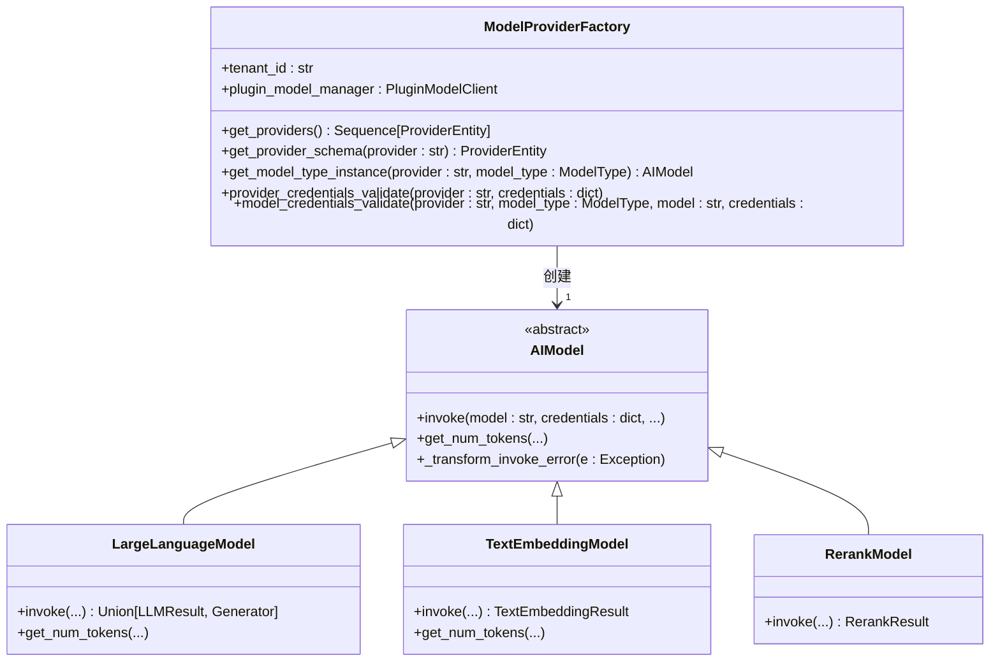
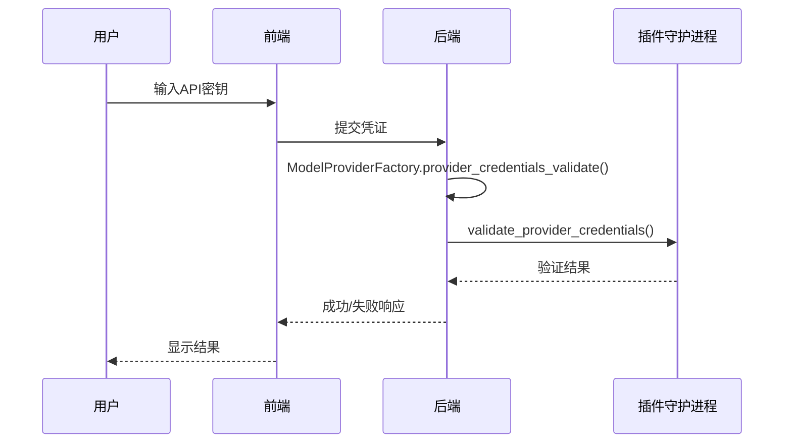
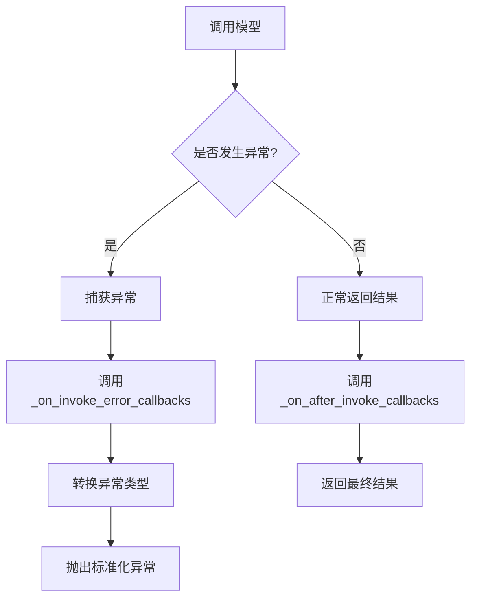

# 提供商管理

<cite>
**本文档中引用的文件**  
- [model_provider_factory.py](file://api/core/model_runtime/model_providers/model_provider_factory.py)
- [provider_entities.py](file://api/core/model_runtime/entities/provider_entities.py)
- [model_entities.py](file://api/core/model_runtime/entities/model_entities.py)
- [provider_credential_schema_validator.py](file://api/core/model_runtime/schema_validators/provider_credential_schema_validator.py)
- [model_credential_schema_validator.py](file://api/core/model_runtime/schema_validators/model_credential_schema_validator.py)
- [common_validator.py](file://api/core/model_runtime/schema_validators/common_validator.py)
- [large_language_model.py](file://api/core/model_runtime/model_providers/__base/large_language_model.py)
- [text_embedding_model.py](file://api/core/model_runtime/model_providers/__base/text_embedding_model.py)
- [rerank_model.py](file://api/core/model_runtime/model_providers/__base/rerank_model.py)
</cite>

## 目录
1. [简介](#简介)
2. [提供商工厂模式实现原理](#提供商工厂模式实现原理)
3. [支持的模型类型与提供商](#支持的模型类型与提供商)
4. [API密钥管理与认证流程](#api密钥管理与认证流程)
5. [错误处理机制](#错误处理机制)
6. [添加新模型提供商的步骤](#添加新模型提供商的步骤)
7. [配置不同提供商的指南](#配置不同提供商的指南)
8. [常见问题解决方案](#常见问题解决方案)
9. [自定义提供商注册与使用示例](#自定义提供商注册与使用示例)
10. [附录](#附录)

## 简介
Dify平台通过插件化架构支持多种大模型提供商（如OpenAI、Mistral、Llama3等），允许用户灵活配置和扩展AI能力。本文档详细阐述了Dify中模型提供商的管理机制，包括工厂模式的设计、认证流程、错误处理以及如何集成新的模型服务。系统采用基于插件的动态加载机制，确保高可扩展性和安全性。

## 提供商工厂模式实现原理

Dify使用`ModelProviderFactory`类实现提供商的统一管理和实例化，采用工厂设计模式来解耦模型调用与具体实现。



**图示来源**  
- [model_provider_factory.py](file://api/core/model_runtime/model_providers/model_provider_factory.py#L1-L377)
- [large_language_model.py](file://api/core/model_runtime/model_providers/__base/large_language_model.py#L1-L592)
- [text_embedding_model.py](file://api/core/model_runtime/model_providers/__base/text_embedding_model.py#L1-L105)
- [rerank_model.py](file://api/core/model_runtime/model_providers/__base/rerank_model.py#L1-L53)

### 工厂核心功能
- **动态加载**：通过`PluginModelClient`从插件系统获取所有可用的模型提供商
- **缓存机制**：使用`contexts`模块缓存提供商和模型模式，提升性能
- **排序支持**：通过`_position.yaml`文件控制提供商在UI中的显示顺序
- **多租户隔离**：每个租户拥有独立的`tenant_id`，确保配置隔离

**本节来源**  
- [model_provider_factory.py](file://api/core/model_runtime/model_providers/model_provider_factory.py#L1-L377)

## 支持的模型类型与提供商

Dify支持多种AI模型类型，并通过统一接口进行管理。

### 模型类型枚举
| 模型类型 | 说明 | 对应原始类型 |
|--------|------|------------|
| `LLM` | 大语言模型 | text-generation |
| `TEXT_EMBEDDING` | 文本嵌入模型 | embeddings |
| `RERANK` | 重排序模型 | reranking |
| `SPEECH2TEXT` | 语音转文本模型 | speech2text |
| `MODERATION` | 内容审核模型 | moderation |
| `TTS` | 文本转语音模型 | tts |

### 提供商实体结构
提供商通过`ProviderEntity`类定义，包含以下关键属性：
- **provider**: 唯一标识符（如openai）
- **label**: 国际化显示名称
- **icon_small/icon_large**: 小/大尺寸图标
- **supported_model_types**: 支持的模型类型列表
- **configurate_methods**: 配置方式（预定义模型或可定制模型）
- **models**: 支持的具体模型列表
- **provider_credential_schema**: 提供商级凭证模式
- **model_credential_schema**: 模型级凭证模式

```mermaid
erDiagram
PROVIDER ||--o{ MODEL : 包含
PROVIDER {
string provider PK
I18nObject label
I18nObject icon_small
I18nObject icon_large
list[ModelType] supported_model_types
list[ConfigurateMethod] configurate_methods
}
MODEL {
string model PK
I18nObject label
ModelType model_type
list[ModelFeature] features
FetchFrom fetch_from
map[ModelPropertyKey, any] model_properties
}
```

**图示来源**  
- [provider_entities.py](file://api/core/model_runtime/entities/provider_entities.py#L1-L172)
- [model_entities.py](file://api/core/model_runtime/entities/model_entities.py#L1-L240)

## API密钥管理与认证流程

Dify通过结构化的凭证验证机制确保安全的API访问。

### 认证架构


**图示来源**  
- [model_provider_factory.py](file://api/core/model_runtime/model_providers/model_provider_factory.py#L150-L180)
- [provider_credential_schema_validator.py](file://api/core/model_runtime/schema_validators/provider_credential_schema_validator.py#L1-L19)

### 凭证验证流程
1. **获取提供商模式**：通过`get_plugin_model_provider()`获取指定提供商的声明
2. **模式验证**：使用`ProviderCredentialSchemaValidator`验证凭证是否符合定义的模式
3. **远程验证**：调用插件守护进程的`validate_provider_credentials()`进行实际API测试
4. **过滤输出**：返回经过验证和过滤的安全凭证

### 凭证表单定义
使用`CredentialFormSchema`定义动态表单：
- **variable**: 变量名（如openai_api_key）
- **label**: 国际化标签
- **type**: 字段类型（text-input, secret-input, select, radio, switch）
- **required**: 是否必填
- **show_on**: 条件显示规则
- **options**: 下拉选项（用于select/radio）

**本节来源**  
- [provider_entities.py](file://api/core/model_runtime/entities/provider_entities.py#L1-L172)
- [provider_credential_schema_validator.py](file://api/core/model_runtime/schema_validators/provider_credential_schema_validator.py#L1-L19)
- [common_validator.py](file://api/core/model_runtime/schema_validators/common_validator.py#L1-L92)

## 错误处理机制

Dify实现了分层的错误处理体系，确保系统的健壮性。

### 异常处理流程


**图示来源**  
- [large_language_model.py](file://api/core/model_runtime/model_providers/__base/large_language_model.py#L1-L592)

### 错误类型
- **凭证验证错误**：API密钥无效、权限不足
- **模型调用错误**：请求超时、速率限制、模型不可用
- **参数验证错误**：参数超出范围、必填字段缺失
- **网络错误**：连接失败、SSRF防护触发

### 回调机制
支持四种回调：
- `on_before_invoke`: 调用前
- `on_new_chunk`: 流式响应新片段
- `on_after_invoke`: 调用后
- `on_invoke_error`: 调用错误

每个回调都包含错误处理策略：可选择抛出错误或仅记录警告。

**本节来源**  
- [large_language_model.py](file://api/core/model_runtime/model_providers/__base/large_language_model.py#L1-L592)

## 添加新模型提供商的步骤

扩展Dify以支持新的模型提供商需要遵循以下步骤：

### 步骤1：创建插件定义
在插件目录中创建`model_provider.yaml`文件：
```yaml
id: my_custom_provider
type: model
name: 
  en_US: My Custom Provider
  zh_Hans: 我的自定义提供商
description:
  en_US: A custom model provider
  zh_Hans: 一个自定义模型提供商
icon:
  small: icon.png
  large: icon_large.png
```

### 步骤2：定义凭证模式
在`model_provider.yaml`中添加凭证模式：
```yaml
provider_credential_schema:
  credential_form_schemas:
    - variable: api_key
      label:
        en_US: API Key
        zh_Hans: API密钥
      type: secret-input
      required: true
```

### 步骤3：实现模型调用
创建Python实现文件，继承相应的模型基类：
- 大语言模型：继承`LargeLanguageModel`
- 文本嵌入模型：继承`TextEmbeddingModel`
- 重排序模型：继承`RerankModel`

### 步骤4：注册到系统
将插件放置在正确的目录结构中，系统会在启动时自动扫描并注册。

### 步骤5：测试验证
使用管理界面或API测试新提供商的连接性和功能。

**本节来源**  
- [model_provider_factory.py](file://api/core/model_runtime/model_providers/model_provider_factory.py#L1-L377)
- [provider_entities.py](file://api/core/model_runtime/entities/provider_entities.py#L1-L172)

## 配置不同提供商的指南

### OpenAI配置示例
1. 进入"设置" -> "模型提供商"
2. 选择"OpenAI"
3. 输入API密钥
4. 选择可用区域（可选）
5. 保存配置

### 自定义提供商配置
对于需要额外参数的提供商：
1. 根据表单提示填写所有必填字段
2. 注意条件显示字段（如某些选项仅在特定模式下可见）
3. 使用"测试连接"功能验证配置

### 多租户配置
- 每个租户独立管理自己的提供商配置
- 系统级默认配置可为新租户提供基础设置
- 可通过API批量配置多个租户

**本节来源**  
- [model_provider_factory.py](file://api/core/model_runtime/model_providers/model_provider_factory.py#L1-L377)
- [provider_entities.py](file://api/core/model_runtime/entities/provider_entities.py#L1-L172)

## 常见问题解决方案

### 问题1：API密钥验证失败
**症状**：保存配置时提示"Invalid provider credentials"
**解决方案**：
1. 检查API密钥格式是否正确
2. 确认API密钥具有必要的权限
3. 检查网络连接和防火墙设置
4. 查看服务器日志获取详细错误信息

### 问题2：模型调用超时
**症状**：请求长时间无响应
**解决方案**：
1. 检查目标API服务状态
2. 确认网络延迟在可接受范围内
3. 调整超时设置（如果支持）
4. 考虑使用备用提供商

### 问题3：流式响应中断
**症状**：聊天流式输出突然停止
**解决方案**：
1. 检查服务器资源使用情况
2. 确认客户端连接稳定性
3. 查看是否有速率限制触发
4. 检查模型上下文长度限制

### 问题4：图标不显示
**症状**：提供商图标显示为默认图标
**解决方案**：
1. 确认`icon_small`和`icon_large`路径正确
2. 检查图标文件是否存在且可访问
3. 验证文件格式是否支持（PNG, SVG等）

**本节来源**  
- [model_provider_factory.py](file://api/core/model_runtime/model_providers/model_provider_factory.py#L1-L377)
- [large_language_model.py](file://api/core/model_runtime/model_providers/__base/large_language_model.py#L1-L592)

## 自定义提供商注册与使用示例

### 示例：注册自定义LLM提供商

```python
from core.model_runtime.model_providers.__base.large_language_model import LargeLanguageModel

class CustomLLMProvider(LargeLanguageModel):
    def invoke(self, model: str, credentials: dict, prompt_messages: list, **kwargs):
        # 实现自定义调用逻辑
        import requests
        
        headers = {
            'Authorization': f'Bearer {credentials["api_key"]}',
            'Content-Type': 'application/json'
        }
        
        payload = self._convert_to_model_input(model, credentials, prompt_messages, **kwargs)
        
        response = requests.post(
            f"{credentials['base_url']}/v1/completions",
            json=payload,
            headers=headers,
            timeout=30
        )
        
        if response.status_code != 200:
            raise Exception(f"API调用失败: {response.text}")
            
        return self._convert_to_model_output(response.json())
    
    def get_num_tokens(self, model: str, credentials: dict, prompt_messages: list) -> int:
        # 实现token计算逻辑
        pass
```

### 使用自定义提供商
1. 将实现文件打包为插件
2. 安装到Dify插件目录
3. 重启服务或刷新插件
4. 在管理界面配置新提供商

### 验证集成
```python
# 获取提供商工厂实例
factory = ModelProviderFactory(tenant_id="your_tenant_id")

# 获取提供商列表
providers = factory.get_providers()

# 验证自定义提供商是否存在
custom_provider = next((p for p in providers if p.provider == "custom_provider"), None)

# 测试凭证验证
try:
    factory.provider_credentials_validate(
        provider="custom_provider",
        credentials={"api_key": "your_api_key"}
    )
    print("凭证验证成功")
except Exception as e:
    print(f"验证失败: {str(e)}")
```

**本节来源**  
- [model_provider_factory.py](file://api/core/model_runtime/model_providers/model_provider_factory.py#L1-L377)
- [large_language_model.py](file://api/core/model_runtime/model_providers/__base/large_language_model.py#L1-L592)

## 附录

### 模型特性支持
| 特性 | 说明 |
|------|------|
| `TOOL_CALL` | 支持工具调用 |
| `MULTI_TOOL_CALL` | 支持多工具调用 |
| `AGENT_THOUGHT` | 支持代理思维链 |
| `VISION` | 支持图像输入 |
| `STREAM_TOOL_CALL` | 支持流式工具调用 |
| `DOCUMENT` | 支持文档处理 |
| `VIDEO` | 支持视频处理 |
| `AUDIO` | 支持音频处理 |
| `STRUCTURED_OUTPUT` | 支持结构化输出 |

### 模型属性键
| 属性键 | 说明 |
|-------|------|
| `MODE` | 模型模式 |
| `CONTEXT_SIZE` | 上下文大小 |
| `MAX_CHUNKS` | 最大分块数 |
| `FILE_UPLOAD_LIMIT` | 文件上传限制 |
| `SUPPORTED_FILE_EXTENSIONS` | 支持的文件扩展名 |
| `MAX_CHARACTERS_PER_CHUNK` | 每块最大字符数 |
| `DEFAULT_VOICE` | 默认语音 |
| `VOICES` | 支持的语音列表 |
| `WORD_LIMIT` | 词数限制 |
| `AUDIO_TYPE` | 音频类型 |
| `MAX_WORKERS` | 最大工作线程数 |

**本节来源**  
- [model_entities.py](file://api/core/model_runtime/entities/model_entities.py#L1-L240)