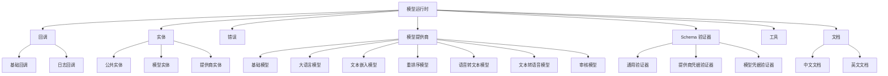
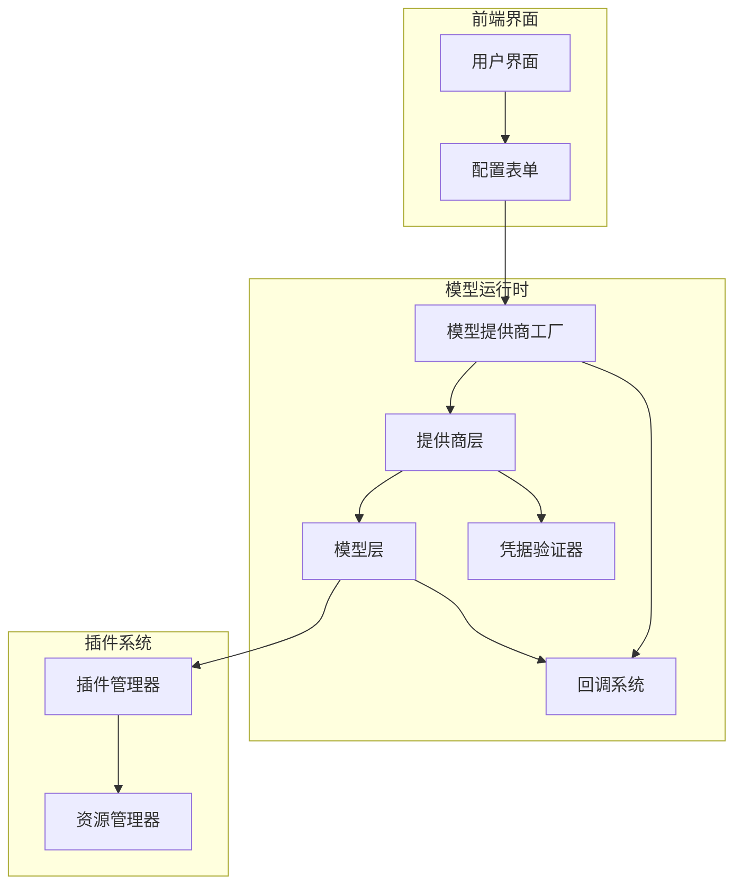
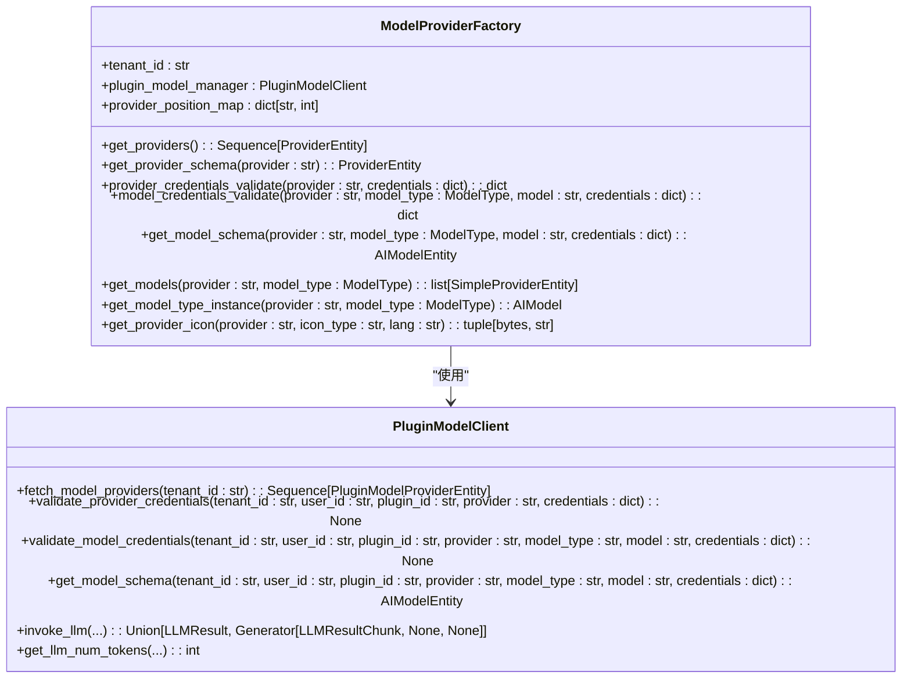
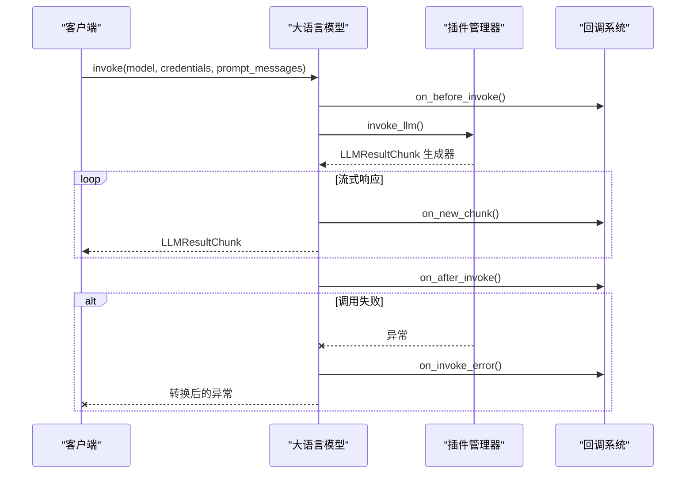
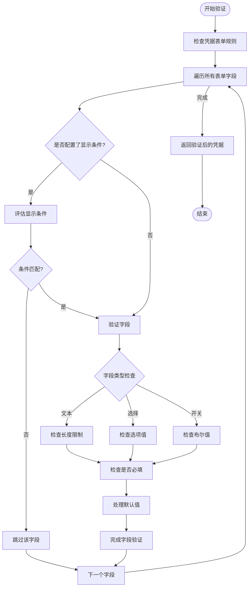
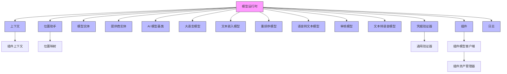

# 模型运行时

<cite>
**本文档中引用的文件**  
- [model_provider_factory.py](file://api/core/model_runtime/model_providers/model_provider_factory.py)
- [large_language_model.py](file://api/core/model_runtime/model_providers/__base/large_language_model.py)
- [model_entities.py](file://api/core/model_runtime/entities/model_entities.py)
- [provider_entities.py](file://api/core/model_runtime/entities/provider_entities.py)
- [provider_credential_schema_validator.py](file://api/core/model_runtime/schema_validators/provider_credential_schema_validator.py)
- [model_credential_schema_validator.py](file://api/core/model_runtime/schema_validators/model_credential_schema_validator.py)
- [common_validator.py](file://api/core/model_runtime/schema_validators/common_validator.py)
- [README_CN.md](file://api/core/model_runtime/README_CN.md)
</cite>

## 目录
1. [简介](#简介)
2. [项目结构](#项目结构)
3. [核心组件](#核心组件)
4. [架构概述](#架构概述)
5. [详细组件分析](#详细组件分析)
6. [依赖分析](#依赖分析)
7. [性能考虑](#性能考虑)
8. [故障排除指南](#故障排除指南)
9. [结论](#结论)

## 简介
Dify 模型运行时模块为系统提供统一的模型调用接口，支持数百种大型语言模型（LLM），涵盖 OpenAI、Mistral、Llama3 等主流提供商。该模块实现了模型配置管理、凭据安全存储、调用优化机制，并支持模型负载均衡、故障转移和性能监控。通过灵活的插件架构，开发者可轻松扩展新模型和提供商，而无需修改前端逻辑。本文档全面介绍其功能特性、配置方法、调优策略及最佳实践。

## 项目结构

**图示来源**  
- [README_CN.md](file://api/core/model_runtime/README_CN.md)
- [model_provider_factory.py](file://api/core/model_runtime/model_providers/model_provider_factory.py)

**本节来源**  
- [README_CN.md](file://api/core/model_runtime/README_CN.md)

## 核心组件

模型运行时的核心组件包括模型提供商工厂、模型实体、提供商实体、凭据验证器和大语言模型调用接口。这些组件共同实现模型的动态加载、配置验证、安全调用和性能监控。

**本节来源**  
- [model_provider_factory.py](file://api/core/model_runtime/model_providers/model_provider_factory.py)
- [model_entities.py](file://api/core/model_runtime/entities/model_entities.py)
- [provider_entities.py](file://api/core/model_runtime/entities/provider_entities.py)

## 架构概述

**图示来源**  
- [model_provider_factory.py](file://api/core/model_runtime/model_providers/model_provider_factory.py)
- [large_language_model.py](file://api/core/model_runtime/model_providers/__base/large_language_model.py)

## 详细组件分析

### 模型提供商工厂分析

模型提供商工厂是模型运行时的核心入口，负责管理所有模型提供商的生命周期。它通过插件系统动态加载提供商，并提供统一的接口用于获取提供商信息、验证凭据和创建模型实例。

**图示来源**  
- [model_provider_factory.py](file://api/core/model_runtime/model_providers/model_provider_factory.py)

**本节来源**  
- [model_provider_factory.py](file://api/core/model_runtime/model_providers/model_provider_factory.py)

### 大语言模型调用分析

大语言模型组件负责处理 LLM 的调用逻辑，包括同步/异步调用、流式响应处理、token 计算和价格计算。它实现了完整的回调系统，支持日志记录、性能监控和错误处理。

**图示来源**  
- [large_language_model.py](file://api/core/model_runtime/model_providers/__base/large_language_model.py)

**本节来源**  
- [large_language_model.py](file://api/core/model_runtime/model_providers/__base/large_language_model.py)

### 凭据验证机制分析

凭据验证器组件负责验证提供商和模型的配置凭据，确保其符合预定义的表单规则。它支持条件显示逻辑，可根据其他字段的值动态决定是否验证某个字段。

**图示来源**  
- [common_validator.py](file://api/core/model_runtime/schema_validators/common_validator.py)
- [provider_credential_schema_validator.py](file://api/core/model_runtime/schema_validators/provider_credential_schema_validator.py)
- [model_credential_schema_validator.py](file://api/core/model_runtime/schema_validators/model_credential_schema_validator.py)

**本节来源**  
- [common_validator.py](file://api/core/model_runtime/schema_validators/common_validator.py)
- [provider_credential_schema_validator.py](file://api/core/model_runtime/schema_validators/provider_credential_schema_validator.py)
- [model_credential_schema_validator.py](file://api/core/model_runtime/schema_validators/model_credential_schema_validator.py)

## 依赖分析

**图示来源**  
- [model_provider_factory.py](file://api/core/model_runtime/model_providers/model_provider_factory.py)
- [large_language_model.py](file://api/core/model_runtime/model_providers/__base/large_language_model.py)

**本节来源**  
- [model_provider_factory.py](file://api/core/model_runtime/model_providers/model_provider_factory.py)
- [large_language_model.py](file://api/core/model_runtime/model_providers/__base/large_language_model.py)

## 性能考虑

模型运行时通过多种机制优化性能：使用缓存存储模型 Schema 以减少重复计算，实现流式响应以降低延迟，集成回调系统进行性能监控。大语言模型组件还支持 token 预计算功能，帮助用户优化成本。建议在生产环境中启用调试日志回调以监控性能瓶颈。

## 故障排除指南

当模型调用出现问题时，首先检查凭据验证是否通过。使用 `provider_credentials_validate` 和 `model_credentials_validate` 方法验证配置的正确性。如果调用失败，查看日志回调输出的详细错误信息。对于流式响应中断问题，确保网络连接稳定并检查超时设置。如果遇到性能问题，可通过启用 `LoggingCallback` 来分析调用延迟。

**本节来源**  
- [large_language_model.py](file://api/core/model_runtime/model_providers/__base/large_language_model.py)
- [common_validator.py](file://api/core/model_runtime/schema_validators/common_validator.py)

## 结论

Dify 模型运行时提供了一个强大而灵活的框架，用于管理多种 LLM 提供商和模型。其插件化架构使得扩展新模型变得简单，而统一的接口设计确保了前后端的解耦。通过完善的凭据验证、性能监控和错误处理机制，该模块为构建可靠的 AI 应用提供了坚实的基础。