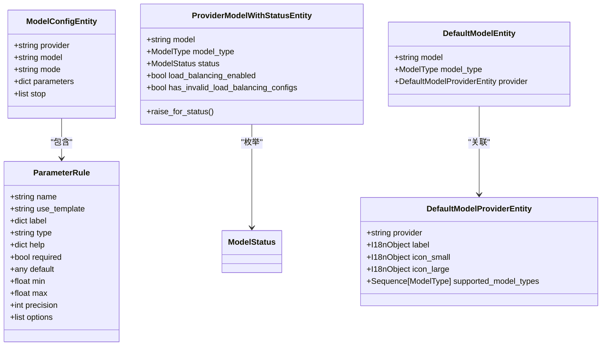
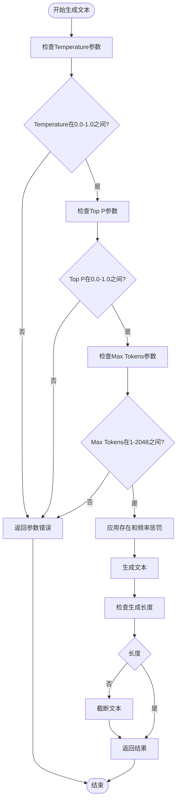
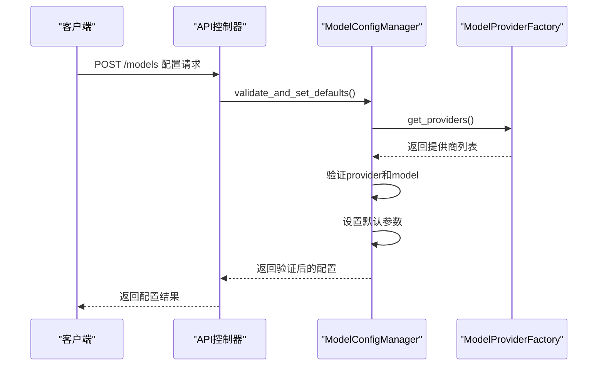
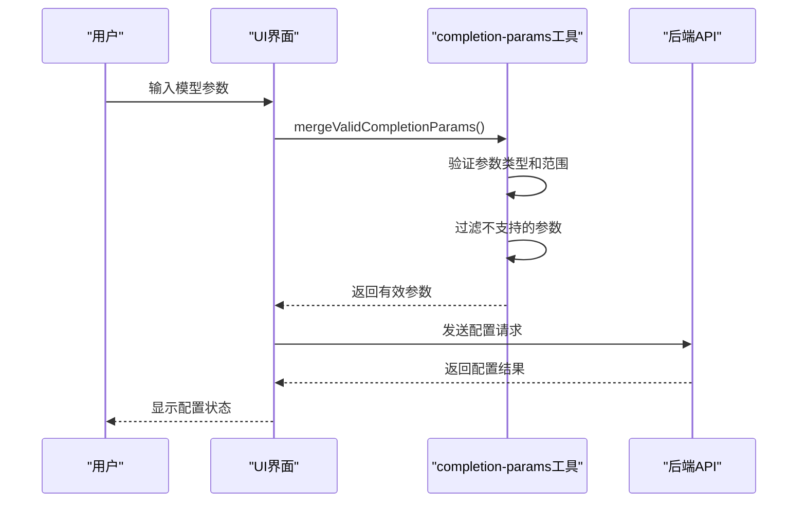
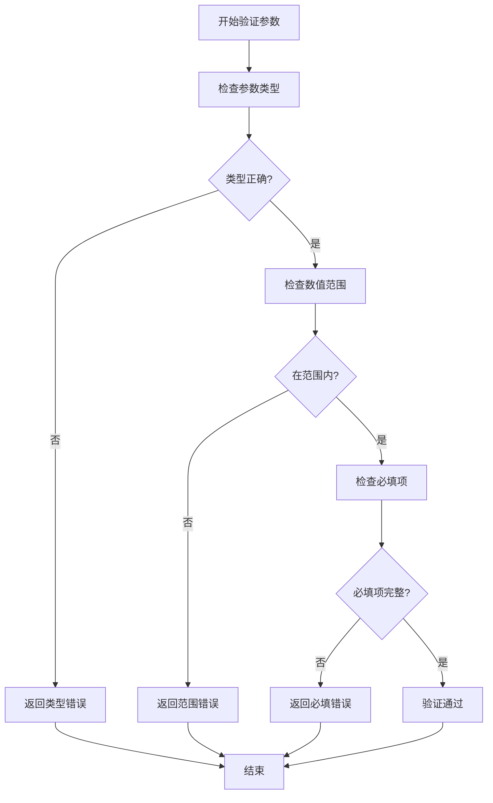

# 模型配置

<cite>
**本文档中引用的文件**  
- [model_entities.py](file://api/core/entities/model_entities.py)
- [defaults.py](file://api/core/model_runtime/entities/defaults.py)
- [manager.py](file://api/core/app/app_config/easy_ui_based_app/model_config/manager.py)
- [completion-params.ts](file://web/utils/completion-params.ts)
- [schema.md](file://api/core/model_runtime/docs/zh_Hans/schema.md)
</cite>

## 目录
1. [简介](#简介)
2. [模型配置实体设计](#模型配置实体设计)
3. 核心模型参数详解
4. 配置方式与实现机制
5. 配置文件结构与最佳实践
6. 实际代码示例
7. 结论

## 简介
Dify平台提供了一套完整的模型配置系统，允许用户通过API和UI界面灵活配置各种大语言模型的参数。本文档全面介绍模型配置的设计与实现，涵盖参数配置方式、对输出质量的影响、默认值设置、验证规则以及动态更新机制。

## 模型配置实体设计

Dify的模型配置系统基于一系列精心设计的实体类，这些实体定义了模型配置的数据结构和行为。核心实体包括`ModelConfigEntity`、`ProviderModelWithStatusEntity`和`ParameterRule`等。



**图示来源**  
- [model_entities.py](file://api/core/entities/model_entities.py#L85-L109)
- [manager.py](file://api/core/app/app_config/easy_ui_based_app/model_config/manager.py#L36-L69)

**本节来源**  
- [model_entities.py](file://api/core/entities/model_entities.py#L1-L110)
- [manager.py](file://api/core/app/app_config/easy_ui_based_app/model_config/manager.py#L1-L122)

## 核心模型参数详解

### Temperature（温度）
温度参数控制生成文本的随机性。较低的温度值（接近0）会使模型输出更加确定性和重复性，而较高的温度值会增加输出的随机性和创造性。

- **标签**: 温度
- **类型**: float
- **默认值**: 0.0
- **范围**: 0.0 - 1.0
- **精度**: 2位小数
- **帮助信息**: 温度控制随机性。较低的温度会导致较少的随机完成。随着温度接近零，模型将变得确定性和重复性。较高的温度会导致更多的随机完成。

### Top P（核心采样）
Top P参数通过核心采样控制输出的多样性。值为0.5表示考虑一半的所有可能性加权选项。

- **标签**: Top P
- **类型**: float
- **默认值**: 1.0
- **范围**: 0.0 - 1.0
- **精度**: 2位小数
- **帮助信息**: 通过核心采样控制多样性：0.5 表示考虑了一半的所有可能性加权选项。

### Max Tokens（最大标记）
最大标记参数指定生成结果长度的上限。如果生成结果被截断，可以调大该参数。

- **标签**: 最大标记
- **类型**: int
- **默认值**: 64
- **范围**: 1 - 2048
- **精度**: 0位小数
- **帮助信息**: 指定生成结果长度的上限。如果生成结果截断，可以调大该参数。

### Presence Penalty（存在惩罚）
存在惩罚对文本中已有的标记的对数概率施加惩罚，减少重复内容的生成。

- **标签**: 存在惩罚
- **类型**: float
- **默认值**: 0.0
- **范围**: 0.0 - 1.0
- **精度**: 2位小数

### Frequency Penalty（频率惩罚）
频率惩罚对文本中出现的标记的对数概率施加惩罚，与存在惩罚的区别在于其基于训练数据中的频率。

- **标签**: 频率惩罚
- **类型**: float
- **默认值**: 0.0
- **范围**: 0.0 - 1.0
- **精度**: 2位小数



**图示来源**  
- [defaults.py](file://api/core/model_runtime/entities/defaults.py#L0-L32)
- [schema.md](file://api/core/model_runtime/docs/zh_Hans/schema.md#ParameterRule)

**本节来源**  
- [defaults.py](file://api/core/model_runtime/entities/defaults.py#L0-L130)
- [schema.md](file://api/core/model_runtime/docs/zh_Hans/schema.md#ParameterRule)

## 配置方式与实现机制

### API配置方式
通过API配置模型参数主要涉及`ModelConfigManager`类的`validate_and_set_defaults`方法，该方法负责验证和设置模型配置的默认值。



**图示来源**  
- [manager.py](file://api/core/app/app_config/easy_ui_based_app/model_config/manager.py#L36-L69)
- [models.py](file://api/controllers/console/workspace/models.py#L255-L288)

### UI界面配置
UI界面配置通过前端组件实现，主要涉及`completion-params.ts`中的`mergeValidCompletionParams`函数，该函数负责合并和验证用户输入的参数。



**图示来源**  
- [completion-params.ts](file://web/utils/completion-params.ts#L0-L41)
- [model-config.tsx](file://web/app/components/header/account-setting/model-provider-page/model-config.tsx)

**本节来源**  
- [manager.py](file://api/core/app/app_config/easy_ui_based_app/model_config/manager.py#L36-L69)
- [completion-params.ts](file://web/utils/completion-params.ts#L0-L82)

## 配置文件结构与最佳实践

### 配置文件结构
模型配置文件遵循标准化的JSON结构，包含模型提供商、模型名称、模式和参数等关键字段。

```json
{
  "model": {
    "provider": "openai",
    "name": "gpt-3.5-turbo",
    "mode": "chat",
    "completion_params": {
      "temperature": 0.7,
      "top_p": 1.0,
      "max_tokens": 512,
      "presence_penalty": 0.0,
      "frequency_penalty": 0.0
    },
    "stop": ["\n", "###"]
  }
}
```

### 最佳实践

#### 设置默认值
Dify系统为每个参数提供了合理的默认值，确保在用户未指定参数时仍能正常工作。

```python
# 参数默认值配置
PARAMETER_RULE_TEMPLATE = {
    DefaultParameterName.TEMPERATURE: {
        "default": 0.0,
        "min": 0.0,
        "max": 1.0,
        "precision": 2,
    },
    DefaultParameterName.TOP_P: {
        "default": 1.0,
        "min": 0.0,
        "max": 1.0,
        "precision": 2,
    },
    # ... 其他参数
}
```

#### 验证规则
系统实现了严格的参数验证规则，确保配置的合法性和安全性。



#### 动态更新机制
系统支持模型配置的动态更新，允许在运行时修改配置而无需重启服务。

```python
def update_model_configuration(tenant_id, provider, model, new_config):
    """
    更新模型配置
    
    :param tenant_id: 租户ID
    :param provider: 模型提供商
    :param model: 模型名称
    :param new_config: 新配置
    """
    # 验证新配置
    validated_config = ModelConfigManager.validate_and_set_defaults(
        tenant_id, new_config
    )
    
    # 更新数据库记录
    default_model = db.session.query(TenantDefaultModel).filter(
        TenantDefaultModel.tenant_id == tenant_id,
        TenantDefaultModel.model_type == model_type.value,
    ).first()
    
    if default_model:
        default_model.provider_name = provider
        default_model.model_name = model
        db.session.commit()
    
    return validated_config
```

**本节来源**  
- [defaults.py](file://api/core/model_runtime/entities/defaults.py#L0-L130)
- [manager.py](file://api/core/app/app_config/easy_ui_based_app/model_config/manager.py#L36-L69)
- [provider_manager.py](file://api/core/provider_manager.py#L368-L403)

## 实际代码示例

### 创建模型配置
以下示例展示了如何通过代码创建和管理模型配置：

```python
from core.app.app_config.entities import ModelConfigEntity
from core.model_runtime.entities.model_entities import ModelType
from core.model_runtime.model_providers.model_provider_factory import ModelProviderFactory
from core.provider_manager import ProviderManager

class ModelConfigManager:
    @classmethod
    def convert(cls, config: dict) -> ModelConfigEntity:
        """
        将配置字典转换为模型配置实体
        
        :param config: 模型配置参数
        """
        model_config = config.get("model")
        if not model_config:
            raise ValueError("model is required")

        completion_params = model_config.get("completion_params")
        stop = []
        if "stop" in completion_params:
            stop = completion_params["stop"]
            del completion_params["stop"]

        model_mode = model_config.get("mode")

        return ModelConfigEntity(
            provider=config["model"]["provider"],
            model=config["model"]["name"],
            mode=model_mode,
            parameters=completion_params,
            stop=stop,
        )
```

### 验证和设置默认值
```python
@classmethod
def validate_and_set_defaults(cls, tenant_id: str, config: Mapping[str, Any]) -> tuple[dict, list[str]]:
    """
    验证并设置模型配置的默认值
    
    :param tenant_id: 租户ID
    :param config: 应用模型配置参数
    """
    if "model" not in config:
        raise ValueError("model is required")

    if not isinstance(config["model"], dict):
        raise ValueError("model must be of object type")

    # 验证和设置provider
    model_provider_factory = ModelProviderFactory(tenant_id)
    provider_entities = model_provider_factory.get_providers()
    model_provider_names = [provider.provider for provider in provider_entities]
    
    if "provider" not in config["model"]:
        raise ValueError(f"model.provider is required and must be in {str(model_provider_names)}")

    # 验证和设置model name
    if "name" not in config["model"]:
        raise ValueError("model.name is required")

    provider_manager = ProviderManager()
    models = provider_manager.get_configurations(tenant_id).get_models(
        provider=config["model"]["provider"], model_type=ModelType.LLM
    )

    if not models:
        raise ValueError("model.name must be in the specified model list")

    model_ids = [m.model for m in models]
    if config["model"]["name"] not in model_ids:
        raise ValueError("model.name must be in the specified model list")

    # 设置默认参数
    if "completion_params" not in config["model"]:
        raise ValueError("model.completion_params is required")

    config["model"]["completion_params"] = cls.validate_model_completion_params(
        config["model"]["completion_params"]
    )

    return dict(config), ["model"]
```

**本节来源**  
- [manager.py](file://api/core/app/app_config/easy_ui_based_app/model_config/manager.py#L1-L122)

## 结论
Dify的模型配置系统提供了一套完整、灵活且安全的机制，用于管理和配置大语言模型的各种参数。通过精心设计的实体类、严格的验证规则和友好的API/界面，用户可以轻松地调整模型行为以满足不同的应用需求。系统的模块化设计和清晰的职责划分使得扩展和维护变得更加容易，为构建高质量的AI应用提供了坚实的基础。