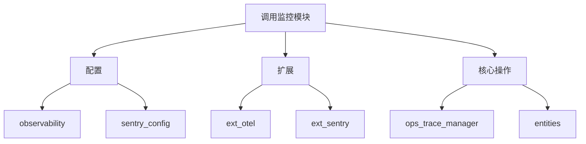
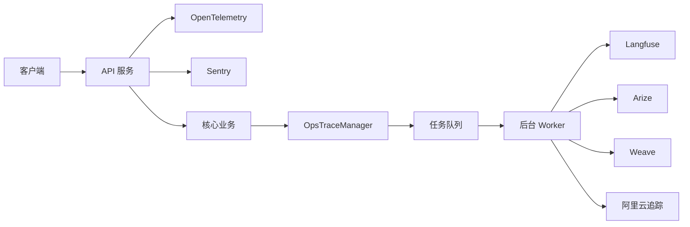
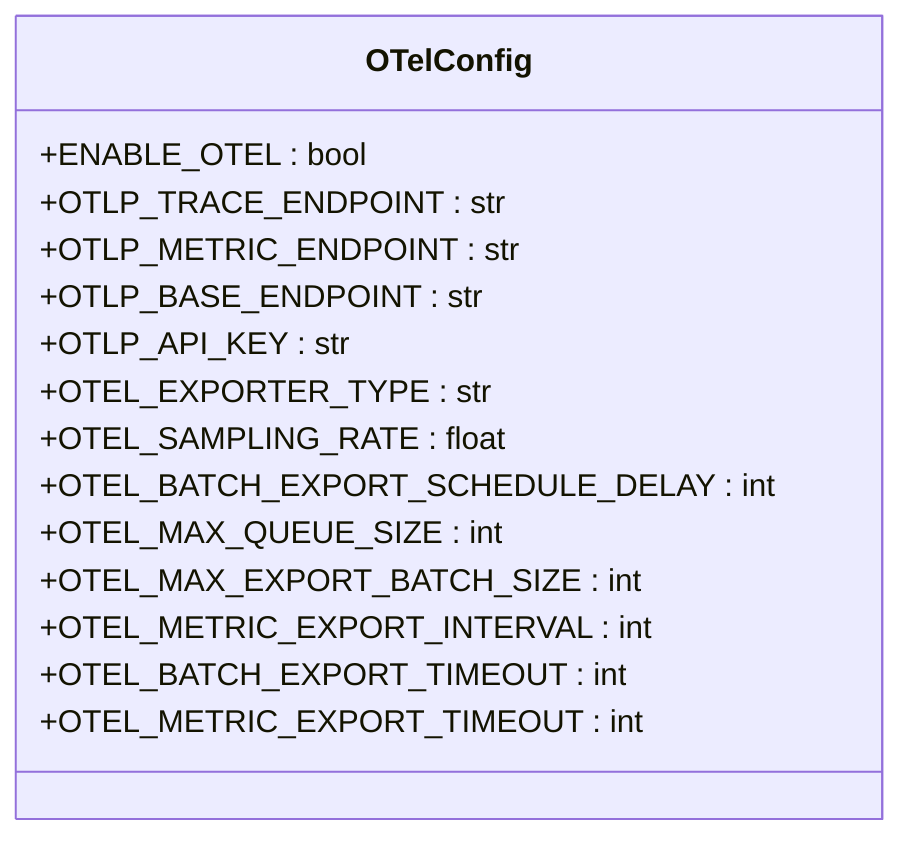
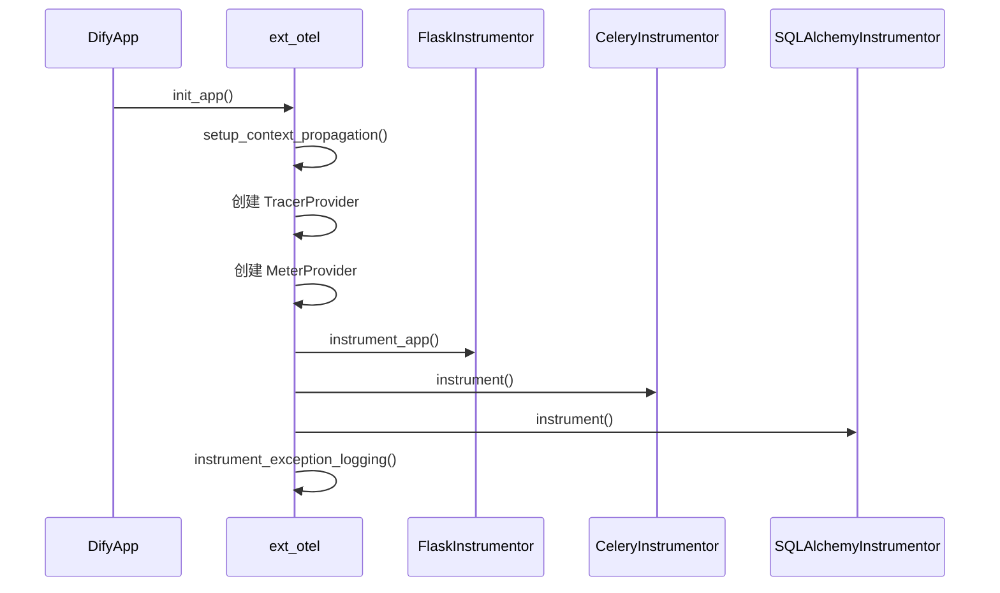
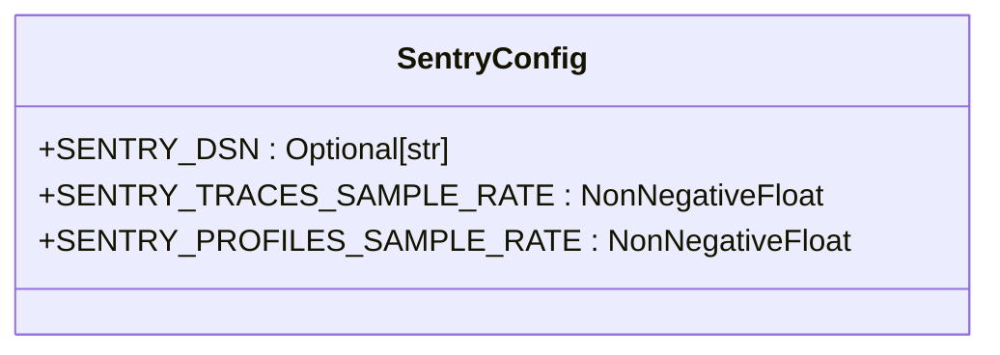
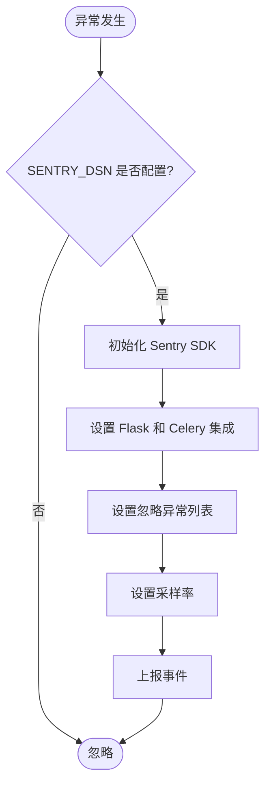
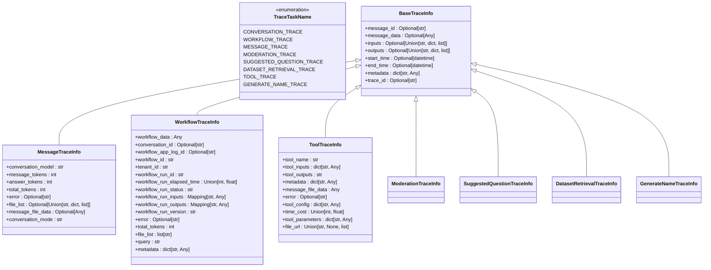
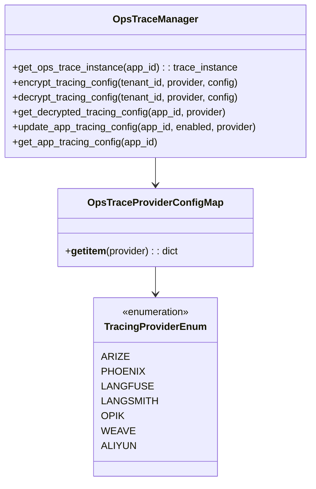
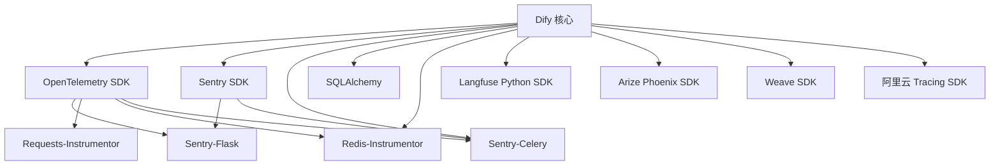

# 调用监控

<cite>
**本文档引用文件**  
- [otel_config.py](file://api/configs/observability/otel/otel_config.py)
- [ext_otel.py](file://api/extensions/ext_otel.py)
- [ext_sentry.py](file://api/extensions/ext_sentry.py)
- [sentry_config.py](file://api/configs/extra/sentry_config.py)
- [ops_trace_manager.py](file://api/core/ops/ops_trace_manager.py)
- [trace_entity.py](file://api/core/ops/entities/trace_entity.py)
- [config_entity.py](file://api/core/ops/entities/config_entity.py)
</cite>

## 目录
1. [简介](#简介)
2. [项目结构](#项目结构)
3. [核心组件](#核心组件)
4. [架构概览](#架构概览)
5. [详细组件分析](#详细组件分析)
6. [依赖分析](#依赖分析)
7. [性能考量](#性能考量)
8. [故障排查指南](#故障排查指南)
9. [结论](#结论)

## 简介
本文档全面介绍 Dify 平台中模型调用的监控机制，涵盖分布式追踪、日志记录、错误报告及性能监控功能。重点阐述如何通过 OpenTelemetry 实现调用链追踪，集成 Sentry 进行异常捕获，并详细说明延迟、成功率与成本监控的实现方式。同时提供监控数据的查询与可视化方案，结合实际案例展示性能问题的诊断与优化流程。

## 项目结构
Dify 的调用监控功能主要分布在 `api` 目录下的多个子模块中，包括配置、扩展、核心操作等部分。整体结构清晰，职责分离明确。



**图示来源**  
- [api/configs/observability](file://api/configs/observability)
- [api/extensions](file://api/extensions)
- [api/core/ops](file://api/core/ops)

**本节来源**  
- [api/configs/observability](file://api/configs/observability)
- [api/extensions](file://api/extensions)
- [api/core/ops](file://api/core/ops)

## 核心组件
Dify 的调用监控由三大核心组件构成：OpenTelemetry 集成、Sentry 错误报告、以及自定义的 OPS 追踪管理器。这些组件协同工作，实现从请求入口到后端服务的全链路监控。

**本节来源**  
- [ext_otel.py](file://api/extensions/ext_otel.py)
- [ext_sentry.py](file://api/extensions/ext_sentry.py)
- [ops_trace_manager.py](file://api/core/ops/ops_trace_manager.py)

## 架构概览
Dify 的调用监控采用分层架构，前端请求通过 Flask 中间件进入系统，由 OpenTelemetry 完成基础链路追踪，Sentry 捕获异常，而核心业务逻辑的细粒度追踪则由 OpsTraceManager 统一调度并异步处理。



**图示来源**  
- [ext_otel.py](file://api/extensions/ext_otel.py)
- [ext_sentry.py](file://api/extensions/ext_sentry.py)
- [ops_trace_manager.py](file://api/core/ops/ops_trace_manager.py)

## 详细组件分析

### OpenTelemetry 集成分析
Dify 通过 `ext_otel.py` 模块实现 OpenTelemetry 的全面集成，支持对 Flask、Celery、SQLAlchemy、Redis 和 Requests 等关键组件的自动埋点。

#### 配置与初始化
OpenTelemetry 的启用由 `OTelConfig` 类控制，相关配置项定义在 `otel_config.py` 中，支持 OTLP 协议（gRPC/HTTP）、采样率、批处理参数等。



**图示来源**  
- [otel_config.py](file://api/configs/observability/otel/otel_config.py)

#### 追踪初始化流程
`init_app` 函数负责初始化 OpenTelemetry，包括设置资源属性、采样器、导出器和度量提供者，并为 Flask、Celery 等框架安装探针。



**图示来源**  
- [ext_otel.py](file://api/extensions/ext_otel.py)

**本节来源**  
- [otel_config.py](file://api/configs/observability/otel/otel_config.py)
- [ext_otel.py](file://api/extensions/ext_otel.py)

### Sentry 错误报告分析
Sentry 集成通过 `ext_sentry.py` 模块实现，主要用于捕获和上报运行时异常，支持与 Flask 和 Celery 的深度集成。

#### 配置与初始化
Sentry 的配置由 `SentryConfig` 类定义，包括 DSN、采样率、环境和版本信息。



**图示来源**  
- [sentry_config.py](file://api/configs/extra/sentry_config.py)

#### 异常过滤机制
通过 `before_send` 回调函数，Dify 可以过滤掉特定类型的异常（如 HTTPException、InvokeRateLimitError），避免无关错误干扰监控。



**图示来源**  
- [ext_sentry.py](file://api/extensions/ext_sentry.py)

**本节来源**  
- [sentry_config.py](file://api/configs/extra/sentry_config.py)
- [ext_sentry.py](file://api/extensions/ext_sentry.py)

### OPS 追踪管理器分析
`OpsTraceManager` 是 Dify 自研的高级追踪管理器，负责收集和处理各类业务追踪数据，如消息、工作流、工具调用等。

#### 追踪类型与实体
支持多种追踪类型，每种类型对应一个数据实体类，定义了追踪所需的数据结构。



**图示来源**  
- [trace_entity.py](file://api/core/ops/entities/trace_entity.py)

#### 追踪提供者管理
支持多种第三方追踪平台，通过策略模式动态加载对应的追踪实例。



**图示来源**  
- [config_entity.py](file://api/core/ops/entities/config_entity.py)
- [ops_trace_manager.py](file://api/core/ops/ops_trace_manager.py)

#### 追踪任务处理流程
追踪任务通过 Celery 异步队列处理，确保不影响主业务流程性能。

```mermaid
flowchart TD
Start([业务事件触发]) --> CreateTask[创建 TraceTask]
CreateTask --> SetType[设置 trace_type]
CreateTask --> SetData[设置 message_id/workflow_run_id 等]
SetData --> AddToQueue[加入 ops_trace_queue]
AddToQueue --> Worker[Celery Worker]
Worker --> ExecuteTask[执行 TraceTask.execute()]
ExecuteTask --> Preprocess[调用 preprocess()]
Preprocess --> SelectHandler[根据 trace_type 选择处理函数]
SelectHandler --> Handle[处理并生成 TraceInfo]
Handle --> Export[导出到第三方平台]
Export --> End([完成])
```

**图示来源**  
- [ops_trace_manager.py](file://api/core/ops/ops_trace_manager.py)

**本节来源**  
- [ops_trace_manager.py](file://api/core/ops/ops_trace_manager.py)
- [trace_entity.py](file://api/core/ops/entities/trace_entity.py)
- [config_entity.py](file://api/core/ops/entities/config_entity.py)

## 依赖分析
Dify 的调用监控系统依赖多个外部库和内部模块，形成一个完整的可观测性生态。



**图示来源**  
- [ext_otel.py](file://api/extensions/ext_otel.py)
- [ext_sentry.py](file://api/extensions/ext_sentry.py)
- [ops_trace_manager.py](file://api/core/ops/ops_trace_manager.py)

**本节来源**  
- [ext_otel.py](file://api/extensions/ext_otel.py)
- [ext_sentry.py](file://api/extensions/ext_sentry.py)
- [ops_trace_manager.py](file://api/core/ops/ops_trace_manager.py)

## 性能考量
Dify 在设计调用监控时充分考虑了性能影响，主要通过以下机制实现：

- **异步处理**：所有业务追踪数据均通过 Celery 队列异步处理，避免阻塞主请求。
- **采样机制**：OpenTelemetry 支持可配置的采样率（`OTEL_SAMPLING_RATE`），默认为 0.1，有效降低数据量。
- **批处理导出**：追踪数据采用批量导出模式，减少网络请求次数。
- **内存缓存**：`OpsTraceManager` 使用 LRU 缓存追踪实例，避免重复创建开销。
- **异常过滤**：Sentry 配置了忽略列表，避免上报无意义的异常。

这些机制共同确保了监控系统在高并发场景下的稳定性和低延迟。

## 故障排查指南
当调用监控功能出现异常时，可按以下步骤进行排查：

1. **检查配置**：确认 `ENABLE_OTEL` 和 `SENTRY_DSN` 等环境变量已正确设置。
2. **查看日志**：检查应用日志中是否有 `OpenTelemetry` 或 `Sentry` 相关的错误信息。
3. **验证连接**：确认 OTLP 端点或 Sentry 服务网络可达。
4. **检查队列**：通过 Celery 监控工具检查 `ops_trace_queue` 是否有积压任务。
5. **测试追踪**：手动触发一个 API 调用，观察是否生成预期的追踪数据。
6. **验证第三方平台**：登录 Langfuse、Arize 等平台，确认数据是否正常接收。

**本节来源**  
- [ext_otel.py](file://api/extensions/ext_otel.py)
- [ext_sentry.py](file://api/extensions/ext_sentry.py)
- [ops_trace_manager.py](file://api/core/ops/ops_trace_manager.py)

## 结论
Dify 构建了一套完善的调用监控体系，结合 OpenTelemetry 的标准化追踪、Sentry 的异常捕获以及自研的 OPS 追踪管理器，实现了从基础设施到业务逻辑的全栈可观测性。该系统不仅支持主流的追踪平台集成，还通过异步处理和采样机制保障了高性能，为模型调用的性能优化和故障诊断提供了强有力的支持。