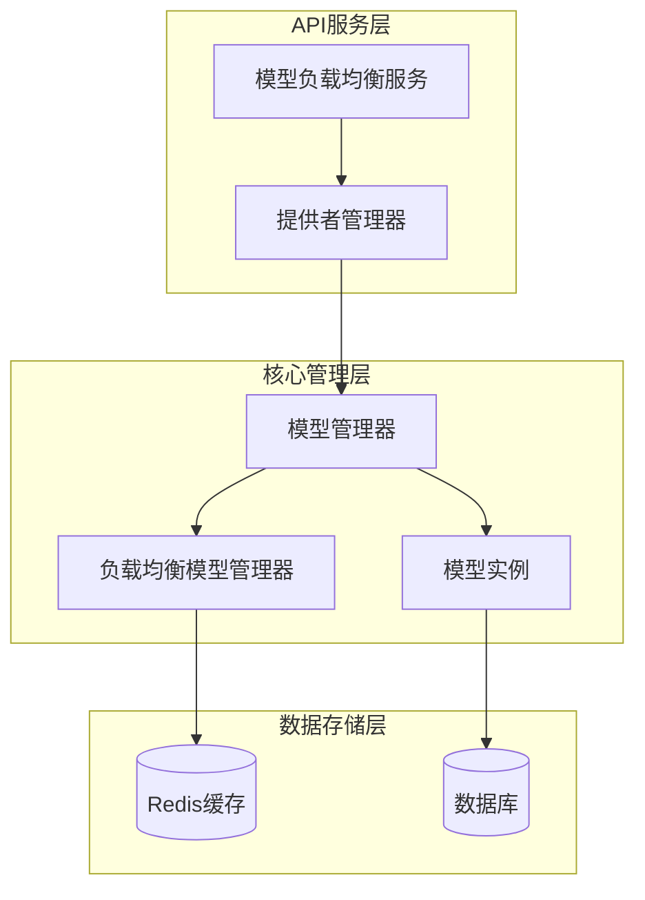
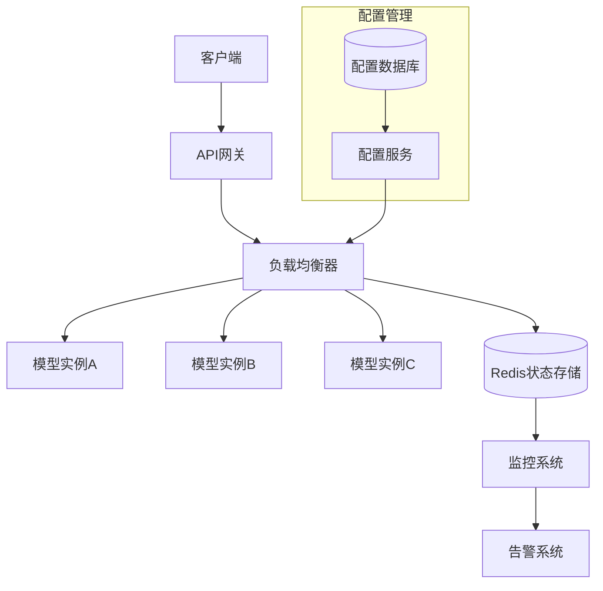
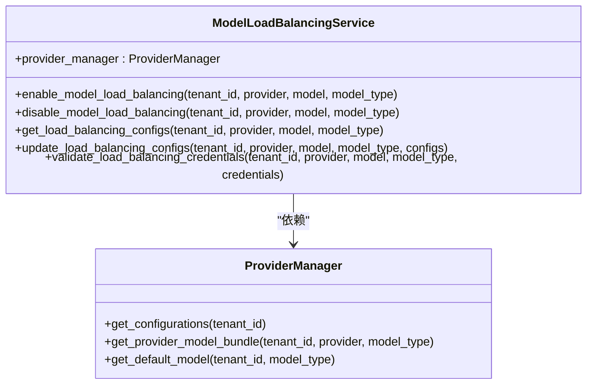
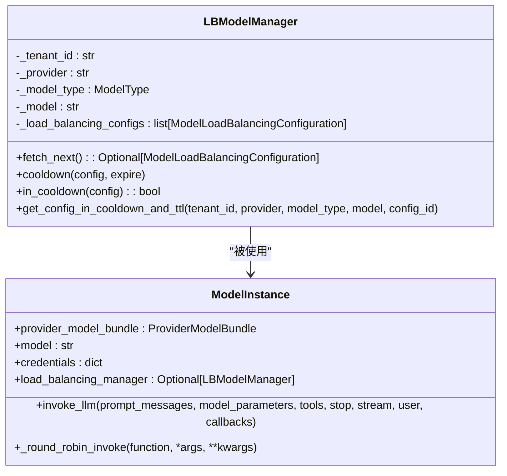
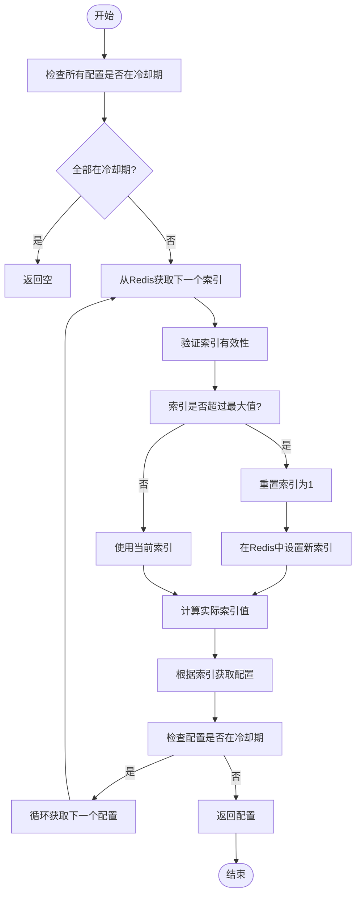
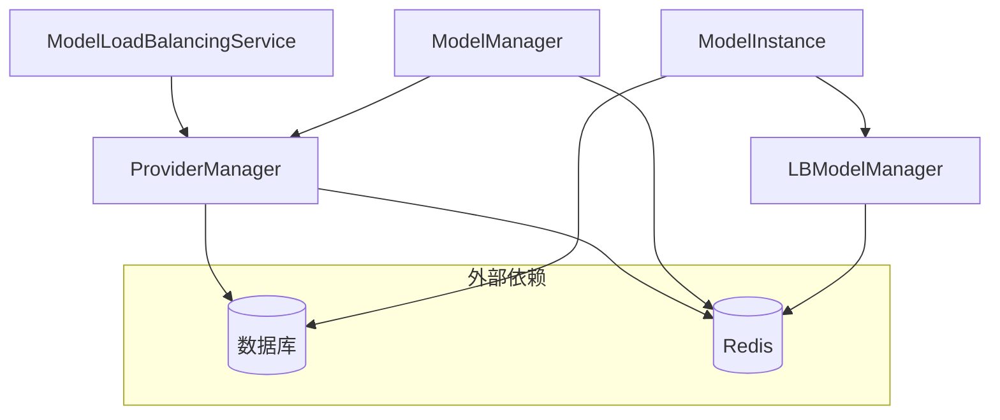

# 负载均衡

<cite>
**本文档引用的文件**
- [model_load_balancing_service.py](file://api/services/model_load_balancing_service.py)
- [model_manager.py](file://api/core/model_manager.py)
- [provider_manager.py](file://api/core/provider_manager.py)
</cite>

## 目录
1. [简介](#简介)
2. [项目结构](#项目结构)
3. [核心组件](#核心组件)
4. [架构概述](#架构概述)
5. [详细组件分析](#详细组件分析)
6. [依赖分析](#依赖分析)
7. [性能考虑](#性能考虑)
8. [故障排除指南](#故障排除指南)
9. [结论](#结论)

## 简介
本文档详细介绍了Dify平台中多模型实例的流量分配策略和故障转移机制。文档涵盖了轮询、加权轮询和最少连接等负载均衡算法的实现方式，解释了健康检查和自动故障转移的配置方法。此外，还提供了连接池管理和请求超时设置等性能优化建议，并通过实际部署案例展示了如何在生产环境中实现高可用的模型服务。

## 项目结构
Dify的负载均衡功能主要分布在API服务层和核心模型管理模块中。系统通过分层架构实现了模型实例的动态管理和流量分配，确保了高可用性和可扩展性。

**图示来源**
- [model_load_balancing_service.py](file://api/services/model_load_balancing_service.py#L1-L620)
- [model_manager.py](file://api/core/model_manager.py#L1-L586)
- [provider_manager.py](file://api/core/provider_manager.py#L1-L1146)

**章节来源**
- [model_load_balancing_service.py](file://api/services/model_load_balancing_service.py#L1-L620)
- [model_manager.py](file://api/core/model_manager.py#L1-L586)

## 核心组件
Dify的负载均衡系统由多个核心组件构成，包括模型负载均衡服务、提供者管理器、模型管理器和负载均衡模型管理器。这些组件协同工作，实现了多模型实例的流量分配和故障转移功能。

**章节来源**
- [model_load_balancing_service.py](file://api/services/model_load_balancing_service.py#L1-L620)
- [model_manager.py](file://api/core/model_manager.py#L1-L586)

## 架构概述
Dify的负载均衡架构采用分层设计，从API服务层到核心管理层再到数据存储层，形成了完整的流量分配和故障处理体系。系统通过Redis缓存实现分布式环境下的状态同步，确保了负载均衡策略的一致性。

**图示来源**
- [model_load_balancing_service.py](file://api/services/model_load_balancing_service.py#L1-L620)
- [model_manager.py](file://api/core/model_manager.py#L1-L586)

## 详细组件分析

### 模型负载均衡服务分析
模型负载均衡服务是Dify负载均衡系统的核心组件，负责管理多模型实例的配置、启用和禁用操作。

**图示来源**
- [model_load_balancing_service.py](file://api/services/model_load_balancing_service.py#L1-L620)
- [provider_manager.py](file://api/core/provider_manager.py#L1-L1146)

### 负载均衡模型管理器分析
负载均衡模型管理器实现了核心的流量分配算法和故障转移机制，是Dify负载均衡策略的具体执行者。

**图示来源**
- [model_manager.py](file://api/core/model_manager.py#L1-L586)

#### 负载均衡算法实现
Dify实现了基于轮询的负载均衡算法，通过Redis计数器实现分布式环境下的请求分配。

**图示来源**
- [model_manager.py](file://api/core/model_manager.py#L463-L535)

## 依赖分析
Dify的负载均衡系统依赖于多个核心组件和外部服务，形成了复杂的依赖关系网络。

**图示来源**
- [model_load_balancing_service.py](file://api/services/model_load_balancing_service.py#L1-L620)
- [model_manager.py](file://api/core/model_manager.py#L1-L586)
- [provider_manager.py](file://api/core/provider_manager.py#L1-L1146)

**章节来源**
- [model_load_balancing_service.py](file://api/services/model_load_balancing_service.py#L1-L620)
- [model_manager.py](file://api/core/model_manager.py#L1-L586)
- [provider_manager.py](file://api/core/provider_manager.py#L1-L1146)

## 性能考虑
为了确保负载均衡系统的高性能和高可用性，Dify采用了多种优化策略：

1. **Redis缓存优化**：使用Redis存储负载均衡状态，实现快速的索引递增和冷却期检查。
2. **连接池管理**：通过连接池复用数据库连接，减少连接创建和销毁的开销。
3. **请求超时设置**：为外部API调用设置合理的超时时间，防止请求堆积。
4. **异步处理**：将非关键操作异步化，提高系统响应速度。
5. **批量操作**：对数据库操作进行批量处理，减少I/O开销。

这些优化措施共同确保了Dify在高并发场景下的稳定性和性能表现。

## 故障排除指南
当负载均衡系统出现问题时，可以按照以下步骤进行排查：

1. **检查Redis连接**：确保Redis服务正常运行，连接配置正确。
2. **验证数据库状态**：检查负载均衡配置是否正确存储在数据库中。
3. **查看日志信息**：通过系统日志定位具体的错误信息。
4. **检查配置有效性**：确认负载均衡配置是否已正确启用。
5. **测试单个模型**：排除单个模型实例的故障可能性。

**章节来源**
- [model_load_balancing_service.py](file://api/services/model_load_balancing_service.py#L1-L620)
- [model_manager.py](file://api/core/model_manager.py#L1-L586)

## 结论
Dify的负载均衡系统通过精心设计的架构和高效的算法实现，为多模型实例的流量分配提供了可靠的解决方案。系统不仅支持基本的轮询算法，还通过冷却机制实现了自动故障转移，确保了服务的高可用性。通过合理的性能优化和完善的监控体系，Dify能够在生产环境中稳定运行，满足各种复杂的业务需求。