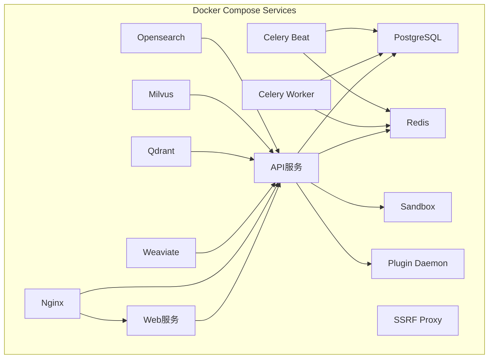
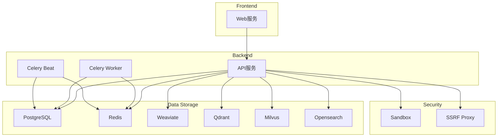
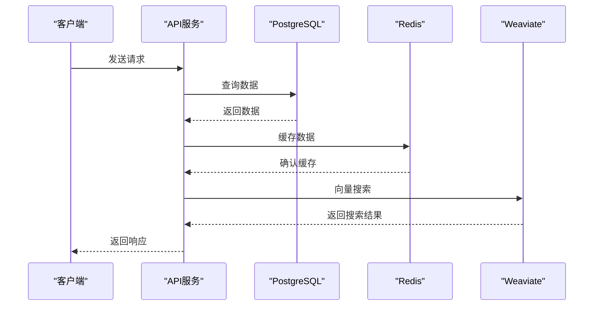
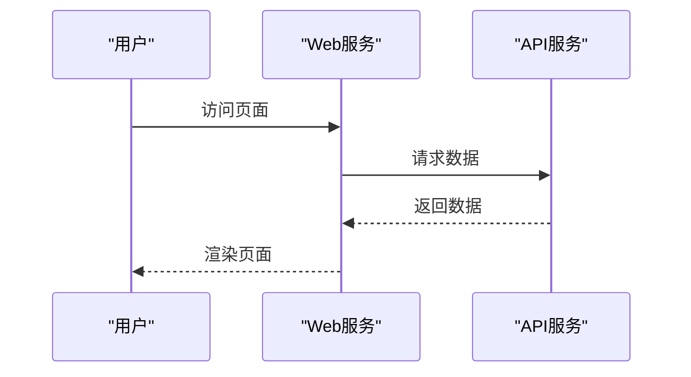
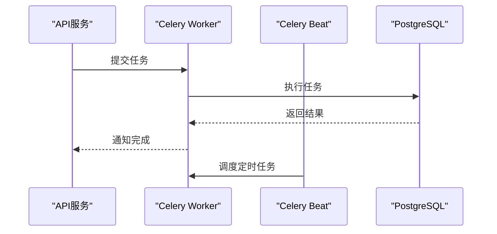
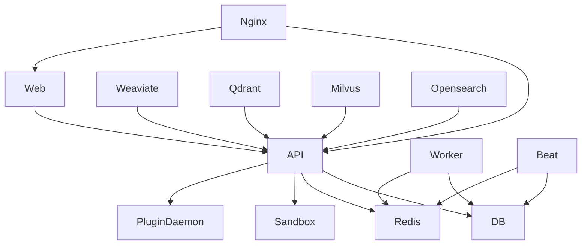

# Docker部署

<cite>
**本文档中引用的文件**  
- [docker-compose.yaml](file://docker/docker-compose.yaml)
- [docker-compose-template.yaml](file://docker/docker-compose-template.yaml)
- [docker-compose.middleware.yaml](file://docker/docker-compose.middleware.yaml)
- [middleware.env.example](file://docker/middleware.env.example)
- [nginx/docker-entrypoint.sh](file://docker/nginx/docker-entrypoint.sh)
- [README.md](file://docker/README.md)
</cite>

## 目录
1. [简介](#简介)
2. [项目结构](#项目结构)
3. [核心组件](#核心组件)
4. [架构概述](#架构概述)
5. [详细组件分析](#详细组件分析)
6. [依赖分析](#依赖分析)
7. [性能考虑](#性能考虑)
8. [故障排除指南](#故障排除指南)
9. [结论](#结论)

## 简介
Dify是一个基于Docker Compose的本地和生产环境部署方案，支持多种向量数据库和存储服务。本指南详细介绍了如何使用`docker-compose.yaml`文件进行部署，包括API、Web、Celery、Redis、PostgreSQL等组件的配置和依赖关系。

## 项目结构
Dify的项目结构包括API、Web、数据库、缓存等多个组件，所有配置文件和脚本都位于`docker`目录下。

**Diagram sources**
- [docker-compose.yaml](file://docker/docker-compose.yaml#L1-L1358)
- [docker-compose-template.yaml](file://docker/docker-compose-template.yaml#L1-L777)

**Section sources**
- [docker-compose.yaml](file://docker/docker-compose.yaml#L1-L1358)
- [docker-compose-template.yaml](file://docker/docker-compose-template.yaml#L1-L777)

## 核心组件
Dify的核心组件包括API服务、Web服务、Celery Worker、Redis缓存、PostgreSQL数据库等。

**Section sources**
- [docker-compose.yaml](file://docker/docker-compose.yaml#L1-L1358)
- [docker-compose-template.yaml](file://docker/docker-compose-template.yaml#L1-L777)

## 架构概述
Dify的架构基于微服务设计，各个组件通过Docker Compose进行编排和管理。

**Diagram sources**
- [docker-compose.yaml](file://docker/docker-compose.yaml#L1-L1358)
- [docker-compose-template.yaml](file://docker/docker-compose-template.yaml#L1-L777)

## 详细组件分析

### API服务分析
API服务是Dify的核心，负责处理所有业务逻辑和数据交互。

#### 对于API服务组件：

**Diagram sources**
- [docker-compose.yaml](file://docker/docker-compose.yaml#L1-L1358)
- [docker-compose-template.yaml](file://docker/docker-compose-template.yaml#L1-L777)

**Section sources**
- [docker-compose.yaml](file://docker/docker-compose.yaml#L1-L1358)
- [docker-compose-template.yaml](file://docker/docker-compose-template.yaml#L1-L777)

### Web服务分析
Web服务提供用户界面，与API服务进行通信。

#### 对于Web服务组件：

**Diagram sources**
- [docker-compose.yaml](file://docker/docker-compose.yaml#L1-L1358)
- [docker-compose-template.yaml](file://docker/docker-compose-template.yaml#L1-L777)

**Section sources**
- [docker-compose.yaml](file://docker/docker-compose.yaml#L1-L1358)
- [docker-compose-template.yaml](file://docker/docker-compose-template.yaml#L1-L777)

### Celery Worker分析
Celery Worker负责处理异步任务和定时任务。

#### 对于Celery Worker组件：

**Diagram sources**
- [docker-compose.yaml](file://docker/docker-compose.yaml#L1-L1358)
- [docker-compose-template.yaml](file://docker/docker-compose-template.yaml#L1-L777)

**Section sources**
- [docker-compose.yaml](file://docker/docker-compose.yaml#L1-L1358)
- [docker-compose-template.yaml](file://docker/docker-compose-template.yaml#L1-L777)

## 依赖分析
Dify的各个组件之间存在复杂的依赖关系，通过Docker Compose进行管理和编排。

**Diagram sources**
- [docker-compose.yaml](file://docker/docker-compose.yaml#L1-L1358)
- [docker-compose-template.yaml](file://docker/docker-compose-template.yaml#L1-L777)

**Section sources**
- [docker-compose.yaml](file://docker/docker-compose.yaml#L1-L1358)
- [docker-compose-template.yaml](file://docker/docker-compose-template.yaml#L1-L777)

## 性能考虑
在部署Dify时，需要考虑各个组件的资源分配和性能优化。

**Section sources**
- [docker-compose.yaml](file://docker/docker-compose.yaml#L1-L1358)
- [docker-compose-template.yaml](file://docker/docker-compose-template.yaml#L1-L777)

## 故障排除指南
在部署和运行Dify时，可能会遇到各种问题，以下是一些常见的故障排除方法。

**Section sources**
- [docker-compose.yaml](file://docker/docker-compose.yaml#L1-L1358)
- [docker-compose-template.yaml](file://docker/docker-compose-template.yaml#L1-L777)

## 结论
Dify的Docker部署方案提供了灵活和可扩展的架构，支持多种向量数据库和存储服务。通过合理的配置和优化，可以满足不同规模的部署需求。