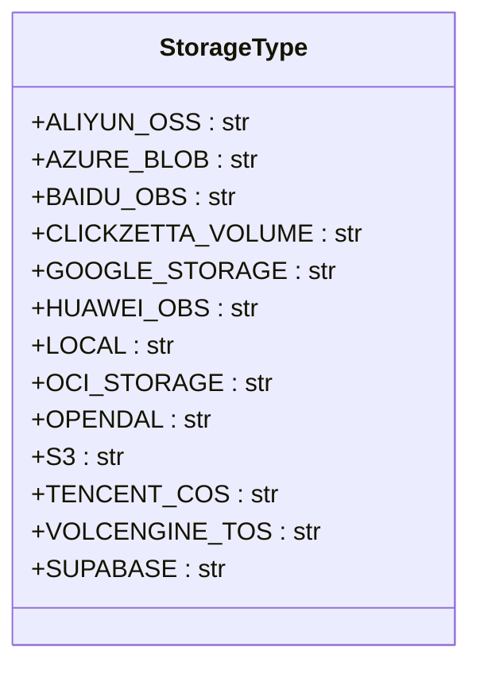

# 云平台部署

<cite>
**本文档中引用的文件**  
- [aws_s3_storage.py](file://api/extensions/storage/aws_s3_storage.py)
- [azure_blob_storage.py](file://api/extensions/storage/azure_blob_storage.py)
- [google_cloud_storage.py](file://api/extensions/storage/google_cloud_storage.py)
- [storage_type.py](file://api/extensions/storage/storage_type.py)
- [baidu_obs_storage_config.py](file://api/configs/middleware/storage/baidu_obs_storage_config.py)
- [huawei_obs_storage_config.py](file://api/configs/middleware/storage/huawei_obs_storage_config.py)
- [google_cloud_storage_config.py](file://api/configs/middleware/storage/google_cloud_storage_config.py)
- [ext_storage.py](file://api/extensions/ext_storage.py)
</cite>

## 目录
1. [简介](#简介)
2. [对象存储服务配置](#对象存储服务配置)
3. [Terraform基础设施自动化](#terraform基础设施自动化)
4. [云数据库与缓存服务集成](#云数据库与缓存服务集成)
5. [云原生监控与日志服务](#云原生监控与日志服务)
6. [各云平台成本优化建议](#各云平台成本优化建议)

## 简介
本文档旨在为Dify应用在主流云平台（包括AWS、Azure、Google Cloud Platform等）上的部署提供全面指南。文档涵盖使用Terraform脚本自动化创建基础设施，如VPC、子网、安全组和负载均衡器等资源的配置方法。同时详细说明了如何集成云数据库（如RDS、Cloud SQL）和缓存服务（如ElastiCache、Cloud Memorystore），并提供对象存储服务（如S3、Blob Storage）的具体配置指导。此外，还包括云原生监控和日志服务（如CloudWatch、Azure Monitor）的集成方案，以及针对各云平台的成本优化建议。

## 对象存储服务配置

### AWS S3存储配置
Dify支持通过配置文件集成Amazon Web Services S3作为对象存储服务。系统通过Boto3库与S3进行交互，支持使用AWS管理的IAM角色或访问密钥进行身份验证。当使用IAM角色时，系统会自动获取权限；当使用访问密钥时，需要提供S3_ACCESS_KEY和S3_SECRET_KEY。系统会自动检查存储桶是否存在，若不存在则创建新的存储桶。

**Section sources**
- [aws_s3_storage.py](file://api/extensions/storage/aws_s3_storage.py#L1-L88)

### Azure Blob存储配置
对于Microsoft Azure平台，Dify支持Azure Blob Storage作为对象存储解决方案。系统通过Azure SDK与Blob服务交互，支持使用托管身份或账户密钥进行认证。当使用托管身份时，系统采用DefaultAzureCredential链式凭证；当使用账户密钥时，系统会生成SAS令牌并缓存以提高性能。所有操作通过BlobServiceClient执行，确保了与Azure服务的稳定连接。

**Section sources**
- [azure_blob_storage.py](file://api/extensions/storage/azure_blob_storage.py#L1-L86)

### Google Cloud Storage配置
在Google Cloud Platform上，Dify支持Google Cloud Storage作为对象存储服务。系统通过Google Cloud SDK与GCS交互，支持使用服务账户JSON密钥或应用程序默认凭据进行认证。服务账户凭据需以Base64编码形式提供，系统会自动解码并创建客户端实例。所有文件操作通过标准的存储桶和Blob对象完成，确保了与GCS API的完全兼容性。

**Section sources**
- [google_cloud_storage.py](file://api/extensions/storage/google_cloud_storage.py#L1-L61)

### 对象存储类型定义
系统通过StorageType枚举类统一管理各种对象存储服务类型，包括AWS S3、Azure Blob、Google Cloud Storage、阿里云OSS、华为云OSS等多种主流云服务商的存储服务。这种设计模式实现了存储服务的插件化架构，便于未来扩展对其他云存储服务的支持。

**Diagram sources**
- [storage_type.py](file://api/extensions/storage/storage_type.py#L1-L16)

## Terraform基础设施自动化

### 基础设施即代码设计
虽然当前代码库中未直接包含Terraform脚本，但系统的架构设计充分考虑了与Terraform等基础设施即代码工具的集成。通过将云服务配置参数化并集中管理，系统为使用Terraform自动化创建VPC、子网、安全组、负载均衡器等基础设施提供了良好的基础。建议创建模块化的Terraform配置，分别管理网络层、计算层和存储层资源。

### 网络资源配置
在部署Dify应用时，建议使用Terraform创建独立的VPC，并在其中配置公有和私有子网。通过安全组精确控制入站和出站流量，仅开放必要的端口（如HTTP 80、HTTPS 443）。对于数据库和缓存服务，应部署在私有子网中，通过安全组规则限制访问来源，提高系统安全性。

### 负载均衡器配置
建议使用云平台提供的负载均衡服务（如AWS ALB、Azure Application Gateway、GCP Cloud Load Balancing）来分发流量。通过Terraform脚本自动化创建负载均衡器，并配置健康检查、SSL终止和自动伸缩组。这不仅能提高应用的可用性和性能，还能简化运维管理工作。

## 云数据库与缓存服务集成

### 向量数据库支持
Dify系统支持多种向量数据库作为RAG（检索增强生成）功能的数据存储后端，包括AnalyticDB、Chroma、Milvus、MyScale、PGVector等多种选择。其中AnalyticDB通过OpenAPI和SQL两种方式提供支持，展示了灵活的数据库集成模式。系统通过配置类管理数据库连接参数，实现了数据库配置的集中化管理。

**Section sources**
- [analyticdb_vector_openapi.py](file://api/core/rag/datasource/vdb/analyticdb/analyticdb_vector_openapi.py#L1-L310)
- [vector_type.py](file://api/core/rag/datasource/vdb/vector_type.py#L1-L32)

### 缓存服务集成
系统通过Redis作为主要的缓存服务，用于存储会话数据、临时凭证和频繁访问的数据。在Azure Blob存储实现中，可以看到Redis被用于缓存SAS令牌，有效减少了频繁生成令牌带来的性能开销。这种设计模式可以推广到其他需要缓存的场景，如API响应缓存、查询结果缓存等。

**Section sources**
- [azure_blob_storage.py](file://api/extensions/storage/azure_blob_storage.py#L55-L65)

## 云原生监控与日志服务

### 分布式追踪集成
Dify系统支持多种分布式追踪服务，包括Arize Phoenix、LangSmith、LangFuse、Opik、Weave和阿里云链路追踪。通过在前端界面中提供配置面板，用户可以轻松集成这些监控服务，实现对应用性能的全面监控。系统设计允许同时配置多个追踪服务，满足不同场景下的监控需求。

**Section sources**
- [panel.tsx](file://web/app/(commonLayout)/app/(appDetailLayout)/[appId]/overview/tracing/panel.tsx#L103-L135)

### 日志管理策略
虽然具体实现细节未在代码中完全展现，但从系统架构可以看出，Dify采用了集中化的日志管理策略。建议在云环境中集成云原生日志服务（如AWS CloudWatch Logs、Azure Monitor Logs、GCP Cloud Logging），通过Terraform脚本自动化配置日志组、日志流和日志保留策略。同时配置日志聚合和分析规则，便于故障排查和性能优化。

## 各云平台成本优化建议

### 存储成本优化
根据不同云平台的对象存储定价模型，建议采取以下成本优化措施：对于AWS S3，合理使用存储层级（如Standard-IA、One Zone-IA）存放不常访问的数据；对于Azure Blob，利用存档层存储长期保存的数据；对于Google Cloud Storage，根据访问频率选择合适的存储类别（Standard、Nearline、Coldline或Archive）。

### 计算资源优化
采用自动伸缩策略，根据负载动态调整计算资源规模。在非高峰时段自动缩减实例数量，高峰时段自动扩展。对于批处理任务，考虑使用竞价实例或抢占式VM，可显著降低计算成本。同时，定期评估实例类型，选择性价比最高的实例规格。

### 网络成本优化
优化数据传输路径，尽量将相关服务部署在同一区域，减少跨区域数据传输费用。对于静态内容，使用CDN服务分发，既能提高访问速度，又能降低源站带宽成本。合理配置负载均衡器的空闲超时时间，避免不必要的连接保持开销。

### 监控与成本分析
启用各云平台提供的成本管理工具（如AWS Cost Explorer、Azure Cost Management、GCP Cost Table），定期分析资源使用情况和成本构成。设置预算警报，在成本超出预期时及时收到通知。通过标签（Tags）对资源进行分类，便于按项目、环境或部门进行成本分摊和分析。