# 监控与日志

<cite>
**本文档中引用的文件**  
- [otel_config.py](file://api/configs/observability/otel/otel_config.py)
- [ext_otel.py](file://api/extensions/ext_otel.py)
- [ext_sentry.py](file://api/extensions/ext_sentry.py)
- [sentry_config.py](file://api/configs/extra/sentry_config.py)
- [TraceAppConfig](file://api/models/model.py#L1859-L1889)
- [workflow_app_logs](file://api/models/workflow.py#L816-L849)
- [ops_trace_manager.py](file://api/core/ops/ops_trace_manager.py#L267-L297)
</cite>

## 目录
1. [引言](#引言)
2. [OpenTelemetry 集成配置](#opentelemetry-集成配置)
3. [Sentry 错误监控系统设置](#sentry-错误监控系统设置)
4. [Prometheus 与 Grafana 集成](#prometheus-与-grafana-集成)
5. [日志收集与分析最佳实践](#日志收集与分析最佳实践)
6. [关键监控指标](#关键监控指标)
7. [告警规则配置](#告警规则配置)
8. [故障排查流程](#故障排查流程)

## 引言
本文档详细描述了 Dify 平台的全面监控与日志管理方案。涵盖了 OpenTelemetry 的 trace、metrics 和 logs 采集与导出配置，Sentry 错误监控系统的前后端集成方法，Prometheus 指标监控与 Grafana 仪表板使用，以及基于 ELK/EFK 栈的日志收集、存储和分析最佳实践。同时列出了关键监控指标、告警规则和故障排查流程，确保系统的可观测性和稳定性。

## OpenTelemetry 集成配置

### OpenTelemetry 配置参数
OpenTelemetry 的配置通过 `OTelConfig` 类进行管理，支持 trace、metrics 和 logs 的全面采集与导出。

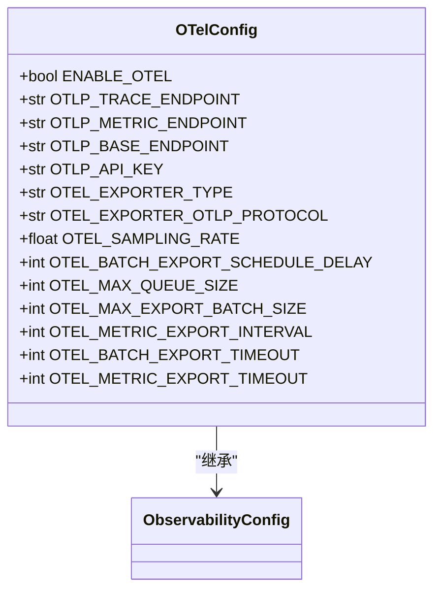

**Diagram sources**
- [otel_config.py](file://api/configs/observability/otel/otel_config.py#L1-L59)

**Section sources**
- [otel_config.py](file://api/configs/observability/otel/otel_config.py#L1-L59)

### OpenTelemetry 初始化流程
OpenTelemetry 在应用启动时通过 `ext_otel.py` 进行初始化，自动集成 Flask、Celery、SQLAlchemy、Redis 和 Requests 等组件的监控。

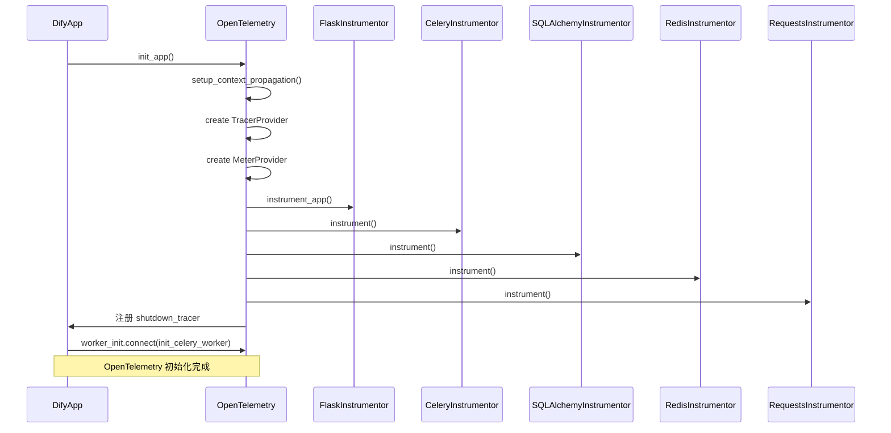

**Diagram sources**
- [ext_otel.py](file://api/extensions/ext_otel.py#L0-L259)

**Section sources**
- [ext_otel.py](file://api/extensions/ext_otel.py#L0-L259)

### 资源属性与采样配置
OpenTelemetry 使用 `Resource` 定义服务元数据，并通过 `ParentBasedTraceIdRatio` 实现采样控制。

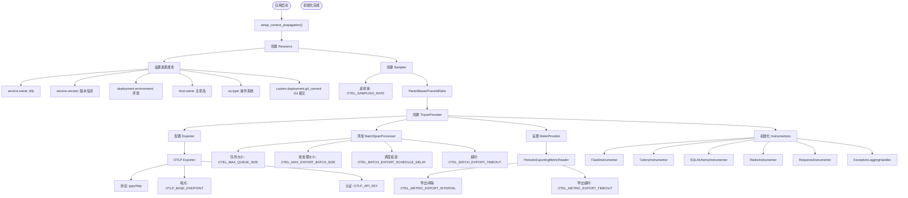

**Diagram sources**
- [ext_otel.py](file://api/extensions/ext_otel.py#L0-L259)

**Section sources**
- [ext_otel.py](file://api/extensions/ext_otel.py#L0-L259)

## Sentry 错误监控系统设置

### Sentry 配置参数
Sentry 的配置通过 `SentryConfig` 类进行管理，支持 DSN、采样率等关键参数设置。

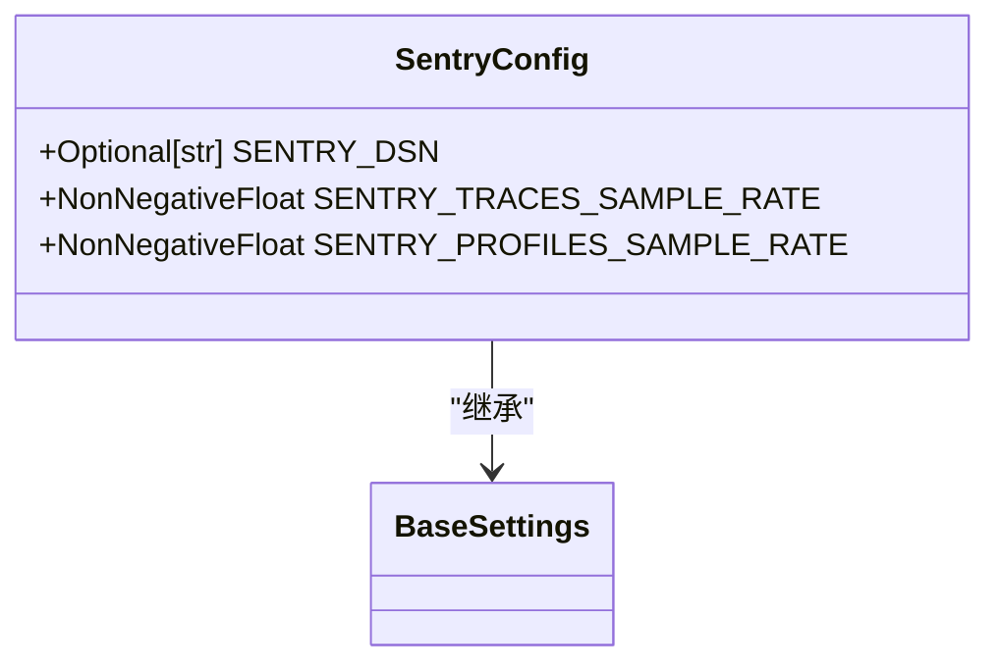

**Diagram sources**
- [sentry_config.py](file://api/configs/extra/sentry_config.py#L1-L28)

**Section sources**
- [sentry_config.py](file://api/configs/extra/sentry_config.py#L1-L28)

### Sentry 初始化流程
Sentry 在应用启动时通过 `ext_sentry.py` 进行初始化，集成 Flask 和 Celery 的错误监控。

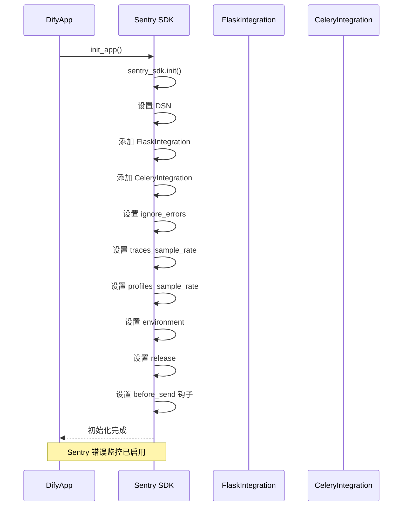

**Diagram sources**
- [ext_sentry.py](file://api/extensions/ext_sentry.py#L0-L40)

**Section sources**
- [ext_sentry.py](file://api/extensions/ext_sentry.py#L0-L40)

### 错误过滤与处理
Sentry 通过 `before_send` 钩子函数过滤特定错误，避免不必要的错误上报。

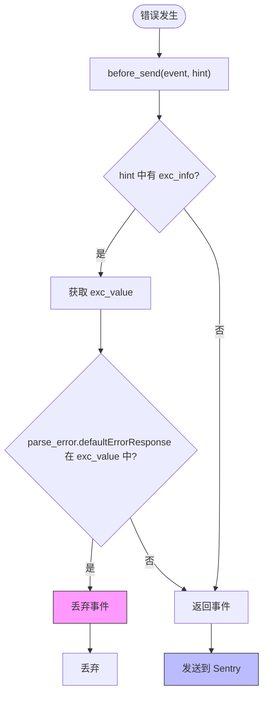

**Diagram sources**
- [ext_sentry.py](file://api/extensions/ext_sentry.py#L0-L40)

**Section sources**
- [ext_sentry.py](file://api/extensions/ext_sentry.py#L0-L40)

## Prometheus 与 Grafana 集成

### 指标导出配置
OpenTelemetry 通过 `PeriodicExportingMetricReader` 将指标导出到 Prometheus 兼容的端点。

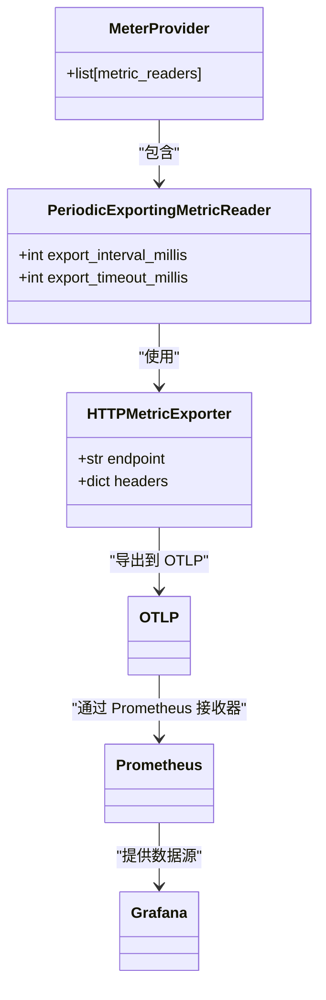

**Diagram sources**
- [ext_otel.py](file://api/extensions/ext_otel.py#L0-L259)

**Section sources**
- [ext_otel.py](file://api/extensions/ext_otel.py#L0-L259)

### Grafana 仪表板集成
系统通过 OpenSearch Dashboards 提供可视化界面，与 Grafana 类似，支持指标展示。

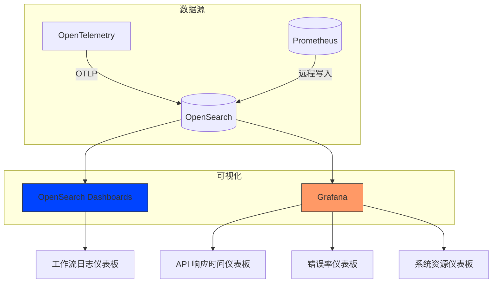

**Diagram sources**
- [docker/volumes/opensearch/opensearch_dashboards.yml](file://docker/volumes/opensearch/opensearch_dashboards.yml#L0-L30)

**Section sources**
- [docker/volumes/opensearch/opensearch_dashboards.yml](file://docker/volumes/opensearch/opensearch_dashboards.yml#L0-L30)

## 日志收集与分析最佳实践

### 日志数据模型
系统定义了 `workflow_app_logs` 表用于存储工作流应用日志，支持多租户隔离。

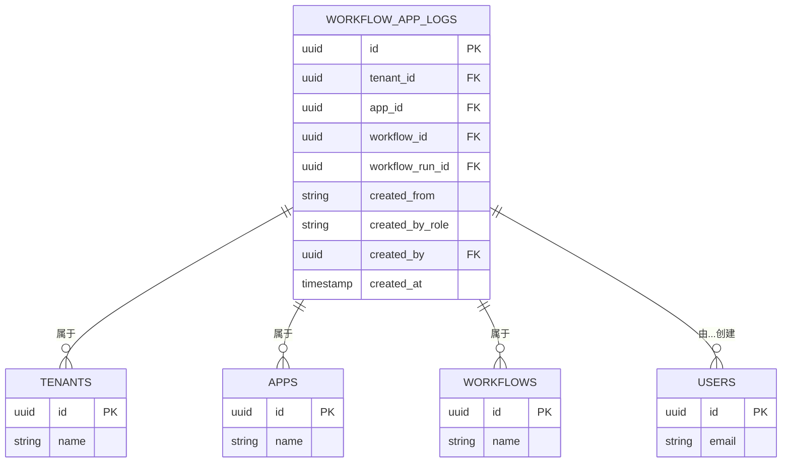

**Diagram sources**
- [workflow.py](file://api/models/workflow.py#L816-L849)

**Section sources**
- [workflow.py](file://api/models/workflow.py#L816-L849)

### ELK/EFK 栈集成
系统通过 OpenSearch（Elasticsearch 分支）实现日志存储与分析，与 Fluentd/Kibana 架构类似。

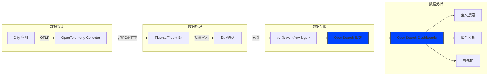

**Diagram sources**
- [docker/volumes/opensearch/opensearch_dashboards.yml](file://docker/volumes/opensearch/opensearch_dashboards.yml#L0-L30)
- [ext_otel.py](file://api/extensions/ext_otel.py#L0-L259)

**Section sources**
- [docker/volumes/opensearch/opensearch_dashboards.yml](file://docker/volumes/opensearch/opensearch_dashboards.yml#L0-L30)
- [ext_otel.py](file://api/extensions/ext_otel.py#L0-L259)

## 关键监控指标

### API 性能指标
系统监控关键 API 的响应时间和错误率。

```mermaid
table
| 指标名称 | 类型 | 描述 | 采集方式 |
|--------|-----|------|--------|
| http.server.response.count | Counter | HTTP 响应计数 | OpenTelemetry Flask Instrumentor |
| http.server.duration | Histogram | HTTP 请求持续时间 | OpenTelemetry |
| http.server.error.count | Counter | HTTP 错误计数 | OpenTelemetry |
| api.response.time.p95 | Gauge | API 响应时间 95 分位 | Prometheus |
| api.error.rate | Gauge | API 错误率 | Prometheus |
```

**Section sources**
- [ext_otel.py](file://api/extensions/ext_otel.py#L0-L259)

### 系统资源指标
监控系统级别的资源使用情况。

```mermaid
table
| 指标名称 | 类型 | 描述 | 采集方式 |
|--------|-----|------|--------|
| process.cpu.usage | Gauge | CPU 使用率 | OpenTelemetry |
| process.memory.usage | Gauge | 内存使用量 | OpenTelemetry |
| system.disk.usage | Gauge | 磁盘使用率 | Prometheus Node Exporter |
| system.network.io | Gauge | 网络 I/O | Prometheus Node Exporter |
| celery.queue.length | Gauge | Celery 队列长度 | Prometheus |
```

**Section sources**
- [ext_otel.py](file://api/extensions/ext_otel.py#L0-L259)

### 应用业务指标
监控核心业务功能的性能。

```mermaid
table
| 指标名称 | 类型 | 描述 | 采集方式 |
|--------|-----|------|--------|
| app.workflow.run.duration | Histogram | 工作流执行时长 | OpenTelemetry |
| app.workflow.run.success | Counter | 工作流成功次数 | OpenTelemetry |
| app.workflow.run.failure | Counter | 工作流失败次数 | OpenTelemetry |
| app.llm.token.usage | Counter | LLM Token 使用量 | OpenTelemetry |
| app.embedding.duration | Histogram | 嵌入生成时长 | OpenTelemetry |
```

**Section sources**
- [ext_otel.py](file://api/extensions/ext_otel.py#L0-L259)

## 告警规则配置

### 告警规则定义
基于 Prometheus 的告警规则配置。

```mermaid
table
| 告警名称 | 条件 | 持续时间 | 严重程度 | 通知方式 |
|--------|------|--------|--------|--------|
| HighAPIErrorRate | api.error.rate > 0.1 | 5m | critical | 邮件、Webhook |
| HighResponseTime | api.response.time.p95 > 5s | 10m | warning | 邮件 |
| HighCPUUsage | process.cpu.usage > 0.8 | 15m | warning | 邮件 |
| HighMemoryUsage | process.memory.usage > 80% | 15m | warning | 邮件 |
| WorkflowFailureRate | app.workflow.run.failure / app.workflow.run.total > 0.2 | 30m | critical | 邮件、Webhook |
| CeleryQueueBacklog | celery.queue.length > 100 | 5m | warning | 邮件 |
```

**Section sources**
- [ext_otel.py](file://api/extensions/ext_otel.py#L0-L259)

## 故障排查流程

### 故障排查流程图
标准化的故障排查流程。

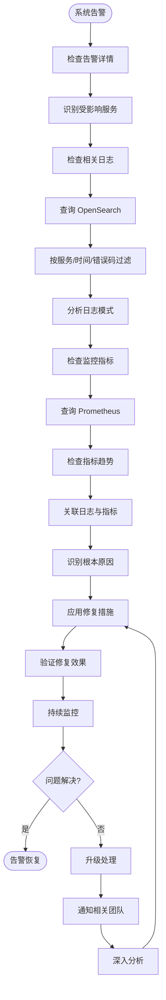

**Section sources**
- [ext_otel.py](file://api/extensions/ext_otel.py#L0-L259)
- [ext_sentry.py](file://api/extensions/ext_sentry.py#L0-L40)