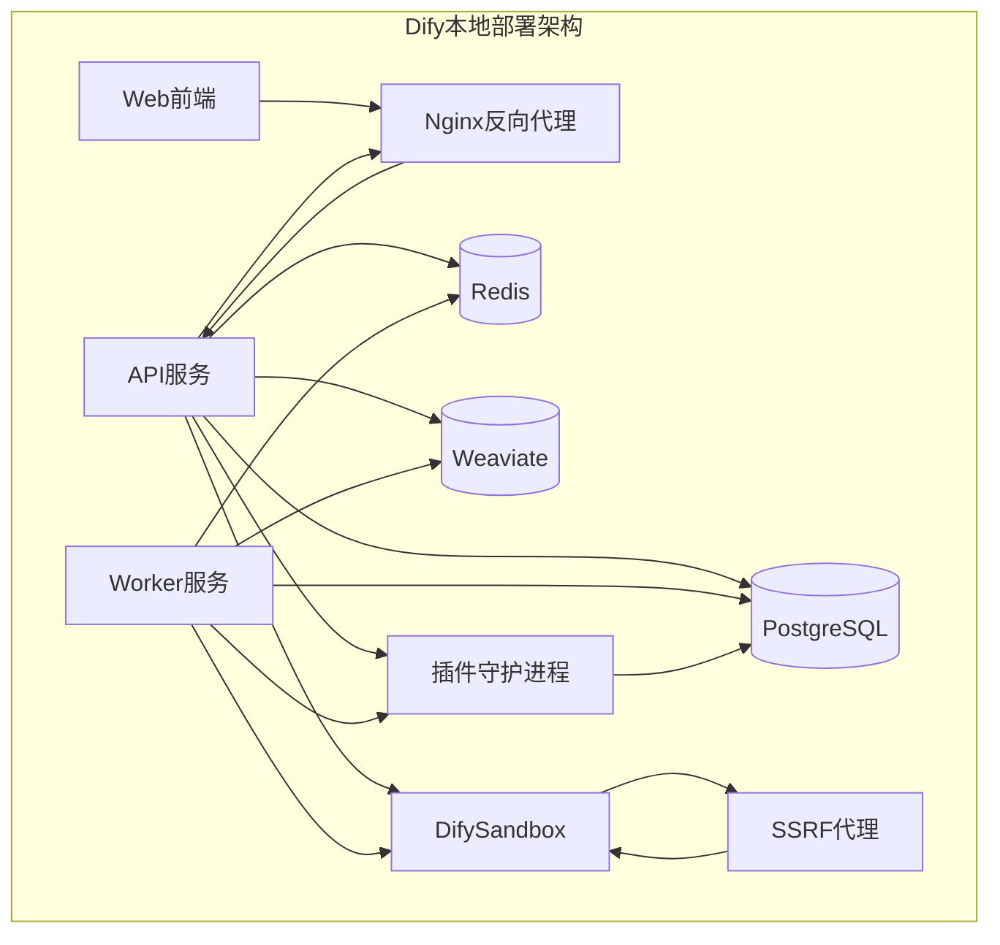
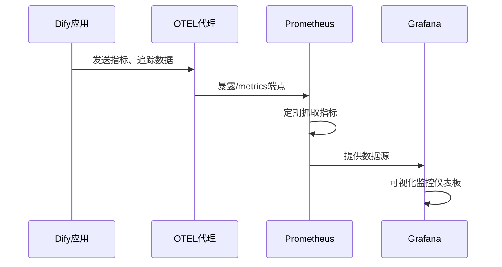

# 部署与运维

<cite>
**本文档引用的文件**  
- [docker-compose.yaml](file://docker/docker-compose.yaml)
- [docker-compose-template.yaml](file://docker/docker-compose-template.yaml)
- [docker-compose.middleware.yaml](file://docker/docker-compose.middleware.yaml)
</cite>

## 目录
1. [简介](#简介)
2. [基于Docker Compose的本地部署](#基于docker-compose的本地部署)
3. [Kubernetes集群部署最佳实践](#kubernetes集群部署最佳实践)
4. [Terraform云部署方案](#terraform云部署方案)
5. [环境变量配置详解](#环境变量配置详解)
6. [监控系统集成](#监控系统集成)
7. [日志管理策略](#日志管理策略)
8. [性能基准测试与容量规划](#性能基准测试与容量规划)

## 简介
Dify平台提供了一套完整的AI应用开发与部署解决方案，支持多种部署模式以适应不同规模和需求的生产环境。本指南详细介绍了Dify平台在不同场景下的部署与运维方案，包括基于Docker Compose的本地部署、Kubernetes集群部署、Terraform云部署等。同时涵盖了环境变量配置、监控系统集成、日志管理、性能测试和容量规划等关键运维主题，为系统管理员和DevOps工程师提供全面的部署指导。

## 基于Docker Compose的本地部署

Dify平台提供了基于Docker Compose的本地部署方案，通过预定义的`docker-compose.yaml`文件实现多容器应用的编排和部署。该方案适用于开发测试环境和小型生产环境，具有部署简单、维护方便的特点。

部署流程包括：
1. 克隆Dify代码仓库
2. 根据`docker-compose-template.yaml`创建自定义的`.env`环境配置文件
3. 执行`docker-compose up -d`启动所有服务

核心服务组件包括API服务、Worker服务、Web前端、数据库（PostgreSQL）、缓存（Redis）、向量数据库（Weaviate）等，通过Docker网络进行安全通信。

**图示来源**  
- [docker-compose.yaml](file://docker/docker-compose.yaml#L1-L1358)

**本节来源**  
- [docker-compose.yaml](file://docker/docker-compose.yaml#L1-L1358)
- [docker-compose-template.yaml](file://docker/docker-compose-template.yaml#L1-L777)

## Kubernetes集群部署最佳实践

对于生产环境，推荐使用Kubernetes进行Dify平台的部署，以实现高可用性、弹性伸缩和自动化运维。虽然具体的Helm图表未在代码库中提供，但可以根据Docker Compose配置推导出Kubernetes部署的最佳实践。

部署建议包括：
- 使用Helm图表管理Dify应用的Kubernetes部署
- 为每个核心组件（API、Worker、Web、数据库等）创建独立的Deployment和Service
- 配置适当的资源限制和请求，确保系统稳定运行
- 使用PersistentVolume和PersistentVolumeClaim管理持久化存储
- 配置Ingress控制器实现外部访问和TLS终止
- 设置HorizontalPodAutoscaler实现自动伸缩

资源规划建议：
- API服务：2-4核CPU，4-8GB内存
- Worker服务：根据任务负载动态调整，建议2-8核CPU，4-16GB内存
- 数据库：4-8核CPU，16-32GB内存，SSD存储
- 向量数据库：根据数据规模规划，建议8核CPU，32GB以上内存
- Redis缓存：2-4核CPU，8-16GB内存

**本节来源**  
- [docker-compose.yaml](file://docker/docker-compose.yaml#L1-L1358)

## Terraform云部署方案

Dify平台支持通过Terraform在主流云服务商上进行自动化部署。虽然具体的Terraform配置文件未在代码库中提供，但可以根据现有部署架构设计云部署方案。

支持的云服务商包括：
- 阿里云
- AWS
- Azure
- 腾讯云
- 华为云

部署架构建议：
- 使用云服务商的托管数据库服务（如RDS）替代自建PostgreSQL
- 使用云原生对象存储（如S3、OSS）替代本地文件存储
- 使用云服务商的托管Redis服务
- 使用云原生向量数据库服务
- 配置云负载均衡器替代Nginx反向代理
- 使用云监控服务集成Prometheus和Grafana

通过Terraform模块化设计，可以实现基础设施即代码（IaC），确保部署的一致性和可重复性。

**本节来源**  
- [docker-compose.yaml](file://docker/docker-compose.yaml#L1-L1358)

## 环境变量配置详解

Dify平台通过丰富的环境变量实现灵活的配置管理，所有配置项均在`docker-compose.yaml`和`docker-compose-template.yaml`中定义。

### 核心配置分类

**表：核心配置分类**
| 配置类别 | 关键环境变量 | 说明 |
|---------|------------|------|
| 基础配置 | `SECRET_KEY`, `DEBUG`, `DEPLOY_ENV` | 系统基础安全和运行环境配置 |
| 数据库配置 | `DB_HOST`, `DB_PORT`, `DB_USERNAME`, `DB_PASSWORD` | PostgreSQL数据库连接配置 |
| 缓存配置 | `REDIS_HOST`, `REDIS_PORT`, `REDIS_PASSWORD` | Redis缓存服务连接配置 |
| 存储配置 | `STORAGE_TYPE`, `OPENDAL_SCHEME`, `S3_BUCKET_NAME` | 文件存储后端配置 |
| 向量数据库配置 | `VECTOR_STORE`, `WEAVIATE_ENDPOINT`, `QDRANT_URL` | 向量数据库连接和配置 |
| 安全配置 | `SENTRY_DSN`, `ENABLE_OTEL`, `OTLP_TRACE_ENDPOINT` | 监控和可观测性配置 |

### 配置文件说明

`docker-compose-template.yaml`作为模板文件，定义了所有可用的环境变量和默认值。用户应基于此模板创建`.env`文件，覆盖需要自定义的配置项。

`docker-compose.middleware.yaml`提供了中间件服务的独立部署配置，可用于微服务架构中的独立部署场景。

**本节来源**  
- [docker-compose.yaml](file://docker/docker-compose.yaml#L1-L1358)
- [docker-compose-template.yaml](file://docker/docker-compose-template.yaml#L1-L777)
- [docker-compose.middleware.yaml](file://docker/docker-compose.middleware.yaml#L1-L194)

## 监控系统集成

Dify平台支持与Prometheus和Grafana等主流监控系统集成，实现全面的系统可观测性。

### OpenTelemetry集成

通过环境变量配置启用OpenTelemetry（OTEL）监控：

**图示来源**  
- [docker-compose.yaml](file://docker/docker-compose.yaml#L1-L1358)

关键配置项：
- `ENABLE_OTEL`: 启用OpenTelemetry
- `OTLP_TRACE_ENDPOINT`: OTLP追踪端点
- `OTLP_METRIC_ENDPOINT`: OTLP指标端点
- `OTEL_SAMPLING_RATE`: 采样率配置

### Sentry集成

Dify平台集成了Sentry错误监控系统，用于捕获和分析运行时错误：

- `API_SENTRY_DSN`: API服务的Sentry DSN
- `WEB_SENTRY_DSN`: Web前端的Sentry DSN
- `PLUGIN_SENTRY_ENABLED`: 插件服务的Sentry启用状态

**本节来源**  
- [docker-compose.yaml](file://docker/docker-compose.yaml#L1-L1358)

## 日志管理策略

Dify平台采用分层的日志管理策略，确保系统运行状态的可追溯性和可审计性。

### 日志配置

通过环境变量进行日志配置：
- `LOG_LEVEL`: 日志级别（INFO、DEBUG、WARN、ERROR）
- `LOG_FILE`: 日志文件路径
- `LOG_FILE_MAX_SIZE`: 单个日志文件最大大小（MB）
- `LOG_FILE_BACKUP_COUNT`: 日志文件保留数量
- `ENABLE_REQUEST_LOGGING`: 是否启用请求日志记录

### 日志收集

建议的生产环境日志收集方案：
- 使用Filebeat或Fluentd收集容器日志
- 发送到Elasticsearch进行存储和索引
- 通过Kibana或Grafana进行可视化分析
- 配置日志轮转和归档策略

**本节来源**  
- [docker-compose.yaml](file://docker/docker-compose.yaml#L1-L1358)

## 性能基准测试与容量规划

### 性能测试方法

建立性能基准测试框架，包括：
- 使用JMeter或Locust进行API压力测试
- 测试不同并发用户数下的响应时间和吞吐量
- 测试文件上传和处理性能
- 测试向量搜索性能
- 测试工作流执行性能

### 容量规划建议

根据性能测试结果进行容量规划：

**表：容量规划建议**
| 组件 | 小型部署 | 中型部署 | 大型部署 |
|------|--------|--------|--------|
| API服务 | 2核4GB | 4核8GB | 8核16GB |
| Worker服务 | 2核4GB | 8核16GB | 16核32GB |
| 数据库 | 4核16GB | 8核32GB | 16核64GB |
| Redis | 2核8GB | 4核16GB | 8核32GB |
| 向量数据库 | 8核32GB | 16核64GB | 32核128GB |
| 日均请求量 | <10万 | 10-100万 | >100万 |

### 性能优化建议

- 优化数据库查询，添加适当索引
- 调整Redis缓存策略，提高缓存命中率
- 优化向量数据库的索引参数
- 调整Worker服务的并发数和队列大小
- 使用CDN加速静态资源访问
- 实现数据库读写分离

**本节来源**  
- [docker-compose.yaml](file://docker/docker-compose.yaml#L1-L1358)