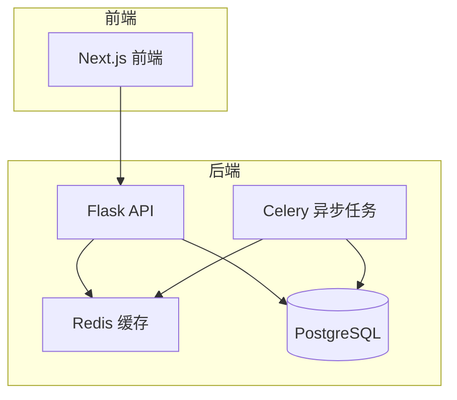

# 项目概述

<cite>
**本文档中引用的文件**  
- [README_CN.md](file://README_CN.md)
- [app.py](file://api/app.py)
- [app_factory.py](file://api/app_factory.py)
- [web/README.md](file://web/README.md)
- [docker-compose.yaml](file://docker/docker-compose.yaml)
</cite>

## 目录
1. [简介](#简介)
2. [核心功能](#核心功能)
3. [部署方式](#部署方式)
4. [系统架构](#系统架构)
5. [技术优势](#技术优势)
6. [学习路径与开发指引](#学习路径与开发指引)
7. [实际应用案例](#实际应用案例)
8. [社区与支持](#社区与支持)

## 简介

Dify 是一个开源的 LLM 应用开发平台，旨在通过直观的界面和强大的功能组合，帮助开发者快速从原型设计过渡到生产环境。该平台融合了 AI 工作流、RAG 管道、Agent 智能体、模型管理以及可观测性等关键能力，为构建基于大语言模型的应用提供了完整的解决方案。

作为一个低代码/无代码的开发平台，Dify 支持从简单的聊天机器人到复杂的自动化工作流的构建，适用于个人开发者、初创企业以及大型组织。其模块化设计和灵活的集成能力使得无论是快速验证想法还是构建企业级应用都变得高效可行。

**Section sources**
- [README_CN.md](file://README_CN.md#L0-L211)

## 核心功能

Dify 提供了一系列核心功能，支持开发者构建复杂且高效的 LLM 应用。

### 工作流
Dify 允许用户在可视化画布上构建和测试 AI 工作流程，支持节点式编排，实现多步骤逻辑的串联与条件判断，适用于复杂业务场景的建模。

### 全面的模型支持
平台无缝集成数百种专有和开源的大语言模型（LLM），涵盖 GPT、Mistral、Llama3 等主流模型，并支持任何与 OpenAI API 兼容的模型。同时支持多种推理提供商和自托管解决方案，提供灵活的模型选择策略。

### Prompt IDE
提供直观的提示词开发环境，支持提示词编写、模型性能对比、变量注入等功能，并可为基于聊天的应用添加文本转语音等扩展功能。

### RAG 管道
具备完整的检索增强生成（RAG）能力，覆盖文档摄入、文本提取、向量化、索引构建到检索的全流程。支持 PDF、PPT、Word 等常见格式的文本提取，开箱即用。

### Agent 智能体
支持基于 LLM 函数调用或 ReAct 框架定义智能体（Agent），并可为其添加预构建或自定义工具。Dify 内置超过 50 种工具，如谷歌搜索、DALL·E、Stable Diffusion、WolframAlpha 等，极大扩展了 Agent 的能力边界。

### LLMOps
提供应用日志监控、性能分析和可观测性功能，支持基于生产数据和人工标注持续优化提示词、数据集和模型配置，实现闭环迭代。

### 后端即服务
所有功能均提供对应的 API 接口，便于将 Dify 集成到现有业务系统中，实现前后端分离架构下的灵活调用。

**Section sources**
- [README_CN.md](file://README_CN.md#L56-L82)

## 部署方式

Dify 提供多种部署方式，满足不同用户的需求。

### 云服务
Dify 提供[云服务](https://dify.ai)，用户可零配置快速体验平台全部功能。沙盒计划包含 200 次免费的 GPT-4 调用，适合初学者和短期项目使用。

### 自托管社区版
通过 Docker 快速部署本地实例。确保机器满足最低要求（CPU >= 2 核，RAM >= 4 GiB）后，执行以下命令即可启动服务：

```bash
cd docker
cp .env.example .env
docker compose up -d
```

启动后访问 [http://localhost/install](http://localhost/install) 进行初始化配置。

### 企业级部署
面向企业用户提供额外功能支持，包括品牌定制、高可用架构、安全合规等。可通过邮件联系获取商业许可。对于 AWS 用户，可在 AWS Marketplace 上一键部署 Dify 高级版至自有 VPC。

### 其他部署方案
支持 Helm Chart、Kubernetes YAML、Terraform、AWS CDK 等多种自动化部署方式，适用于云原生环境和 DevOps 流程。

**Section sources**
- [README_CN.md](file://README_CN.md#L84-L109)
- [docker-compose.yaml](file://docker/docker-compose.yaml)

## 系统架构

Dify 采用前后端分离的微服务架构，模块化设计清晰，便于扩展和维护。

### 前端架构
前端基于 [Next.js](https://nextjs.org/) 构建，位于 `web/` 目录下，使用 React 框架实现响应式用户界面。支持国际化（i18n），已覆盖中、英、日、韩等多种语言。

环境配置通过 `.env.local` 文件管理，支持开发、测试、生产等多环境切换。构建命令为 `pnpm run build`，启动命令为 `pnpm run start`。

### 后端架构
后端基于 Flask 框架构建，位于 `api/` 目录下，采用工厂模式创建应用实例。核心文件 `app_factory.py` 负责初始化各类扩展组件，如数据库、Redis、Celery、Sentry、OTEL 等。

应用启动入口为 `app.py`，根据命令行参数判断是否为数据库迁移操作，分别创建不同配置的应用实例。生产环境中启用 gevent 进行异步处理，提升并发性能。

### 模块化设计
后端核心功能按模块组织：
- `core/`：核心逻辑，包括 agent、rag、workflow、model_runtime 等
- `controllers/`：API 控制器，处理不同端点请求
- `models/`：数据模型定义
- `services/`：业务服务层
- `extensions/`：各类扩展组件，如存储、日志、邮件等



**Diagram sources**
- [app.py](file://api/app.py)
- [app_factory.py](file://api/app_factory.py)
- [web/README.md](file://web/README.md)

**Section sources**
- [app.py](file://api/app.py)
- [app_factory.py](file://api/app_factory.py)
- [web/README.md](file://web/README.md)

## 技术优势

Dify 在技术设计上具备多项优势，确保平台的灵活性、可扩展性和可观测性。

### 多模型提供商支持
通过 `model_runtime` 模块实现对多种模型提供商的统一接入，支持 `predefined-model`（预定义模型）、`customizable-model`（自定义模型）和 `fetch-from-remote`（远程获取）三种配置方式，满足不同场景需求。

### 自托管与可观测性
支持完全自托管部署，保障数据安全与隐私。集成 OpenTelemetry（OTEL）实现分布式追踪，支持 Langfuse、Arize Phoenix、Weave 等多种可观测性平台，便于调试和性能优化。

### 插件化与扩展性
提供代码扩展（code-based extension）机制，支持通过 API 调用外部服务。内置丰富的工具插件，并可通过 MCP（Model Context Protocol）协议实现与外部系统的深度集成。

### 高可用与可维护性
采用微服务思想，各组件职责清晰。通过 Celery 实现异步任务处理，解耦核心流程。支持通过环境变量灵活配置部署参数，便于 CI/CD 集成。

**Section sources**
- [api/core/model_runtime/docs/zh_Hans/provider_scale_out.md](file://api/core/model_runtime/docs/zh_Hans/provider_scale_out.md#L0-L26)

## 学习路径与开发指引

### 初学者路径
1. 访问 [Dify 云服务](https://dify.ai) 注册账号
2. 使用可视化界面创建第一个聊天应用
3. 尝试添加 RAG 功能，上传文档进行检索测试
4. 构建简单工作流，体验节点编排
5. 查阅[官方文档](https://docs.dify.ai) 深入学习

### 开发者路径
1. 克隆仓库，使用 Docker 启动本地环境
2. 阅读 `api/README.md` 和 `web/README.md` 了解前后端开发规范
3. 修改前端组件或后端服务进行功能扩展
4. 使用 Jest 编写单元测试
5. 提交 Pull Request 参与社区贡献

### 企业用户路径
1. 评估 AWS Marketplace 或 Helm Chart 部署方案
2. 配置高可用数据库和对象存储
3. 集成企业身份认证系统（如 OAuth）
4. 设置监控告警和日志审计
5. 联系商务团队获取技术支持

**Section sources**
- [README_CN.md](file://README_CN.md)
- [web/README.md](file://web/README.md)

## 实际应用案例

### 智能客服系统
通过 Dify 构建基于企业知识库的智能客服机器人，结合 RAG 实现精准问答，使用工作流实现多轮对话管理，显著降低人工客服压力。

### 自动化内容生成
利用 Agent 智能体串联多个工具，实现从新闻抓取、内容摘要到社交媒体发布的自动化流程，提升内容运营效率。

### 内部知识助手
部署私有化实例，连接公司内部文档系统，构建员工专属的知识查询助手，提高信息获取效率。

### 教育辅助工具
开发个性化学习助手，根据学生提问动态生成讲解内容，并调用 DALL·E 生成示意图，增强学习体验。

这些案例展示了 Dify 从原型到生产的完整能力，开发者可在数小时内完成应用构建并上线。

## 社区与支持

Dify 拥有活跃的开源社区，提供多种支持渠道：
- [GitHub Discussions](https://github.com/langgenius/dify/discussions)：分享应用与交流经验
- [GitHub Issues](https://github.com/langgenius/dify/issues)：报告问题与功能请求
- [Discord 社区](https://discord.gg/FngNHpbcY7)：实时交流与技术支持
- [X(Twitter)](https://twitter.com/dify_ai)：获取最新动态
- 邮件支持：hello@dify.ai（使用问题）、business@dify.ai（商业咨询）

欢迎贡献代码、文档翻译或分享您的应用案例，共同推动平台发展。

**Section sources**
- [README_CN.md](file://README_CN.md#L200-L211)